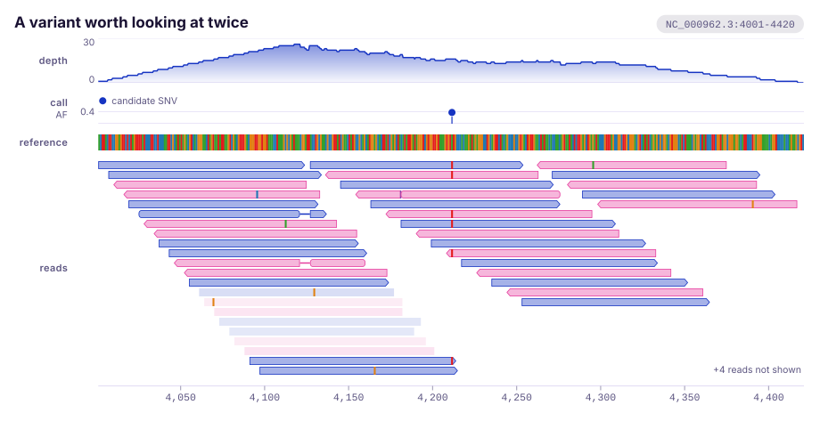
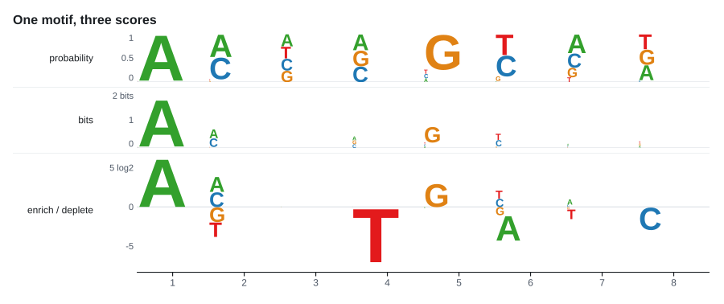

<div align="center">
  <h1>karyon</h1>
  <p><strong>Genomic track plots for Rust. Composable tracks over a shared coordinate axis, rendered to standalone SVG.</strong></p>

  <p>
    <a href="https://github.com/PathoGenOmics-Lab/karyon/actions/workflows/ci.yml"></a>
    <a href="LICENSE"></a>
    
    
    <a href="https://github.com/PathoGenOmics-Lab"></a>
  </p>
</div>

__Paula Ruiz-Rodriguez<sup>1</sup>__
<br>
<sub> 1. I<sup>2</sup>SysBio, University of Valencia-CSIC, FISABIO Joint Research Unit Infection and Public Health, Valencia, Spain </sub>

General plotting libraries know about points and lines. They do not know that a
position is a base, that a gene has a strand, that a pixel at genome scale
covers two thousand bases, or that a figure is worthless if its tracks do not
line up. `karyon` is the small amount of code that does know those things.

It draws what a genome browser draws: a stack of tracks over one shared
coordinate axis, so read depth, the reference bases, the gene models and the
variant calls all agree on where position 761,410 is.


Zoom in and the same tracks show individual bases. Nothing about the tracks
changes, only the region:


## Quick start

Not on crates.io yet, so point Cargo at the repository:

```toml
[dependencies]
karyon = { git = "https://github.com/PathoGenOmics-Lab/karyon" }
```

```rust
use karyon::{AxisTrack, CoverageTrack, Feature, FeatureTrack, Figure, Region, Strand};

let region = Region::parse("NC_000962.3:761000-763000")?;

Figure::new(region)
    .title("rpoB locus")
    .push(CoverageTrack::new(760_999, depth).label("depth"))
    .push(FeatureTrack::new(vec![
        Feature::new(761_050, 762_100).name("rpoB").strand(Strand::Forward),
    ]).label("genes"))
    .push(AxisTrack::new())
    .save_svg("rpoB.svg")?;
```

Run the figures above yourself:

```bash
cargo run --example locus -- assets
```

## Tracks

| Track | What it draws | Notes |
|:------|:--------------|:------|
| `CoverageTrack` | Per-base signal: depth, GC content, mappability | Area, line or bars. Bins to one point per pixel with max, mean or min. Optional log scale |
| `SequenceTrack` | The reference bases | Letters when zoomed in, coloured blocks when not, a hint when the bases are thinner than a pixel |
| `FeatureTrack` | Genes, exons, repeats, primers | Strand arrows, automatic packing into rows so nothing overlaps, labels inside or beside |
| `VariantTrack` | SNPs, indels, any point event | Lollipops scaled by value, or ticks when dense. Coloured and legended by category |
| `IdeogramTrack` | The whole chromosome | Cytogenetic bands, a pinched centromere, and a marker showing where the window is. The one track that does not share the x axis |
| `PileupTrack` | Aligned reads | Real CIGARs, packed into rows, mismatches painted against the reference, strand arrows, gaps and insertions |
| `LogoTrack` | Sequence logos | Seven scores, five of them against a background so symbols can hang below the baseline. Arbitrary alphabets |
| `AxisTrack` | The coordinate ruler | Round tick positions, one unit for the whole ruler, bp, kb or Mb as the zoom demands |

Each is an implementation of one trait with no privileged access to the figure.
A track type that is not here is about thirty lines: see the example on
[`Track`](src/track/mod.rs).

## Where am I


`IdeogramTrack` is the one track that **deliberately ignores the shared axis**.
Every other track maps its data through the same `Scale`, which is what keeps
their x axes aligned. An ideogram exists to answer "where am I", and a track
that only showed the region on display could not answer it: it would be a
picture of the window, drawn inside the window. So it draws the whole
chromosome across the plotting area and marks the region on it.

```rust
use karyon::{Band, IdeogramTrack, Stain};

// A row of the UCSC cytoBand table converts without a lookup table of your own.
let bands = vec![Band::new(0, 2_300_000, Stain::from_name("gneg")).name("p13")];

IdeogramTrack::new(chromosome_length, bands).show_band_names(true);
```

The grey ladder is mixed from the theme's own ink and page, so a dark figure
gets a dark ladder rather than a light one somebody forgot to invert. A tiny
window gets a marker with a minimum width, because a pointer too thin to see is
neither a pointer nor a measurement.

A bacterial chromosome has no cytogenetics to speak of, so `IdeogramTrack::bare`
gives an outline. It still answers the only question it was ever asked:


## Read pileups

This is the track you open when a variant call looks wrong.



A read is not an interval, so `PileupTrack` takes a real CIGAR and walks it.
Only some operations advance along the reference, which is what puts a
mismatched base at the right position when there is an insertion upstream of it:

```rust
use karyon::{CigarOp, PileupTrack, Read, ReadColoring, Strand};

let read = Read::new(4_120, vec![
        CigarOp::SoftClip(5),
        CigarOp::Match(60),
        CigarOp::Deletion(6),
        CigarOp::Match(45),
    ])
    .sequence(bases)          // SAM SEQ, soft clipped bases included
    .strand(Strand::Forward)
    .mapping_quality(60);

PileupTrack::new(reads)
    .reference(4_000, reference)   // without this, no mismatch can be found
    .coloring(ReadColoring::Strand)
    .fade_by_quality(true)
    .max_rows(Some(30));
```

Everything a SAM record carries has somewhere to go: `M`, `=` and `X` all
become `Match` and the track compares the sequences itself rather than trusting
the operation; `I`, `D`, `N`, `S` and `H` each consume what the specification
says they consume. A deletion draws as a line across the gap, an insertion as
its own mark, a skip as a thin intron line.

Two defaults worth knowing. A pileup at thousandfold depth is a thousand rows
tall and useful to nobody, so it stops at forty rows and prints how many reads
that hid rather than dropping them quietly. And mismatches are only hunted once
a base is worth at least a fifth of a pixel, because below that finding one
would mean walking every base of every read to draw something invisible.

## Sequence logos

A classic logo can only say "this symbol is common here". It measures
conservation, so a column that is nearly uniform comes out flat, and the
biology hiding in that column stays hidden.

`LogoTrack` draws the classic logo and the alternative. `LogoTrack::edlogo()`
scores each symbol as `log2(p / q)` against a background and recentres the
column on its own median, so enriched symbols stack above the line and depleted
ones hang below it. This is the plot
[Logolas](https://github.com/kkdey/Logolas) calls an EDLogo.



Look at position 4. It is near uniform, so the bits panel says there is nothing
there, and it has no T at all, which only the third panel can tell you.

```rust
use karyon::{Figure, LogoTrack, Region};

let logo = LogoTrack::from_sequences(0, &alignment)
    .alphabet_size(4)                              // count the bases that never appear
    .edlogo()
    .background([("A", 0.35), ("C", 0.15), ("G", 0.15), ("T", 0.35)])
    .label("motif");

Figure::new(Region::new("motif", 0, 8)?)
    .push(logo)
    .save_svg("motif.svg")?;
```

Symbols are arbitrary strings, so an alphabet is not limited to four letters or
to one character each:


### Scores

A logo has to decide what a letter's height means. `LogoScore` offers seven
answers, and the five that compare against a background are the ones that can
put a symbol below the line. They follow the scoring schemes of Logolas.

| Score | Height | Answers |
|:------|:-------|:--------|
| `Probability` | `p` | what is here |
| `InformationContent` | `p (log2 K - H)` | how conserved is this position |
| `LogOdds` | `log2(p / q)` | how many doublings from the background |
| `KullbackLeibler` | `p log2(p / q)` | how much this symbol contributes to the divergence |
| `Difference` | `p - q` | how many percentage points of surplus |
| `Ratio` | `p / q` | how many times the background |
| `OddsRatio` | `log2(p/(1-p)) - log2(q/(1-q))` | how the odds shift |

They are not interchangeable, and the gap between them is widest exactly where
a symbol is absent:


Position 1 has no T and nothing else going on; position 4 carries a real
gradient. Log odds is dominated by the first, because an absent symbol has an
enormous log odds. Weighting by probability turns that into the
`KullbackLeibler` panel, where the same missing T drops to -0.15 bits and the
real signal becomes the tallest thing on the plot. Neither is wrong. They
answer different questions, and the second is the one to reach for when a
handful of absent symbols would otherwise flatten the figure.

Where the baseline sits is a separate choice. `Centering::Quantile(0.5)` is the
median and the default, matching Logolas; `Centering::None` leaves the baseline
at "exactly the background".

### How much of it should you believe

A logo drawn from four sequences and a logo drawn from four thousand look
identical. Four sequences that happen to agree at a position produce a
perfectly conserved column, two full bits, with no hint that the evidence is
thin. That is not a plotting problem, it is an estimation problem.

`LogoTrack::stabilize()` shrinks each column towards the background before
anything is drawn, by the Dirichlet adaptive shrinkage of the Logolas paper.
Each column of counts is modelled as multinomial with a prior that is a mixture
of Dirichlet distributions, all centred on the background and differing only in
how tightly. The mixture weights are fitted across every column at once, which
is what makes it empirical Bayes rather than a guess: a well sampled position
overrules the prior and barely moves, a thin one is pulled most of the way home.


The proportions are identical in all six panels. The raw ones cannot tell five
sequences from five hundred, and the shrunk ones can.

```rust
let logo = LogoTrack::from_sequences(0, &alignment)
    .alphabet_size(4)
    .stabilize();

// The shrinkage is reportable, not a black box.
let fit = logo.dash_fit().unwrap();
println!("weight on the null component: {:.2}", fit.weights[0]);
println!("column 1 moved {:.0}% of the way to the background", fit.shrinkage(0) * 100.0);
```

Two things follow from turning it on. It needs **counts**, so a track built from
a probability matrix must also be told its `sample_size`, since a matrix of
probabilities carries no record of the alignment it came from. And `smoothing`
stops being applied, because the shrunk composition already has no zeros in it.

The fitter is available on its own as `karyon::dash::Dash` for any compositional
data, logo or not.

Two more things are worth knowing. `LogoTrack::smoothing` sets how far an
absent symbol can fall, and it is a fraction of the column mass rather than a
pseudocount, so the same motif plots identically whether you pass counts out of
500 or a probability matrix. And the two absolute scores get a fixed axis:
information content always runs from zero to `log2(K)`, the way WebLogo draws
DNA from zero to two bits, so two figures of two motifs stay comparable.

## Colour

Both palettes were run through a colour vision validator rather than chosen by
eye, and the numbers decided the outcome.

The categorical palette stops at **six hues** because that is where the
measurement stopped, not where the eye got bored: a seventh could not be added
without some pair collapsing, and an olive against the vermillion came out 1.8
apart under protanopia on a scale whose floor is 8. The dark theme is a
**selected set of steps, not an inversion** of the light one, because a dark
background wants a narrower lightness band and half of a flipped palette lands
outside it.


Nucleotides are the honest exception. `BaseColors::conventional()` is the IGV
convention and the default, because a figure that recolours the bases surprises
every reader. It is also not safe: measured pairwise, **adenine and guanine sit
1.7 apart under protanopia**, and that is the transition pair, the commonest
substitution there is. `BaseColors::colorblind_safe()` fixes it, with a closest
pair of 11.0, at the cost of green no longer meaning what a reader expects:

```rust
use karyon::{BaseColors, Theme};

let mut theme = Theme::light();
theme.bases = BaseColors::colorblind_safe();
```

## Coordinates

Positions are **0-based and half-open** everywhere, the BED convention. The two
exceptions are the ones a reader sees: `Region::parse` accepts the 1-based
inclusive locus strings that samtools and IGV use, and tick labels are printed
in that same form.

```rust
let region = Region::parse("chr1:101-200")?; // what you type in IGV
assert_eq!(region.start(), 100);             // 0-based
assert_eq!(region.end(), 200);               // exclusive
assert_eq!(region.len(), 100);
```

A VCF `POS` or a GFF `start` is therefore `pos - 1` on the way in. This is the
single most common source of off-by-one bugs in genomic plotting, so the crate
states the convention on every constructor rather than leaving it to be
guessed.

## Design

**Zero runtime dependencies.** The crate compiles in under a second and adds
nothing to your dependency tree. The SVG writer is a few hundred lines because
that is all this needs.

**Scale aware by construction.** A coverage track over four megabases does not
emit four million points; it bins to one value per pixel column, choosing max,
mean or min. A sequence track past single-base resolution draws a hint instead
of a million rectangles. A 4 Mb genome-wide figure comes out under 100 KB, which
is checked by a test.

**Output that survives publication.** Plain SVG 1.1, no scripts, no external
references, no embedded fonts. It opens unchanged in a browser, in Inkscape and
in Illustrator, and every element stays selectable when a reviewer asks for the
gene labels to be bigger.

**Deterministic.** The same input renders byte-identical output, and category
colours follow first appearance rather than hash order. A figure that recolours
itself when a sample is added is not one you can put in a paper.

**No file parsing.** `karyon` takes vectors of numbers and structs, not paths to
BAM files. Reading genomic formats is a solved problem that
[noodles](https://github.com/zaeleus/noodles) and
[rust-bio](https://github.com/rust-bio/rust-bio) solve better, and keeping them
out is what makes the dependency count zero.

## Roadmap

Not implemented yet, in the order they are likely to arrive:

- Dotplot and synteny ribbons between two sequences
- Manhattan plot, with its own y axis and significance line
- PNG output, likely behind a feature flag so the default stays dependency-free

## Installation

```bash
git clone https://github.com/PathoGenOmics-Lab/karyon
cd karyon
cargo test
```

Nothing is published to crates.io yet. `cargo add karyon` will work once 0.1.0
is released there.

## License

GPL-3.0-or-later. See [LICENSE](LICENSE).
