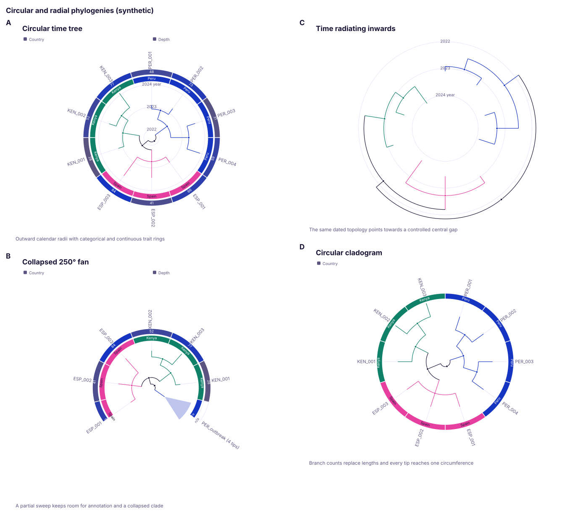
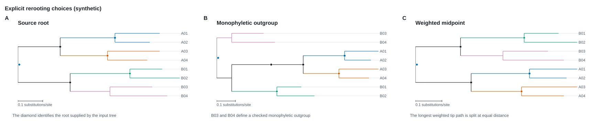
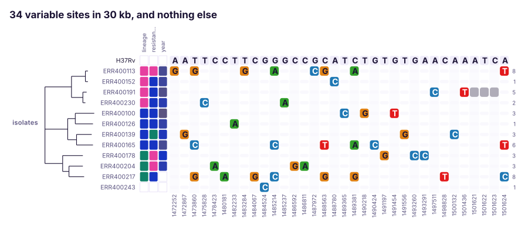
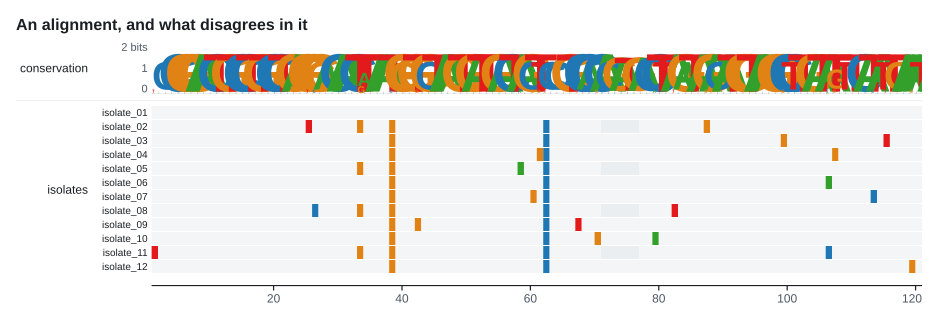
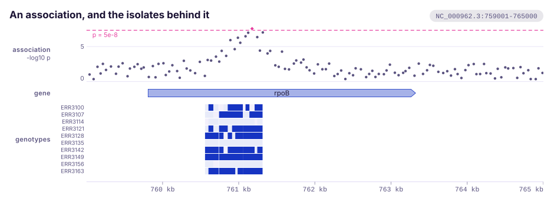

<div align="center">
  
  <h1>karyon</h1>
  <p><strong>Genomic track plots for Rust. Composable tracks over a shared coordinate axis, rendered to standalone SVG.</strong></p>

  <p>
    <a href="https://github.com/PathoGenOmics-Lab/karyon/actions/workflows/ci.yml"></a>
    <a href="LICENSE"></a>
    
    
    <a href="https://github.com/PathoGenOmics-Lab"></a>
  </p>
</div>

__Paula Ruiz-Rodriguez<sup>1</sup>__
__and Mireia Coscolla<sup>1</sup>__
<br>
<sub> 1. I<sup>2</sup>SysBio, University of Valencia-CSIC, FISABIO Joint Research Unit Infection and Public Health, Valencia, Spain </sub>

📖 **Full documentation: <https://pathogenomics-lab.github.io/karyon/>**

General plotting libraries know about points and lines. They do not know that a
position is a base, that a gene has a strand, that a pixel at genome scale
covers two thousand bases, or that a figure is worthless if its tracks do not
line up. `karyon` is the small amount of code that does know those things.

It draws what a genome browser draws: a stack of tracks over one shared
coordinate axis, so read depth, the reference bases, the gene models and the
variant calls all agree on where position 761,410 is.


Zoom in and the same tracks show individual bases. Nothing about the tracks
changes, only the region:


<details>
  <summary><strong>Explore the complete visual catalogue</strong></summary>
  
</details>

### One visual system

Named output profiles keep type, marks and density together, quantitative
tracks share one axis contract, and categories use shape or pattern as well as
colour. Panel sheets align the data origins even when their label gutters
differ.

```rust
use karyon::{QuantitativeAxis, ReferenceLine, RenderProfile};

plot("chr1:1-10000")?
    .profile(RenderProfile::Manuscript)
    .add_coverage(depth)
    .adjust(|track| track.axis(
        QuantitativeAxis::new()
            .range(0.0, 100.0)
            .unit("x")
            .reference(ReferenceLine::new(30.0).label("QC 30x")),
    ));
```


### Annotated phylogenies

Annotated Newick, BEAST, NHX and Nexus trees retain typed metadata. A tree can
be placed on calendar time, coloured by inherited branch annotations and
aligned to colour strips, heatmaps, bars, binary marks or shaped categories.
The same data can be drawn as a rectangular tree, complete circle, partial fan
or equal-angle unrooted view; named clades can collapse visually without
changing the source topology.

```rust
use karyon::{SupportStyle, TraitColumn, Tree, TreeTrack};

let tree = Tree::parse_annotated_newick(
    "(sample_A[&date=2024.25,country=Peru,coverage=48,mutation=rpoB-S450L]:0.2,\
      sample_B[&date=2024.50,country=Spain,coverage=73]:0.3);",
)?;
let track = TreeTrack::new(tree)
    .time("date")
    .time_unit("year")
    .color_by("country")
    .support_style(SupportStyle::SymbolsAndLabels)
    .branch_labels("mutation")
    .trait_column(
        TraitColumn::categorical("country")
            .label("Country")
            .ring_width(12.0),
    )
    .trait_column(TraitColumn::continuous("coverage").label("Depth"))
    .circular();
```



Phylograms can also expose support, branch-specific events and a true
branch-length scale in rectangular, circular and unrooted coordinates:


Rooting is explicit too: choose an internal node or name, validate a
monophyletic outgroup, or bisect the weighted tip diameter. Successful choices
can mark the selected root without changing pairwise tip distances.



The [phylogenetics guide](https://pathogenomics-lab.github.io/karyon/guide/phylogenetics/)
covers circular and fan geometry, unrooted trees, trait rings, visible support,
branch events, scale bars, node, outgroup and midpoint rerooting, MRCA queries,
rotation, ladderising, subtree extraction and the input guarantees for time
trees.

### Geographic genomics

`Map` draws supplied locations, counts and explicit flows under an
equirectangular, Mercator or orthographic projection. `PhyloMap` composes the
same offline world map with a circular tree, using one annotation such as
`country` to match terminal taxa to a unique coordinate table. Neither type is
a genomic track: both are complete drawings that can sit beside figures in a
`Panels` sheet.

```rust
use karyon::{GeoLocation, GeoProjection, PhyloMap, Tree};

let tree = Tree::parse_annotated_newick(
    "(sample_A[&country=Peru]:1,sample_B[&country=Spain]:1);",
)?;

let map = PhyloMap::new(tree)
    .location_by("country")
    .projection(GeoProjection::orthographic(15.0, -18.0))
    .coordinates([
        GeoLocation::new("Peru", -9.19, -75.0152),
        GeoLocation::new("Spain", 40.4637, -3.7492),
    ]);
```


Coordinates are never guessed or clamped. Duplicate place names, invalid
coordinates, unmapped tips and points outside an orthographic hemisphere are
counted visibly instead of disappearing. See the [geographic genomics
guide](https://pathogenomics-lab.github.io/karyon/guide/maps/) for projections,
flows, connector modes and the exact missing-data contract.

## Quick start

Not on crates.io yet, so point Cargo at the repository:

```toml
[dependencies]
karyon = { git = "https://github.com/PathoGenOmics-Lab/karyon" }
```

```rust
use karyon::{plot, Feature, Strand};

plot("NC_000962.3:761,000-763,000")?
    .title("rpoB locus")
    .add_coverage(depth)
    .label("depth")
    .add_features(vec![
        Feature::new(761_050, 762_100).name("rpoB").strand(Strand::Forward),
    ])
    .label("genes")
    .save("rpoB.svg")?;
```

One call per track, in the order they stack. The locus string is the 1-based
inclusive form samtools and IGV use, `add_coverage` takes its start from the
region, and the coordinate ruler goes on the bottom without being asked for. A
bad locus string is an error rather than a panic, and it converts into
`io::Error`, so the region and the file it renders to share one `?`.

The call after an `add_` still talks about the track it added, so `label` names
it and `adjust` hands it over for anything else:

```rust
    .add_coverage(depth)
    .label("depth")
    .adjust(|track| track.aggregate(Aggregate::Min).height(70.0))
```

The closure gets the concrete track, so every builder method on it is in reach
and a name that is not on that track fails to compile. Where the call sits is
not checked, though: an `adjust` written one `add_` too late configures the next
track instead.

A stack built in a loop or behind a condition needs every arm to have one type,
which is what `done` is for:

```rust
let mut figure = plot("chr2:1-4,000")?;
for (name, depth) in samples {
    figure = figure.add_coverage(depth).label(name).done();
}
```

Run the figures above yourself:

```bash
cargo run --example locus -- assets
```

### The layer underneath

`plot` builds a [`Figure`], and `Figure` is still the thing to reach for when a
track comes from an alternative constructor such as `WindowTrack::gc_skew` or
`SnpTrack::from_alignment`, or is read back before it is drawn: `panel.sites()`
and `ruler.span_of(450)` both want the track as a variable. `Plot::add_track`
takes a finished track without leaving the plot; `Figure` takes a whole stack of
them.

```rust
use karyon::{AxisTrack, CoverageTrack, Figure, Region};

Figure::new(Region::parse("NC_000962.3:761000-763000")?)
    .push(CoverageTrack::new(760_999, depth).label("depth"))
    .push(AxisTrack::new())
    .save_svg("rpoB.svg")?;
```

`Plot::into_figure` hands one over, which is how a plot feeds `Panels`. Neither
layer can do anything the other cannot; the difference is only how much has to
be written down.

[`Figure`]: https://docs.rs/karyon/latest/karyon/figure/struct.Figure.html

## From the shell

The same stack, without writing any Rust. Each track flag starts a track and
the flags after it describe that one, so **the order of the flags is the order
of the stack**. It is the same grammar with spaces instead of dots:

```bash
karyon NC_000962.3:761,000-763,000 \
  --coverage depth.bedgraph --label depth --aggregate min \
  --sequence H37Rv.fa \
  --features genes.gff3     --label annotation \
  --variants calls.vcf      --label variants \
  --title 'rpoB locus' -o rpoB.svg
```

Any track file may be `-` for standard input, which is how the binary formats
get in. They are not read here: `samtools` and `bcftools` already write exactly
what these readers take, so the pipeline is the parser.

```bash
samtools depth -a -r NC_000962.3:761000-763000 aln.bam \
  | karyon NC_000962.3:761,000-763,000 --coverage - --label depth -o rpoB.svg
```

Twelve of the thirty tracks have a standard text format to read, and those
are the ones the command has: `--coverage`, `--sequence`, `--features`,
`--variants`, `--windows`, `--manhattan`, `--tree`, `--msa`, `--snps`,
`--ideogram`, `--matrix` and `--pileup`, plus `--axis` for the ruler when it
should not sit at the bottom. The rest have no file to read from, so they stay
in the library. `karyon --help` is the whole grammar.

**Coordinates are read as each format defines them**, which is the one thing
here that would fail silently. BED, bedGraph and cytoBand are 0-based and
half-open. GFF3, VCF, SAM and `samtools depth` are 1-based. Both come out at
the same place in the figure, and every reader has a test that pins a known
base through the conversion.

## Tracks

| Track | What it draws | Notes |
|:------|:--------------|:------|
| `CoverageTrack` | Per-base signal: depth, GC content, mappability | Area, line or bars. Bins to one point per pixel with max, mean or min. Optional log scale |
| `SequenceTrack` | The reference bases | Letters when zoomed in, coloured blocks when not, a hint when the bases are thinner than a pixel |
| `FeatureTrack` | Genes, exons, repeats, primers | Strand arrows, automatic packing into rows so nothing overlaps, labels inside or beside |
| `VariantTrack` | SNPs, indels, any point event | Lollipops scaled by value, or ticks when dense. Coloured and legended by category |
| `TreeTrack` | A phylogeny | Newick, BEAST, NHX or Nexus in; node, outgroup or midpoint rooting; rectangular, circular, fan or unrooted output. Support, events, scale bars, node glyphs, clade fields and layered iTOL-style metadata remain independently readable |
| `SnpTrack` | Variable sites only | Invariant columns dropped and the rest spaced evenly, each carrying its own position |
| `MsaTrack` | A multiple sequence alignment | Differences against a reference row or a consensus, nucleotide or residue class colouring, optionally ordered by an adjacent tree |
| `DomainTrack` | Domains and motifs along sequences | Labelled interval architectures, optionally ordered by an adjacent tree so gains and losses form clade blocks |
| `DotplotTrack` | Two sequences on two axes | Alignment blocks as diagonals, anti-diagonals for inversions |
| `SyntenyTrack` | Two sequences on two bars | The same blocks as ribbons, which cross where the alignment does |
| `ManhattanTrack` | Association statistics | Points by significance, a threshold line, and hits coloured and ringed above it |
| `MatrixTrack` | Samples against sites | A genotype or presence matrix, one row per sample, names in the axis strip |
| `IdeogramTrack` | The whole chromosome | Cytogenetic bands, a pinched centromere, and a marker showing where the window is. The one track that does not share the x axis |
| `PileupTrack` | Aligned reads | Real CIGARs, packed into rows, mismatches painted against the reference, strand arrows, gaps and insertions |
| `LogoTrack` | Sequence logos | Seven scores, five of them against a background so symbols can hang below the baseline. Arbitrary alphabets |
| `AxisTrack` | The coordinate ruler | Round tick positions, one unit for the whole ruler, bp, kb or Mb as the zoom demands |
| `CodonTrack` | A coding sequence in codons | Numbered codons, translated where a letter fits, counted from the far end on the reverse strand. The ruler that lets a figure be pointed at as S450L |
| `SplitReadTrack` | Reads that align in pieces | One row per molecule, one bar per alignment, connectors saying in what order and orientation it visited them. Backward hops dip below the row |
| `CladeTrack` | Intervals that belong to a branch | A block whose width is a coordinate span and whose height is a clade. Rows inside it that do not carry it are cut out |
| `TranscriptionUnitTrack` | Transcription units | Bent arrow at the start site, hollow 5' leader, hairpin or bar at the terminator. Leaderless transcripts are a different picture, not a different label |
| `StructuralTrack` | Structural variants | Arcs between breakpoints, arch height by span, stroke weight by supporting reads |
| `OrfTrack` | The six reading frames | Stops as marks, open stretches as bars, frame numbers in the axis strip |
| `TanglegramTrack` | Two trees over one collection | Tips joined across the middle, crossings counted and coloured. The count is not a statistic and the docs say so |
| `BisulfiteTrack` | Methylation per molecule | One row per read, filled and open circles per cytosine, nothing where a read did not reach. Confetti against stripes |
| `MethylationTrack` | Methylation per site | One lane per strand, faded by read depth, hemimethylated sites available as a query |
| `SquiggleTrack` | Raw nanopore current | Min to max envelope per pixel column, resolving into the trace when zoomed in, with the basecaller move table |
| `LocusTrack` | One locus across several genomes | Gene arrows joined by identity ribbons, genes with no homolog outlined |
| `WindowTrack` | Windowed signed statistics | pN/pS, GC skew, Tajima's D: coloured by which side of the baseline they fall |
| `GenomeTrack` | Several sequences end to end | Alternating blocks with names, so a whole assembly can share one axis |
| `LegendTrack` | A legend | Wraps onto extra rows rather than dropping a key |

Each is an implementation of one trait with no privileged access to the figure.
A track type that is not here is about thirty lines: see the example on
[`Track`](src/track/mod.rs).

## Only what differs



An alignment of closely related genomes is almost entirely agreement. In the
figure above, thirty kilobases carry thirty-four differences: a plot of all
thirty thousand columns would spend 99.9% of its pixels on the part that says
nothing.

The tree on the left is not decoration. **Its leaf order is the row order**, so
a clade's shared substitutions line up into a block instead of being scattered
down the panel in whatever order the samples happened to be listed. That block
is usually the finding:

```rust
use karyon::{SnpTrack, tree::Tree};

let tree = Tree::parse_newick("((ERR01:0.01,ERR02:0.012)0.98:0.04,ERR03:0.06);")?;
let panel = SnpTrack::from_alignment(0, &alignment).tree(tree);
```

Rows are matched to leaves by name. A sample the tree does not mention keeps its
place at the bottom rather than vanishing, because a row silently dropped from a
figure is worse than a row out of order.

`SnpTrack` throws the invariant columns away and spaces what is left evenly.
The idea is the one [snipit](https://github.com/aineniamh/snipit) is built
around; the implementation and the drawing here are this crate's own.

```rust
use karyon::{Region, SnpTrack};

let panel = SnpTrack::from_alignment(0, &alignment).offset(1_472_000);
let region = Region::new("sites", 0, panel.sites().len() as u64)?;
```

**The trade is that the x axis stops being linear in the genome.** Two adjacent
columns may be nine bases apart or nine kilobases apart, and the spacing says
nothing about which. That is why every column carries its own position turned on
end underneath, and why an `AxisTrack` does not belong under this panel: a ruler
there would be a lie.

The rest is reading aid. A cell that matches the reference is a quiet bar rather
than a letter, because the matches are the noise; the reference row runs along
the top; alternating columns are tinted so the eye can cross a wide panel; and
each row carries its own count of differences on the right.

## Alignments



**The coordinates are alignment columns, not genomic positions.** They are two
different things, so the region spans the width of the alignment and the ruler
counts columns. Ungapping a row back to reference coordinates is a real
operation with real decisions in it, and this crate does not do it behind your
back.

A wall of coloured residues is pretty and says very little, because in a real
alignment most cells agree and the agreement is the noise. So the default is
`MsaDisplay::Differences`: rows are a quiet bar and only what disagrees with the
comparison row gets painted. Compare against a named row when one of them is the
reference, or leave it and the consensus is used.

```rust
use karyon::{LogoTrack, MsaSequence, MsaTrack};

let rows = vec![MsaSequence::new("H37Rv", b"ACGTACGT".to_vec())];

MsaTrack::new(rows).compare_to(0);

// Conservation belongs above the alignment, not inside it, and takes the same
// sequences.
LogoTrack::from_sequences(0, &alignment_as_strings).alphabet_size(4).stabilize();
```

Protein alignments colour by physicochemical class, six of them, which is how
many hues the validated palette has: cysteine sits with the hydrophobics,
histidine with the positives, tyrosine with the polars, and glycine and proline
keep their own, since those two are usually what a reader is hunting for.


Neighbouring cells of the same colour are merged into one rectangle. Most of an
alignment agrees with itself, so in the figure above twelve rows of a hundred
and twenty columns come out as a hundred and twelve rectangles rather than one
thousand four hundred and forty. That is the difference between a figure and a
file no viewer will open.

## Comparing two sequences


One set of `AlignmentBlock`s, drawn two ways, because the two answer different
halves of the question. A dotplot gives the second sequence the vertical axis,
so a rearrangement has a shape: forward blocks climb, reversed ones descend, and
a translocation sits off the main diagonal. Ribbons give it a second bar, which
is compact and follows one block at a time, and an inversion becomes a twist.

```rust
use karyon::{AlignmentBlock, DotplotTrack, SyntenyTrack};

// Both spans ascend and the strand is a flag, which is how PAF records it.
let blocks = vec![
    AlignmentBlock::new(1_520_000, 2_100_000, 1_520_000, 2_100_000)
        .reversed(true)
        .identity(0.97),
];

DotplotTrack::new(blocks.clone()).target_length(4_380_000);
SyntenyTrack::new(blocks).target_length(4_380_000).names("H37Rv", "CDC1551");
```

The figure's region is always the query; the target keeps its own scale, either
the whole sequence or a `target_range`. Ribbons are translucent so that two
crossing ones read as two, and each block is also drawn solid on both bars, so a
thin ribbon still shows exactly what it connects.

## Association, and who carries it

A Manhattan panel says where the signal is. The question it always provokes is
who carries it, and that is a matrix: one row per isolate, one column per site.
Both share the figure's x axis, so the haplotype block sits under its own tower.



```rust
use karyon::{Association, CellScale, ManhattanTrack, MatrixRow, MatrixTrack};

ManhattanTrack::new(vec![Association::from_p_value(761_155, 8.1e-9)])
    .genome_wide_threshold()          // -log10(5e-8), and see the caveat below
    .unit(" -log10 p");

MatrixTrack::new(sites, vec![MatrixRow::new("ERR3100", genotypes)]);
```

`genome_wide_threshold` is a Bonferroni correction for a million independent
tests. It is the convention in human GWAS and frequently the wrong number
everywhere else, because what it should be follows from how many independent
tests were really run: a shorter genome, or stronger linkage between
neighbouring sites, leaves far fewer than a million. Set your own with
`threshold` if you know it.

In a matrix, three things have to look different: a sample that does not carry
the allele, a sample that was never typed, and empty page. So the sequential
ramp starts a step off the surface rather than on it, and missing data has its
own grey. `f64::NAN` is missing; zero is a genotype.

## Where am I


`IdeogramTrack` is the one track that **deliberately ignores the shared axis**.
Every other track maps its data through the same `Scale`, which is what keeps
their x axes aligned. An ideogram exists to answer "where am I", and a track
that only showed the region on display could not answer it: it would be a
picture of the window, drawn inside the window. So it draws the whole
chromosome across the plotting area and marks the region on it.

```rust
use karyon::{Band, IdeogramTrack, Stain};

// A row of the UCSC cytoBand table converts without a lookup table of your own.
let bands = vec![Band::new(0, 2_300_000, Stain::from_name("gneg")).name("p13")];

IdeogramTrack::new(chromosome_length, bands).show_band_names(true);
```

The grey ladder is mixed from the theme's own ink and page, so a dark figure
gets a dark ladder rather than a light one somebody forgot to invert. A tiny
window gets a marker with a minimum width, because a pointer too thin to see is
neither a pointer nor a measurement.

Most sequences have no cytogenetics to speak of: plasmids, organelle genomes,
viruses, draft assemblies and bacterial chromosomes among them.
`IdeogramTrack::bare` gives an outline instead. It still answers the only
question the track was ever asked:


## Protein coordinates


A variant in a coding sequence is named by residue rather than by base: BRAF
V600E, TP53 R175H, rpoB S450L. A figure drawn in bases cannot be pointed at with
any of those names.

`CodonTrack` is the `AxisTrack` that can. It partitions a coding sequence into
codons, numbers them, and translates them where there is room for a letter, so
the lollipop for S450L sits over a cell that says S and is labelled 450.

The partition is the claim. Two changes at different bases of one codon are
competing alleles at one residue, not a double mutant, and two changes in
neighbouring codons are two substitutions however few bases apart they are.
Neither statement can be made on a ruler of bases.

On the reverse strand codon 1 sits at the **highest** coordinate and the
numbering runs right to left, which is the whole reason this is a track and not
a division by three. Roughly half the coding sequences in any annotation run
backwards, and getting their numbering wrong is silent: the figure still draws,
it just names the wrong residue.

Translation is NCBI table 1, and table 11 gives the same residues, so bacteria,
archaea and plastids need nothing. `genetic_code` takes any other table in the
same form, which is what a mitochondrial or ciliate sequence needs to avoid
being translated into a plausible protein that is wrong.

```rust
let ruler = CodonTrack::new(759_806, 763_325, Strand::Forward).sequence(from, bases);
assert_eq!(ruler.codon_of(761_154), Some(450));
assert_eq!(ruler.residue_of(450), Some(b'S'));
```

## Read pileups

This is the track you open when a variant call looks wrong.


A read is not an interval, so `PileupTrack` takes a real CIGAR and walks it.
Only some operations advance along the reference, which is what puts a
mismatched base at the right position when there is an insertion upstream of it:

```rust
use karyon::{CigarOp, PileupTrack, Read, ReadColoring, Strand};

let read = Read::new(4_120, vec![
        CigarOp::SoftClip(5),
        CigarOp::Match(60),
        CigarOp::Deletion(6),
        CigarOp::Match(45),
    ])
    .sequence(bases)          // SAM SEQ, soft clipped bases included
    .strand(Strand::Forward)
    .mapping_quality(60);

PileupTrack::new(reads)
    .reference(4_000, reference)   // without this, no mismatch can be found
    .coloring(ReadColoring::Strand)
    .fade_by_quality(true)
    .max_rows(Some(30));
```

Everything a SAM record carries has somewhere to go: `M`, `=` and `X` all
become `Match` and the track compares the sequences itself rather than trusting
the operation; `I`, `D`, `N`, `S` and `H` each consume what the specification
says they consume. A deletion draws as a line across the gap, an insertion as
its own mark, a skip as a thin intron line.

Two defaults worth knowing. A pileup at thousandfold depth is a thousand rows
tall and useful to nobody, so it stops at forty rows and prints how many reads
that hid rather than dropping them quietly. And mismatches are only hunted once
a base is worth at least a fifth of a pixel, because below that finding one
would mean walking every base of every read to draw something invisible.

## Sequence logos

A classic logo can only say "this symbol is common here". It measures
conservation, so a column that is nearly uniform comes out flat, and the
biology hiding in that column stays hidden.

`LogoTrack` draws the classic logo and the alternative. `LogoTrack::edlogo()`
scores each symbol as `log2(p / q)` against a background and recentres the
column on its own median, so enriched symbols stack above the line and depleted
ones hang below it. This is the plot
[Logolas](https://github.com/kkdey/Logolas) calls an EDLogo.


Look at position 4. It is near uniform, so the bits panel says there is nothing
there, and it has no T at all, which only the third panel can tell you.

```rust
use karyon::{Figure, LogoTrack, Region};

let logo = LogoTrack::from_sequences(0, &alignment)
    .alphabet_size(4)                              // count the bases that never appear
    .edlogo()
    .background([("A", 0.35), ("C", 0.15), ("G", 0.15), ("T", 0.35)])
    .label("motif");

Figure::new(Region::new("motif", 0, 8)?)
    .push(logo)
    .save_svg("motif.svg")?;
```

Symbols are arbitrary strings, so an alphabet is not limited to four letters or
to one character each:


### Scores

A logo has to decide what a letter's height means. `LogoScore` offers seven
answers, and the five that compare against a background are the ones that can
put a symbol below the line. They follow the scoring schemes of Logolas.

| Score | Height | Answers |
|:------|:-------|:--------|
| `Probability` | `p` | what is here |
| `InformationContent` | `p (log2 K - H)` | how conserved is this position |
| `LogOdds` | `log2(p / q)` | how many doublings from the background |
| `KullbackLeibler` | `p log2(p / q)` | how much this symbol contributes to the divergence |
| `Difference` | `p - q` | how many percentage points of surplus |
| `Ratio` | `p / q` | how many times the background |
| `OddsRatio` | `log2(p/(1-p)) - log2(q/(1-q))` | how the odds shift |

They are not interchangeable, and the gap between them is widest exactly where
a symbol is absent:


Position 1 has no T and nothing else going on; position 4 carries a real
gradient. Log odds is dominated by the first, because an absent symbol has an
enormous log odds. Weighting by probability turns that into the
`KullbackLeibler` panel, where the same missing T drops to -0.15 bits and the
real signal becomes the tallest thing on the plot. Neither is wrong. They
answer different questions, and the second is the one to reach for when a
handful of absent symbols would otherwise flatten the figure.

Where the baseline sits is a separate choice. `Centering::Quantile(0.5)` is the
median and the default, matching Logolas; `Centering::None` leaves the baseline
at "exactly the background".

### How much of it should you believe

A logo drawn from four sequences and a logo drawn from four thousand look
identical. Four sequences that happen to agree at a position produce a
perfectly conserved column, two full bits, with no hint that the evidence is
thin. That is not a plotting problem, it is an estimation problem.

`LogoTrack::stabilize()` shrinks each column towards the background before
anything is drawn, by the Dirichlet adaptive shrinkage of the Logolas paper.
Each column of counts is modelled as multinomial with a prior that is a mixture
of Dirichlet distributions, all centred on the background and differing only in
how tightly. The mixture weights are fitted across every column at once, which
is what makes it empirical Bayes rather than a guess: a well sampled position
overrules the prior and barely moves, a thin one is pulled most of the way home.


The proportions are identical in all six panels. The raw ones cannot tell five
sequences from five hundred, and the shrunk ones can.

```rust
let logo = LogoTrack::from_sequences(0, &alignment)
    .alphabet_size(4)
    .stabilize();

// The shrinkage is reportable, not a black box.
let fit = logo.dash_fit().unwrap();
println!("weight on the null component: {:.2}", fit.weights[0]);
println!("column 1 moved {:.0}% of the way to the background", fit.shrinkage(0) * 100.0);
```

Two things follow from turning it on. It needs **counts**, so a track built from
a probability matrix must also be told its `sample_size`, since a matrix of
probabilities carries no record of the alignment it came from. And `smoothing`
stops being applied, because the shrunk composition already has no zeros in it.

The fitter is available on its own as `karyon::dash::Dash` for any compositional
data, logo or not.

Two more things are worth knowing. `LogoTrack::smoothing` sets how far an
absent symbol can fall, and it is a fraction of the column mass rather than a
pseudocount, so the same motif plots identically whether you pass counts out of
500 or a probability matrix. And the two absolute scores get a fixed axis:
information content always runs from zero to `log2(K)`, the way WebLogo draws
DNA from zero to two bits, so two figures of two motifs stay comparable.

## Colour

Both palettes were run through a colour vision validator rather than chosen by
eye, and the numbers decided the outcome.

The categorical palette stops at **six hues** because that is where the
measurement stopped, not where the eye got bored: a seventh could not be added
without some pair collapsing, and an olive against the vermillion came out 1.8
apart under protanopia on a scale whose floor is 8. The dark theme is a
**selected set of steps, not an inversion** of the light one, because a dark
background wants a narrower lightness band and half of a flipped palette lands
outside it.


Nucleotides are the honest exception. `BaseColors::conventional()` is the IGV
convention and the default, because a figure that recolours the bases surprises
every reader. It is also not safe: measured pairwise, **adenine and guanine sit
1.7 apart under protanopia**, and that is the transition pair, the commonest
substitution there is. `BaseColors::colorblind_safe()` fixes it, with a closest
pair of 11.0, at the cost of green no longer meaning what a reader expects:

```rust
use karyon::{BaseColors, Theme};

let mut theme = Theme::light();
theme.bases = BaseColors::colorblind_safe();
```

## Coordinates

Positions are **0-based and half-open** everywhere, the BED convention. The two
exceptions are the ones a reader sees: `Region::parse` accepts the 1-based
inclusive locus strings that samtools and IGV use, and tick labels are printed
in that same form.

```rust
let region = Region::parse("chr1:101-200")?; // what you type in IGV
assert_eq!(region.start(), 100);             // 0-based
assert_eq!(region.end(), 200);               // exclusive
assert_eq!(region.len(), 100);
```

A VCF `POS` or a GFF `start` is therefore `pos - 1` on the way in. This is the
single most common source of off-by-one bugs in genomic plotting, so the crate
states the convention on every constructor rather than leaving it to be
guessed.

## Design

**Every track lives on the genomic axis.** That is the entry test, and it is
what separates this crate from a general plotting library. If a track's `draw`
never reads the shared scale, its x is a sample list or a count and the plot is
a bar chart, a line chart or a heatmap that happened to be handed genomic data,
which matplotlib already draws better. Three tracks were removed under this rule
rather than kept for the sake of a longer feature list.

**Zero runtime dependencies.** The crate compiles in under a second and adds
nothing to your dependency tree. The SVG writer is a few hundred lines because
that is all this needs.

**Scale aware by construction.** A coverage track over four megabases does not
emit four million points; it bins to one value per pixel column, choosing max,
mean or min. A sequence track past single-base resolution draws a hint instead
of a million rectangles. A 4 Mb genome-wide figure comes out under 100 KB, which
is checked by a test.

**Output that survives publication.** Plain SVG 1.1, no scripts, no external
references, no embedded fonts. It opens unchanged in a browser, in Inkscape and
in Illustrator, and every element stays selectable when a reviewer asks for the
gene labels to be bigger.

**Deterministic.** The same input renders byte-identical output, and category
colours follow first appearance rather than hash order. A figure that recolours
itself when a sample is added is not one you can put in a paper.

**No file parsing in the library.** `karyon` the crate takes vectors of numbers
and structs, not paths. Reading genomic formats is a solved problem that
[noodles](https://github.com/zaeleus/noodles) and
[rust-bio](https://github.com/rust-bio/rust-bio) solve better, and keeping them
out is what makes the dependency count zero. `karyon` the command reads files,
but only line based text ones, and it lives in its own binary target so
`cargo add karyon` still brings in nothing.

## Roadmap

Not implemented yet, in the order they are likely to arrive:

- A figure-level highlight and mask, one column running through every track, so a
  masked region is visible as a mask rather than as an absence of variants
- PNG output, likely behind a feature flag so the default stays dependency-free

## Installation

```bash
git clone https://github.com/PathoGenOmics-Lab/karyon
cd karyon
cargo test
```

The command line front end installs from the same repository:

```bash
cargo install --git https://github.com/PathoGenOmics-Lab/karyon
```

Nothing is published to crates.io yet. `cargo add karyon` will work once 0.1.0
is released there.

## License

MIT. See [LICENSE](LICENSE).

A plotting library is meant to be a dependency, and a copyleft one cannot be
used by a tool that is not itself copyleft. The formats it sits beside are
permissive for the same reason: noodles and rust-bio are both MIT.

---
<h2 id="contributors" align="center">

✨ [Contributors](https://github.com/PathoGenOmics-Lab/karyon/graphs/contributors)
</h2>

<!-- ALL-CONTRIBUTORS-LIST:START - Do not remove or modify this section -->
<!-- prettier-ignore-start -->
<!-- markdownlint-disable -->
<div align="center">
karyon is developed with ❤️ by:
<table>
  <tr>
    <td align="center">
      <a href="https://github.com/paururo">
        
        <br />
        <sub><b>Paula Ruiz-Rodriguez</b></sub>
      </a>
      <br />
      <a href="" title="Code">💻</a>
      <a href="" title="Research">🔬</a>
      <a href="" title="Ideas">🤔</a>
      <a href="" title="Data">🔣</a>
      <a href="" title="Desing">🎨</a>
      <a href="" title="Tool">🔧</a>
    </td>
    <td align="center">
      <a href="https://github.com/mireiacoscolla">
        
        <br />
        <sub><b>Mireia Coscolla</b></sub>
      </a>
      <br />
      <a href="https://www.uv.es/instituto-biologia-integrativa-sistemas-i2sysbio/es/investigacion/proyectos/proyectos-actuales/mol-tb-host-1286169137294/ProjecteInves.html?id=1286289780236" title="Funding/Grant Finders">🔍</a>
      <a href="" title="Ideas">🤔</a>
      <a href="" title="Mentoring">🧑‍🏫</a>
      <a href="" title="Research">🔬</a>
      <a href="" title="User Testing">📓</a>
    </td>
  </tr>
</table>

This project follows the [all-contributors](https://github.com/all-contributors/all-contributors) specification ([emoji key](https://allcontributors.org/docs/en/emoji-key)).
</div>
<!-- markdownlint-restore -->
<!-- prettier-ignore-end -->
<!-- ALL-CONTRIBUTORS-LIST:END -->
