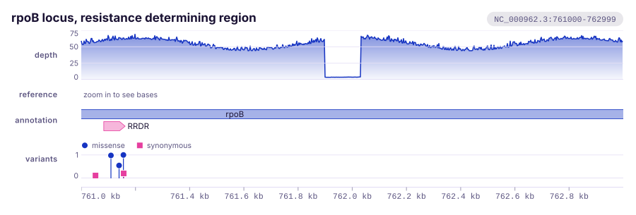

<div align="center">
  
  <h1>karyon</h1>
  <p><strong>Genomic track plots for Rust. Composable tracks over a shared coordinate axis, rendered to standalone SVG.</strong></p>

  <p>
    <a href="https://github.com/PathoGenOmics-Lab/karyon/actions/workflows/ci.yml"></a>
    <a href="LICENSE"></a>
    
    
    <a href="https://github.com/PathoGenOmics-Lab"></a>
  </p>

  <h3>
    <a href="https://pathogenomics-lab.github.io/karyon/">Documentation</a>
    &nbsp;·&nbsp;
    <a href="https://pathogenomics-lab.github.io/karyon/playground/">Playground</a>
    &nbsp;·&nbsp;
    <a href="https://pathogenomics-lab.github.io/karyon/getting-started/quickstart/">Quick start</a>
    &nbsp;·&nbsp;
    <a href="https://pathogenomics-lab.github.io/karyon/plots/">Plot catalogue</a>
    &nbsp;·&nbsp;
    <a href="https://pathogenomics-lab.github.io/karyon/tracks/">Track reference</a>
  </h3>
</div>

__Paula Ruiz-Rodriguez<sup>1</sup>__
__and Mireia Coscolla<sup>1</sup>__
<br>
<sub> 1. I<sup>2</sup>SysBio, University of Valencia-CSIC, FISABIO Joint Research Unit Infection and Public Health, Valencia, Spain </sub>

General plotting libraries know about points and lines. They do not know that a
position is a base, that a gene has a strand, that a pixel at genome scale
covers two thousand bases, or that a figure is worthless if its tracks do not
line up. `karyon` is the small amount of code that does know those things.

It draws what a genome browser draws: a stack of tracks over one shared
coordinate axis, so read depth, the reference bases, the gene models and the
variant calls all agree on where position 761,410 is.



Zoom in and the same tracks show individual bases. Nothing about the tracks
changes, only the region:


That figure is this much code:

```rust
use karyon::{plot, Feature, Strand, Variant};

let svg = plot("NC_000962.3:761000-761200")?
    .title("rpoB resistance determining region")
    .add_coverage(depth).label("depth")
    .add_sequence(bases).label("reference")
    .add_features(genes).label("genes")
    .add_variants(calls).label("variants")
    .to_svg();
```

Thirty-three track types compose that way, over one region, in the order you
write them. No runtime dependencies, no I/O beyond an optional `save_svg`, and
plain SVG 1.1 that opens unchanged in a browser, in Inkscape and in Illustrator.

<details>
  <summary><strong>Every kind of plot it draws, on one sheet</strong></summary>
  <br>
  
</details>

## Where to go

The documentation is the manual; this page is the front door.

| If you want to | Go to |
| --- | --- |
| try it without installing anything | [Playground](https://pathogenomics-lab.github.io/karyon/playground/), which is this crate compiled to WebAssembly and running in your own browser |
| draw something in the next five minutes | [Quick start](https://pathogenomics-lab.github.io/karyon/getting-started/quickstart/) |
| find the plot that fits your data | [Plot catalogue](https://pathogenomics-lab.github.io/karyon/plots/), which sorts all thirty-three tracks by biological question rather than by type name |
| look up one track's exact API | [Track reference](https://pathogenomics-lab.github.io/karyon/tracks/) |
| read files instead of building vectors | [File formats](https://pathogenomics-lab.github.io/karyon/guide/formats/): BED, bedGraph, GFF3, VCF, SAM, cytoBand, `samtools depth`, FASTA and Newick |
| draw trees, traits, support or dN/dS | [Phylogenetics](https://pathogenomics-lab.github.io/karyon/guide/phylogenetics/) |
| put samples on a map | [Geographic genomics](https://pathogenomics-lab.github.io/karyon/guide/maps/) |
| make it match the rest of your figures | [Theming](https://pathogenomics-lab.github.io/karyon/guide/theming/) and the [visual system](https://pathogenomics-lab.github.io/karyon/guide/visual-system/) |
| use it from a shell instead of Rust | [Command line](https://pathogenomics-lab.github.io/karyon/guide/cli/) |
| know why a base lands where it does | [Coordinates](https://pathogenomics-lab.github.io/karyon/how-it-works/coordinates/), which is the one thing worth reading before trusting a figure |
| add a track type it lacks | [Extending](https://pathogenomics-lab.github.io/karyon/how-it-works/extending/), which is about thirty lines |
| copy a whole worked figure | [Recipes](https://pathogenomics-lab.github.io/karyon/recipes/) |

## Coordinates, in one paragraph

Positions are **0-based and half-open** everywhere, the BED convention. The two
exceptions are the ones a reader sees: locus strings such as
`NC_000962.3:761,000-763,000` are 1-based and inclusive, as samtools and IGV
write them, and tick labels are printed the same way. `karyon::read` does that
subtraction for you, and a property in the test suite checks that the same
interval written as BED and as GFF3 comes back as the same two numbers. The
[coordinates page](https://pathogenomics-lab.github.io/karyon/how-it-works/coordinates/)
is the long version.

## Installation

```bash
cargo install --git https://github.com/PathoGenOmics-Lab/karyon
```

Or as a library, until it is published to crates.io:

```toml
[dependencies]
karyon = { git = "https://github.com/PathoGenOmics-Lab/karyon" }
```

Building from source needs nothing but a Rust toolchain, 1.74 or newer:

```bash
git clone https://github.com/PathoGenOmics-Lab/karyon
cd karyon
cargo test
```

## Roadmap

Not implemented yet, in the order they are likely to arrive:

- A figure-level highlight and mask, one column running through every track, so a
  masked region is visible as a mask rather than as an absence of variants
- PNG output, likely behind a feature flag so the default stays dependency-free
- A release on crates.io

## Contributing

Bug reports, questions and pull requests are all welcome. The
[contributing guide](https://pathogenomics-lab.github.io/karyon/about/contributing/)
says what a change needs before it can be merged, and
[Q&A](https://github.com/PathoGenOmics-Lab/karyon/discussions/categories/q-a) is
the place for anything that is a question rather than a defect.

## Citation

Please cite the tool and the formats it reads. The
[citation page](https://pathogenomics-lab.github.io/karyon/about/citation/) has
both.

## License

MIT. See [LICENSE](LICENSE).

A plotting library is meant to be a dependency, and a copyleft one cannot be
used by a tool that is not itself copyleft. The formats it sits beside are
permissive for the same reason: noodles and rust-bio are both MIT.

---
<h2 id="contributors" align="center">

✨ [Contributors](https://github.com/PathoGenOmics-Lab/karyon/graphs/contributors)
</h2>

<!-- ALL-CONTRIBUTORS-LIST:START - Do not remove or modify this section -->
<!-- prettier-ignore-start -->
<!-- markdownlint-disable -->
<div align="center">
karyon is developed with ❤️ by:
<table>
  <tr>
    <td align="center">
      <a href="https://github.com/paururo">
        
        <br />
        <sub><b>Paula Ruiz-Rodriguez</b></sub>
      </a>
      <br />
      <a href="" title="Code">💻</a>
      <a href="" title="Research">🔬</a>
      <a href="" title="Ideas">🤔</a>
      <a href="" title="Data">🔣</a>
      <a href="" title="Desing">🎨</a>
      <a href="" title="Tool">🔧</a>
    </td>
    <td align="center">
      <a href="https://github.com/mireiacoscolla">
        
        <br />
        <sub><b>Mireia Coscolla</b></sub>
      </a>
      <br />
      <a href="https://www.uv.es/instituto-biologia-integrativa-sistemas-i2sysbio/es/investigacion/proyectos/proyectos-actuales/mol-tb-host-1286169137294/ProjecteInves.html?id=1286289780236" title="Funding/Grant Finders">🔍</a>
      <a href="" title="Ideas">🤔</a>
      <a href="" title="Mentoring">🧑‍🏫</a>
      <a href="" title="Research">🔬</a>
      <a href="" title="User Testing">📓</a>
    </td>
  </tr>
</table>

This project follows the [all-contributors](https://github.com/all-contributors/all-contributors) specification ([emoji key](https://allcontributors.org/docs/en/emoji-key)).
</div>
<!-- markdownlint-restore -->
<!-- prettier-ignore-end -->
<!-- ALL-CONTRIBUTORS-LIST:END -->
