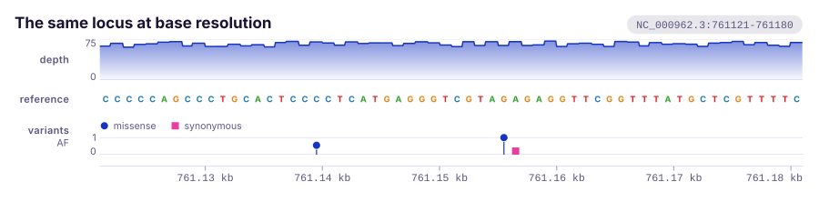

# Quickstart

The shortest path to a figure, twice: once from Rust, once from the shell.
Both build the same thing, a stack of tracks over one shared coordinate axis
written out as a standalone SVG, and neither needs anything installed beyond a
Rust toolchain.

## From Rust

With the dependency added as in [Installation](installation.md):

```toml
[dependencies]
karyon = { git = "https://github.com/PathoGenOmics-Lab/karyon" }
```

this is a whole program:

```rust
use karyon::{plot, Aggregate, Feature, Strand, Variant};

fn main() -> std::io::Result<()> {
    // One value per base of the window, however you got it. The dip is the
    // shape a deletion leaves behind.
    let depth: Vec<f64> = (0..2_000)
        .map(|i| if (900..1_030).contains(&i) { 3.0 } else { 55.0 - (i % 23) as f64 })
        .collect();
    let bases: Vec<u8> = b"ACGT".iter().cycle().take(2_000).copied().collect();

    plot("NC_000962.3:761000-762999")?
        .title("rpoB locus, resistance determining region")
        .add_coverage(depth)
        .label("depth")
        .adjust(|track| track.aggregate(Aggregate::Min).height(70.0))
        .add_sequence(bases)
        .label("reference")
        .add_features(vec![
            Feature::new(759_806, 763_325)
                .name("rpoB")
                .strand(Strand::Forward),
            Feature::new(761_081, 761_162)
                .name("RRDR")
                .strand(Strand::Forward)
                .color("#d55e00"),
        ])
        .label("annotation")
        .add_variants(vec![
            Variant::new(761_108).value(0.98).category("missense"),
            Variant::new(761_154).value(1.00).category("missense"),
            Variant::new(761_155).value(0.21).category("synonymous"),
        ])
        .label("variants")
        .save("rpoB.svg")?;

    Ok(())
}
```

`cargo run` writes `rpoB.svg`:


Six things about that program are worth naming.

**One call per track, in the order they stack.** `add_coverage` is the top of
the figure because it is first. There is no layout to describe: a track says
how tall it wants to be, and the figure stacks the bands and hands each one the
rectangle it may paint in, already clipped. Every one of them maps its data
through the same scale, which is what keeps their x axes lined up.

**The region is held once.** `add_coverage` takes a plain array and lays it from
the left edge of the window, so the start is not repeated on every track. When
an array starts somewhere else, the `_at` form takes that start.

**`label` and `adjust` still talk about the track just added.** `label` names it
in the left gutter, and `adjust` hands the concrete track to a closure, so every
builder method on it is in reach and a name that is not on that track fails to
compile. Here it asks the coverage track for `Aggregate::Min`, because at two
and a half bases per pixel a dropout is the thing worth not smoothing away.

**The ruler is filled in.** A figure without coordinates along it is rarely what
anyone meant, so an axis goes on the bottom. `add_axis` puts one somewhere else
and `remove_axis` leaves it out.

**The region and the file fail the same way.** A bad locus string is an error
rather than a panic, and it converts into `io::Error`, so both of the `?` above
work in a function that returns `io::Result`.

**Nothing was drawn that could not be seen.** Two thousand bases over 788
pixels of plotting area is two and a half bases per pixel, so the coverage
track bins to one value per column and the sequence track prints a hint rather
than two thousand rectangles nobody could read. Zooming in is a smaller region
and no other change.

!!! warning "Coordinates"
    The locus string is the 1-based inclusive form samtools and IGV use, and so
    are the tick labels. Everything else is **0-based and half-open**, the BED
    convention: `rpoB` is 1-based 759,807 to 763,325 in the annotation, so it is
    `Feature::new(759_806, 763_325)` here, and the S450L call at VCF `POS`
    761,155 is `Variant::new(761_154)`. A VCF `POS` or a GFF `start` is `pos - 1`
    on the way in.

`to_svg()` hands back the string instead of writing a file, which is what a web
service or a test wants. `save` gives the plot back, so one stack can be
rendered twice, once per theme.

The region is a coordinate system rather than a claim about a genome. An
alignment is indexed by column and a raw signal by sample, so
`plot("alignment:1-320")` is as good a region as a locus is, and the ruler
counts whatever the region counts.

## From the shell

The command line front end installs from the same repository:

```bash
cargo install --git https://github.com/PathoGenOmics-Lab/karyon
```

It is the same grammar with spaces instead of dots. Each track flag starts a
track and the flags after it describe that one, so **the order of the flags is
the order of the stack**:

```bash
karyon NC_000962.3:761,121-761,180 \
  --coverage depth.txt  --label depth     --height 45 \
  --sequence H37Rv.fa   --label reference \
  --variants calls.vcf  --label variants  --height 40 \
  --title 'The same locus at base resolution' \
  -o rpoB-zoom.svg
```



`depth.txt` is what `samtools depth` writes, `H37Rv.fa` is the reference and
`calls.vcf` is a VCF. **Each is read as its own format defines coordinates**:
BED, bedGraph and cytoBand 0-based and half-open, GFF3, VCF, SAM and
`samtools depth` 1-based. Both come out at the same place in the figure, and
every reader has a test pinning a known base through the conversion.

The keys in the variant legend come from the `ANN` or `BCSQ` consequence when
the VCF carries one, and otherwise from the shape of the call, which is `REF`
against `ALT` and needs no annotation: a substitution, an insertion or a
deletion.

Without `-o` the SVG goes to standard output. `karyon --help` prints the whole
grammar, which is twelve track flags and the ruler.

!!! note "A FASTA is read from its own first base"
    `--sequence` wants the reference the window is cut out of, not the window.
    Byte *n* of the record is the base at 0-based position *n*, so a FASTA
    holding only the sixty bases on display would place them at positions 0 to
    59 and the track would come out empty.

BAM, CRAM and BCF are not read here. They arrive through a pipe, since
`samtools` and `bcftools` already write exactly what these readers take, so the
pipeline is the parser. Any track file may be `-`, and one track may take it:

```bash
samtools depth -a -r NC_000962.3:761000-763000 aln.bam \
  | karyon NC_000962.3:761,000-763,000 --coverage - --label depth -o rpoB.svg
```

## About the two figures

Both are rendered by the `locus` example, which is the program above with two
more variant calls, seeded pseudo-random depth and bases in place of the
arithmetic ones, and the zoomed figure drawn from the same two arrays:

```bash
cargo run --example locus -- assets
```

The seed is why the committed files come out byte-identical between runs, so a
diff appears only when the rendering actually changed. Your data will differ.
The layout will not: the code on this page renders at the same 900 by 284 and
900 by 203 as the two figures above.

## Next

- [Tracks](../tracks.md), for the twenty-nine track types and what each one
  draws.
- [Plot API](../guide/plot.md), for what `label`, `adjust` and `done` do and
  where the short form stops.
- [Command line](../guide/cli.md), for the rest of the grammar the shell half
  of this page used.
