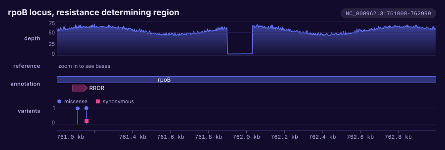

# Command line

`karyon` is a second front end onto the same library, and it reaches eighteen
of the thirty-three track types: the ones that have a file to read. Trees drawn
with metadata, maps and the selection views are library only.

The parsing is not in this binary. It lives in the library as
[`karyon::read`](formats.md), and every reader there takes a `&str` rather than
a path, so nothing in the crate opens a file to read one and the dependency
count stays at zero. What the binary keeps is opening the path. Every format is
line based text. This page is
the grammar: which flags start a track, which describe the one before them, and
what the command says when one of them is wrong.

## The grammar is the stack

A figure is a list of tracks in the order they are drawn, and `argv` is already
an ordered list whose later words describe the earlier ones. That is exactly
what `Plot` is, so the grammar is the obvious one:

- each `--<track>` flag starts a track,
- the flags after it describe that track until the next one starts,
- **the order of the flags is the order of the stack**.

Figure flags such as `--title` are attached to nothing and may sit anywhere.
The correspondence with the Rust API is one to one, spaces instead of dots:

```text
--coverage depth.bg --label depth --aggregate min

    .add_coverage(..).label("depth").adjust(|t| t.aggregate(Aggregate::Min))
```

So the same figure is the same list of words either way:

=== "Shell"

    ```bash
    karyon NC_000962.3:761,000-763,000 \
      --coverage depth.bedgraph --label depth --aggregate min \
      --sequence H37Rv.fa \
      --features genes.gff3     --label annotation \
      --variants calls.vcf      --label variants \
      --title 'rpoB locus' -o rpoB.svg
    ```

=== "Rust"

    ```rust
    use karyon::{plot, Aggregate};

    plot("NC_000962.3:761,000-763,000")?
        .title("rpoB locus")
        .add_coverage(depth)
        .label("depth")
        .adjust(|track| track.aggregate(Aggregate::Min))
        .add_sequence(bases)
        .add_features(genes)
        .label("annotation")
        .add_variants(calls)
        .label("variants")
        .save("rpoB.svg")?;
    ```

    The library takes values rather than paths, so `depth`, `bases`, `genes` and
    `calls` are already in hand. Reading them from a bedGraph, a FASTA, a GFF3
    and a VCF is the only thing the command does that the library does not.


## The region

The first argument is the region every track is drawn over, written as a locus
string: a sequence name, a colon, and a 1-based inclusive span. Commas,
underscores and spaces inside the numbers are dropped, so
`NC_000962.3:761,000-763,000` and `NC_000962.3:761000-763000` are the same
2,000 bases.

One region per figure. It is the only argument that is not a flag or a flag's
value, so it may sit anywhere on the line, but it reads better first and the
help text puts it there. A second bare word is an error rather than a silent
choice between two regions.

Every reader skips rows on another sequence and rows outside the window, so a
genome-wide file can be handed over whole and only the window comes back.

!!! warning "Coordinates"
    The locus string and the tick labels are 1-based and inclusive, the form
    samtools and IGV use. Everything else in the crate is 0-based and half-open.
    Files are read as each format defines them: BED, bedGraph and cytoBand are
    0-based half-open, and GFF3, VCF, SAM and `samtools depth` are 1-based
    inclusive. Both come out at the same place in the figure, and every reader
    has a test that pins a known base through the conversion.

## Track flags

Eighteen flags, seventeen of which take a file. `-` in place of a path means
standard input.

| Flag | The track | What it reads |
|:-----|:----------|:--------------|
| `--coverage <FILE>` | Per-base signal | bedGraph, `samtools depth`, or a bare column of values |
| `--sequence <FILE>` | The reference bases | FASTA |
| `--features <FILE>` | Genes and other intervals | BED or GFF3 |
| `--variants <FILE>` | Point calls | VCF |
| `--windows <FILE>` | A statistic in windows | bedGraph |
| `--manhattan <FILE>` | Association statistics | a table of position and value |
| `--tree <FILE>` | A phylogeny | Newick |
| `--msa <FILE>` | A multiple sequence alignment | aligned FASTA |
| `--snps <FILE>` | The variable sites of an alignment | aligned FASTA |
| `--ideogram <FILE>` | Cytogenetic bands | a cytoBand table |
| `--matrix <FILE>` | A value per sample per site | a table |
| `--pileup <FILE>` | Aligned reads | SAM text, as `samtools view` writes it |
| `--synteny <FILE>` | Alignment ribbons between two sequences | PAF, as `minimap2` writes it |
| `--dotplot <FILE>` | The same alignments as a dot plot | the same PAF |
| `--orfs <FILE>` | Open reading frames in six frames | FASTA, the same file `--sequence` takes |
| `--logo <FILE>` | A sequence logo | aligned FASTA, the same file `--msa` takes |
| `--tanglegram <FILE>` | Two phylogenies face to face | Newick, and a second one named by `--against` |
| `--axis` | The coordinate ruler | nothing |

Eighteen of the thirty-three track types have a file the command can put in
front of them, and those are the ones it has. The rest are library only, either
because their format is binary, because no single standard exists for what they
draw, or because nobody has written the reader yet;
[Track catalogue](../tracks.md) says which is which for each of them. What each
reader accepts, column by column, is in [Formats](formats.md).

`--orfs` and `--logo` compute rather than read: reading frames off the same
FASTA `--sequence` takes, and a logo off the same aligned FASTA `--msa` takes.
So either can be stacked under the track it was derived from without naming a
second file.

A ruler is added at the bottom without being asked for. `--axis` puts one where
the flag sits and cancels the automatic one, so writing `--axis` first is a
ruler on top and nothing at the bottom. `--no-axis` leaves it out entirely.

A track flag takes the word after it as its file, whatever that word is, so a
forgotten path swallows the next flag and the error arrives a word or two later
than the mistake.

## Track modifiers

Each of these describes the track before it. They are not all universal,
because most of them are a setting only some tracks have.

| Flag | Value | Applies to | Default |
|:-----|:------|:-----------|:--------|
| `--label <TEXT>` | any text | every track, `--axis` included | no name in the gutter |
| `--against <FILE>` | a path, or `-` | `--tanglegram` | none, and it is required |
| `--height <PX>` | a number of pixels | `--coverage`, `--sequence`, `--variants`, `--windows`, `--manhattan`, `--ideogram`, `--synteny`, `--dotplot`, `--axis` | the track's own |
| `--aggregate <HOW>` | `max`, `mean`, `min` | `--coverage` | `max` |
| `--style <HOW>` | `area`, `line`, `bars` for `--coverage`; `steps`, `line` for `--windows` | `--coverage`, `--windows` | `area` and `steps` |
| `--log` | none | `--coverage` | linear |
| `--color <HEX>` | as in `'#d55e00'` | `--coverage`, `--features` | the theme's colours |
| `--format <NAME>` | `bedgraph`, `depth`, `values`, `bed`, `gff3` | `--coverage`, `--features` | told from the file |

`--against` is the one modifier that carries a file rather than a setting, for
a track whose data is not one file. A tanglegram is two phylogenies, and a
`--<track>` flag takes one path, so the second is named:

```bash
karyon chr1:1-1000 --no-axis \
  --tanglegram before.nwk --against after.nwk --label topology -o tangle.svg
```

It is spelled by what the file means rather than by where it sits, which is the
same rule every other modifier follows, and it is required. A tanglegram given
one tree twice has no crossings at all, and no crossings is what a perfect
result looks like, so the missing half is an error instead of a default:

```console
$ karyon chr1:1-1000 --tanglegram before.nwk
karyon: a tanglegram track is drawn from two files, and --against names the second
```

The two trees are named in the figure after the files they came from, since two
phylogenies side by side with nothing over them do not say which is which.
`--no-axis` is worth adding: a tanglegram has no genomic coordinates, so the
ruler underneath it measures nothing.

`--height` is on the tracks that do not size themselves. A feature track, a
pileup, an alignment, a matrix and a tree are as tall as the number of rows
their data needs, so a height would be a number fighting the layout; a coverage
band or a ruler has a height of its own and takes one.

`--aggregate` says what a pixel column does when it covers more than one base.
It and `--log` are coverage settings, since coverage is the track that bins.
`min` is worth reaching for when a dropout is the thing not to smooth away.

`--style` spells two vocabularies with one flag, and the error names the one
that fits the track it landed on:

```console
$ karyon NC_000962.3:761,000-763,000 --coverage depth.bedgraph --style steps
karyon: --style does not take "steps", only area, line or bars for a coverage track
```

`--color` is written into the SVG as it stands, so any colour an SVG understands
works; a hex is the spelling that survives every renderer. Every modifier except
`--label` and `--format` says so when it lands on a track that has no use for
it, rather than being accepted and doing nothing:

```console
$ karyon NC_000962.3:761,000-763,000 --features genes.gff3 --aggregate min
karyon: --aggregate means nothing to a features track
```

`--format` is the exception: it is accepted after any track and consulted only
by `--coverage` and `--features`, the two readers that have more than one file
shape to tell apart. Its words are `bedgraph` (or `bg`), `depth`, `values`,
`bed` and `gff3` (or `gff`, or `gtf`, both read as GFF3). Naming an interval
format for a coverage track is refused rather than guessed at, and naming a
signal format for a feature track leaves the guess to run.

!!! warning "`--sequence` wants the whole sequence"
    The FASTA reader takes the first record of the file and the region indexes
    into it from its first base, so a `samtools faidx ref.fa chr:start-end`
    slice is read as if it began at base 1 of the chromosome. That draws an
    empty sequence track, or the wrong bases, without an error. Hand it the
    reference, and let the region do the cutting.

## Figure options

| Flag | Effect |
|:-----|:-------|
| `--title <TEXT>` | a title above the stack |
| `--width <PX>` | the figure width, 900 by default |
| `--theme <NAME>` | `light` or `dark` |
| `--no-axis` | leave the ruler out |
| `--no-region-label` | leave out the locus printed at the top right |
| `-o`, `--output <FILE>` | write to a file rather than standard output |
| `-h`, `--help` | the whole grammar, which is the specification |
| `-V`, `--version` | the version and nothing else |

`-h` and `-V` are answered before anything else is looked at, so
`karyon --version` prints the version whatever else is on the line.

The dark theme is a selected set of colours rather than an inversion of the
light one:

```bash
karyon NC_000962.3:761,000-763,000 \
  --coverage depth.bedgraph --label depth \
  --features genes.gff3 --label annotation \
  --theme dark -o rpoB-dark.svg
```



## Standard input

Any track file may be `-`, and one track may take it, since there is only one
standard input to go around:

```console
$ karyon NC_000962.3:761,000-763,000 --coverage - --variants -
karyon: only one track can read from standard input
```

Header and comment lines are dropped by every reader: `#` for BED, GFF3 and VCF,
`@` for a SAM header, and blank lines throughout. A tool's output therefore
pipes in as it comes, with nothing to strip first. Tab separated and space
separated files both read.

## Output

Standard output by default, so a figure goes into a pipe or a redirect:

```bash
karyon Chr1:1-50,000 --manhattan gwas.tsv --label association > scan.svg
```

`-o` writes a file instead. It always names a file: `-o -` writes a file called
`-`, and leaving `-o` out is the way to ask for standard output.

## Binary formats

BAM, CRAM and BCF are not read here, and are not meant to be. `samtools` and
`bcftools` already write exactly what these readers take, so the pipeline is the
parser and the library keeps its zero dependencies.

Coverage from an alignment:

```bash
samtools depth -a -r chr20:1,000,000-1,050,000 sample.bam \
  | karyon chr20:1,000,000-1,050,000 --coverage - --label depth -o depth.svg
```

Reads from a CRAM, under the annotation they fall in:

```bash
samtools view -T ecoli.fa aln.cram NC_000913.3:3,423,000-3,424,000 \
  | karyon NC_000913.3:3,423,000-3,424,000 \
      --features genes.gff3 --label genes \
      --pileup - --label reads -o reads.svg
```

Calls from a BCF, which comes out of `bcftools` as VCF text with its `##`
header, dropped on the way in:

```bash
bcftools view -r Chr1:1,000,000-1,001,000 calls.bcf \
  | karyon Chr1:1,000,000-1,001,000 --variants - --label calls -o calls.svg
```

!!! note "`samtools depth` over more than one file"
    It writes one depth column per file, so four columns for two alignments,
    which is also the shape of a bedGraph. The reader tells the two apart by the
    column count and would take the first depth for an interval end. Pass
    `--format depth` and the first sample is read.

## When it fails

Every failure exits non-zero with one line on standard error, naming the flag
and the file it was reading, and the line number when a file did not say what it
claimed to. The whole figure is built before a byte of it is written, so a file
that would not parse leaves no output behind to be mistaken for a result.

The command line itself is checked before anything is opened:

```console
$ karyon --coverage depth.bedgraph
karyon: the first argument is the region, as in NC_000962.3:761,000-763,000

$ karyon NC_000962.3:0-1000 --coverage depth.bedgraph
karyon: invalid locus "NC_000962.3:0-1000": 1-based coordinates start at 1, not 0

$ karyon NC_000962.3:761,000-763,000 --label depth
karyon: --label describes the track before it, and no track has been given yet

$ karyon NC_000962.3:761,000-763,000 --coverage depth.bedgraph --aggregate median
karyon: --aggregate does not take "median", only max, mean or min
```

Then the files:

```console
$ karyon NC_000962.3:761,000-763,000 --features nowhere.bed
karyon: --features nowhere.bed: No such file or directory (os error 2)

$ karyon chr1:1-1000 --features broken.bed
karyon: --features broken.bed: line 2: end is not a number: "three-hundred-and-fifty"

$ karyon NC_000962.3:761,000-761,500 --coverage two-samples.depth
karyon: --coverage two-samples.depth: line 1: end is before start
```

A file that opened and parsed and held nothing for this window is also an error,
because an empty track is almost always the wrong region or the wrong sequence
name rather than a fact worth drawing:

```console
$ karyon chr7:1-1000 --features genes.gff3
karyon: --features genes.gff3: no features in the region
```

Rows on another sequence and rows outside the window are not errors on their
own. They are skipped, which is what lets a whole genome annotation be handed to
a two kilobase figure.

## Next

- [File formats](formats.md), for what each reader accepts, column by column.
- [Recipes](../recipes.md), for whole pipelines that end in one of these
  commands.
- [Plot API](plot.md), for the same figure written in Rust.
