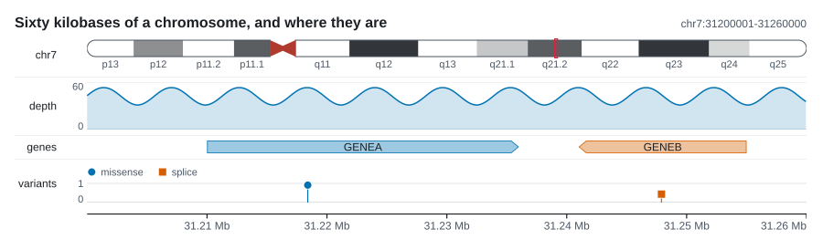

# File formats

The library reads no files. `karyon` the crate takes vectors of numbers and
structs; `karyon` the command is where the reading lives, and every format below
is line based text, which is what keeps the dependency count at zero. There is
one section per format, each saying which columns are read, which coordinate
convention the file counts in, and what stops the figure rather than being
skipped.


Binary formats are not read at all. BAM, CRAM and BCF come in through a pipe,
because `samtools` and `bcftools` already write exactly what these readers take,
so the pipeline is the parser:

```bash
samtools depth -a -r NC_000962.3:761000-763000 aln.bam \
  | karyon NC_000962.3:761,000-763,000 --coverage - --label depth -o rpoB.svg
```

Any track file may be `-` for standard input, and one track in a figure may take
it. Which flag takes which file, and everything else about the grammar, is in
[The command line](cli.md); this page is about what is inside the files.

## The rule that decides everything

!!! warning "Skipped or refused"
    A row **on another sequence, or outside the region on display, is skipped
    without a word**. Handing over a whole genome file and drawing one window
    of it is the normal way to use this, so those rows are not an error and not
    a warning: they are not in this figure.

    A row that **does not parse is never skipped**. It stops the figure and
    names the line:

    ```
    karyon: --coverage depth.txt: line 3: depth is not a number: "NA"
    ```

    A malformed row that disappeared would be a figure quietly missing data,
    which is worse than no figure at all.

The line number counts the lines that were dropped as comments or blanks, so it
is the line number in your editor.

The two halves of the rule meet at the order the checks run in. For
`--coverage`, `--windows`, `--variants`, `--manhattan` and `--pileup` the shape
of the line is checked before the sequence name is compared, so a file whose
column count changes partway through is an error even where the change is on a
sequence this figure does not draw. `--pileup` reads the flag that early too,
since that is what says whether the record was placed anywhere at all. For
`--features` and `--ideogram` the sequence is compared first, so a broken row
elsewhere in a genome-wide annotation goes past unread.

Four things are dropped by every reader before it looks at anything else:

- Blank lines.
- Lines starting with `#`, which covers BED and GFF3 comments, GFF3 pragmas and
  the VCF header.
- Lines starting with `@`, which is the SAM header.
- A UCSC `track` or `browser` line, but **only when it also carries a
  `key=value`**. A sequence may be called `track`, and in a space separated file
  its rows are otherwise indistinguishable from the header and would vanish
  without a word.

Fields are split on tabs when the line has a tab, and on whitespace when it does
not, because every format here is tab separated on paper and space separated in
about half the files that exist. One consequence: a tab separated file may hold
a field with a space in it, such as a sample called `isolate 12`, and a space
separated file may not. The examples below are aligned with spaces so they are
readable; real files are usually tab separated and both read the same.

## Telling formats apart

Two of the readers take more than one format and have to work out which they
were given.

### A coverage file

`--coverage` accepts three shapes, and the column count is the only difference
between them:

| Columns | Read as | Example line |
|:--|:--|:--|
| 4 | bedGraph | `chr2L 100 103 5` |
| 3 | `samtools depth` | `chr2L 100 5` |
| 1 | a bare column of values | `5` |

The shape is decided once, on the first line that carries data, and the rest of
the file has to keep to it. A file that changes count halfway is a file whose
positions cannot be trusted, so it is refused with the line it changed on rather
than guessed at line by line.

`--format bedgraph`, `--format depth` or `--format values` overrides the guess.
`--format bed` and `--format gff3` are refused here, because those name
intervals with a strand and a name rather than a value per base, and reading one
would take a score for a depth.

!!! warning "`samtools depth` over more than one file also writes four columns"
    `samtools depth a.bam b.bam` writes one depth column per file, so the column
    count alone reads its output as a bedGraph. Taken that way, the position
    becomes a start, the first depth becomes an end and the second depth becomes
    the value, so each record turns into a run of bases at the height of the
    second sample: a plausible looking figure of nothing.

    What tells the two apart is that two bedGraph intervals never overlap and
    two depth records at consecutive positions do, so an overlap is refused
    rather than drawn:

    ```
    karyon: --coverage depth.txt: line 2: these intervals overlap, so this is
    not a bedGraph. samtools depth over more than one file also writes four
    columns: pass --format depth to read it as that, or --format bedgraph to
    insist
    ```

    With `--format depth` the first sample is the one drawn and the rest of the
    columns are ignored. `--format bedgraph` insists on the other reading, which
    is what an out of order bedGraph needs.

!!! danger "A three column file is always read as depth"
    A BED3 handed to `--coverage` is misread and **cannot be detected**. A BED3
    has no value column whose absence could be noticed, so `chr1 100 200` is
    read as position 100 carrying a depth of 200: one point at 0-based 99, at a
    height that is really a coordinate. Nothing errors and nothing warns.

    A BED belongs to `--features`. If you want the intervals as a signal,
    convert them to bedGraph with a fourth column first.

### A feature file

`--features` accepts BED and GFF3, and decides between them in this order:

1. `--format bed` or `--format gff3` wins outright.
2. A `##gff-version` line anywhere in the file means GFF3.
3. Column seven of the first data row: GFF3 spends it on the strand, so `+`,
   `-`, `.` or `?` there means GFF3, and a BED of nine or more columns spends it
   on `thickStart`, a number.
4. Anything else, including a row with fewer than seven columns, is BED. A GFF3
   row always has nine, so a short row cannot be one.

### The words `--format` takes

| Word | Reads as | Where it is meaningful |
|:--|:--|:--|
| `bedgraph`, `bg` | bedGraph | `--coverage` |
| `depth` | `samtools depth` | `--coverage` |
| `values` | a bare column of values | `--coverage` |
| `bed` | BED | `--features` |
| `gff3`, `gff`, `gtf` | GFF3 | `--features` |

`--format` describes the track before it, like every other track option. A word
from the other group is not a command line error: `--format depth` on a
`--features` track has nothing to say about BED against GFF3, so the guess runs
as usual. The one combination that is refused outright is `--format bed` or
`--format gff3` on a `--coverage` track, because reading intervals as a signal
would take a score for a depth.

!!! note "`gtf` is a spelling of `gff3`, not a GTF reader"
    A GTF's first eight columns are a GFF3's, so the coordinates come out right.
    Its ninth column is not: GTF writes `gene_id "ENSG1"; gene_name "ABC";`
    rather than `key=value`, so no name is found and the features draw unlabelled.

## Coordinates

This is the one place in the project where the convention is not uniform, and
getting it wrong is silent, so every reader states which it reads and every one
has a test that pins a known base through the conversion.

| Format | Flag | The file counts | On the way in |
|:--|:--|:--|:--|
| bedGraph | `--coverage`, `--windows` | 0-based, half-open | passed through |
| `samtools depth` | `--coverage` | 1-based | `pos - 1` |
| a column of values | `--coverage` | nothing | starts at the region's first base |
| BED | `--features` | 0-based, half-open | passed through |
| GFF3 | `--features` | 1-based, inclusive | `start - 1`, end unchanged |
| cytoBand | `--ideogram` | 0-based, half-open | passed through |
| VCF | `--variants` | 1-based | `POS - 1` |
| association table | `--manhattan` | 1-based | `pos - 1` |
| FASTA | `--sequence` | nothing | byte `n` is position `n` |
| aligned FASTA | `--msa`, `--snps` | alignment columns | passed through |
| Newick | `--tree` | nothing | nothing to convert |
| SAM | `--pileup` | 1-based | `POS - 1` |
| matrix table | `--matrix` | 1-based header | `position - 1` |

Whatever a file counts in, it comes out at the same place in the figure. The
locus you type on the command line is the 1-based inclusive form samtools and
IGV use, whatever the files are written in: `chr1:101-200` is the hundred bases
0-based `100..200`. The whole convention, and why the GFF3 end needs no
arithmetic while its start does, is in
[Coordinates](../how-it-works/coordinates.md).

## bedGraph

Used by `--coverage` and by `--windows`.

```text
track type=bedGraph name=coverage
chr2L  100  103  5
chr2L  103  105  9
```

| Column | Field | Read |
|:--|:--|:--|
| 1 | chrom | matched against the region |
| 2 | start | yes, 0-based |
| 3 | end | yes, exclusive |
| 4 | value | yes |

**Coordinates** pass straight through. `100 103` is the three bases 100, 101 and
102; 103 belongs to the interval that starts there.

**With `--coverage`** every base of the interval takes the value, and the
interval is clipped to the region before it is expanded, so a genome-wide file
does not become one pair per base of the genome. A position no interval covers
stays at zero, which is what a bedGraph leaves out and what a depth of zero
means.

**With `--windows`** the intervals stay intervals, since a window track draws
the window and not the base. A window that does not reach the region is left
behind, and a window hanging over an edge keeps its own bounds, because a window
cut short would draw as a window of another size.

**Errors**: with `--coverage`, a column count that changes partway through the
file, since the shape was decided on the first data row; with `--windows`, a row
of fewer than four columns, wherever in the file it sits, extra columns past the
fourth being ignored. Either way: a start, end or value that is not a number,
and an end before its start.

**Skipped**: rows on another sequence, and intervals that touch no base of the
region.

## samtools depth

Used by `--coverage`.

```text
# samtools depth -a -r NC_000962.3:761100-761104 aln.bam
NC_000962.3  761100  12
NC_000962.3  761101  14
NC_000962.3  761102  0
```

| Column | Field | Read |
|:--|:--|:--|
| 1 | chrom | matched against the region |
| 2 | pos | yes, 1-based |
| 3 | depth | yes |

**Coordinates** are 1-based, so position 761100 lands at 0-based 761099.

Without `-a`, `samtools depth` leaves out the positions with no reads on them.
Those stay at zero anyway, so the figure is the same.

`samtools depth a.bam b.bam` writes one depth column per file. That is four
columns or more, which needs `--format depth` to read; see
[Telling formats apart](#a-coverage-file). The first sample is the one drawn.

**Errors**: a position of 0, since the file claims to count from 1 and taking
one off it would wrap; a depth that is not a number.

**Skipped**: rows on another sequence, and positions outside the region.

## A bare column of values

Used by `--coverage`, for anything already computed per base.

```text
0.5
0.25
0.75
```

There is one column and it is the value. The file carries no sequence name and
no positions, so **the first value lands on the first base of the region**, the
second on the base after it, and so on. That makes the file specific to one
window: the same file drawn over `Chr4:501-600` and over `Chr4:1-100` puts its
values in two different places.

Values that run past the right edge of the region are dropped. If the file runs
out before the region does, the rest of the region stays at zero.

**Errors**: a value that is not a number.

**Skipped**: nothing is skipped for being elsewhere, because the file never says
where it is.

## BED

Used by `--features`.

```text
track name=genes description="TAIR10"
Chr1  3630  5899  AT1G01010  0  +
Chr1  6787  9130  AT1G01020  0  -
Chr2  3000  4000  AT2G01010  0  +
```

| Column | Field | Read |
|:--|:--|:--|
| 1 | chrom | matched against the region |
| 2 | chromStart | yes, 0-based |
| 3 | chromEnd | yes, exclusive |
| 4 | name | yes, as the label; a `.` is no name |
| 5 | score | ignored |
| 6 | strand | yes, `+` or `-`, anything else is unknown |
| 7 and beyond | thickStart, itemRgb, blocks | ignored, though column seven is what tells a BED9 from a GFF3 |

**Coordinates** pass straight through, with no arithmetic at all: a row saying
`3630 5899` becomes a feature saying the same, because both count from zero and
leave the end out.

**Errors**: fewer than three columns; a start or end that is not a number; an
end before its start, which would otherwise widen into a single base at the
start and draw a gene a whole interval from where the file put it.

**Skipped**: rows on another sequence, and features that touch no base of the
region. A feature outside the window would still take a row in the packing that
decides how tall the track is, so it is dropped rather than carried.

## GFF3

Used by `--features`.

```text
##gff-version 3
#!genome-build H37Rv
NC_000962.3  RefSeq  gene  759807  763325  .  +  .  ID=gene-Rv0667;Name=rpoB
NC_000962.3  RefSeq  gene  763370  767320  .  +  .  ID=gene-Rv0668;Name=rpoC
```

| Column | Field | Read |
|:--|:--|:--|
| 1 | seqid | matched against the region |
| 2 | source | ignored |
| 3 | type | ignored |
| 4 | start | yes, 1-based inclusive |
| 5 | end | yes, inclusive |
| 6 | score | ignored |
| 7 | strand | yes |
| 8 | phase | ignored |
| 9 | attributes | the name only: `Name=`, failing that `gene=`, failing that `ID=` |

**Coordinates** are 1-based and inclusive, so the start moves back one and the
end does not: `759807 763325` becomes `759806..763325`. The end needs no
arithmetic because a 1-based inclusive end is already one past the last base
once the count starts at zero. The two spellings name the same bases.

Attribute values are percent decoded, since the ninth column spends `;`, `=` and
`,` on its own syntax and a value holding one arrives escaped:
`Name=chromosomal%20replication%2C%20initiator` reads as
`chromosomal replication, initiator`. A `%` that starts nothing is left as
written.

!!! note "Column three is ignored, which means every record draws"
    Nothing filters on the feature type, so a full annotation carrying `gene`,
    `mRNA`, `exon` and `CDS` records over the same locus draws all of them,
    stacked into rows. Filter first if that is not what you want:

    ```bash
    awk '$3 == "gene"' annotation.gff3 \
      | karyon NC_000962.3:759,000-768,000 --features - --label genes -o genes.svg
    ```

**Errors**: fewer than five columns, since the last four are not needed to place
a feature and the first five are; a start of 0, which a 1-based file cannot
have; a start or end that is not a number.

**Skipped**: rows on another sequence, which is also why the `##FASTA` section
some assemblers write after the annotation goes past instead of failing as a
broken feature; and features that touch no base of the region.

## cytoBand

Used by `--ideogram`.

```text
chr21  0         2800000   p13    gvar
chr21  2800000   6970000   p12    stalk
chr21  10900000  12000000  p11.1  acen
chr21  12000000  46709983  q22.3  gneg
chr20  0         64444167  p13    gneg
```



| Column | Field | Read |
|:--|:--|:--|
| 1 | chrom | matched against the region's sequence |
| 2 | chromStart | yes, 0-based |
| 3 | chromEnd | yes, exclusive |
| 4 | name | yes, when there is one |
| 5 | gieStain | yes, when there is one |

**Coordinates** pass straight through: cytoBand is BED with two extra columns.

The stain words are the UCSC ones, matched without regard to case: `gneg`,
`gpos25`, `gpos50`, `gpos75`, `gpos` or `gpos100`, `acen`, `gvar` and `stalk`.
An unknown or missing stain is the palest band rather than a guess, so a table
that stops after the coordinates still draws.

**The region does not filter this one.** The ideogram is the whole chromosome
with a marker showing where the window is, so every band on the matching
sequence is kept whatever the region says. The length of the chromosome is the
highest end seen on that sequence, which is why a table holding every chromosome
gives the right length for the one being drawn.

**Errors**: fewer than three columns; a start or end that is not a number; an
end before its start, which would collapse the band to nothing while its end
still set the chromosome length.

**Skipped**: rows on another sequence. A sequence the table does not hold at all
gives no bands, and the track says `no bands in the region`.

## VCF

Used by `--variants`.

```text
##fileformat=VCFv4.2
##contig=<ID=NC_045512.2,length=29903>
#CHROM       POS    ID  REF   ALT  QUAL  FILTER  INFO
NC_045512.2  21563  .   A     G    900   PASS    DP=54;AF=0.98;ANN=G|missense_variant|MODERATE|S
NC_045512.2  21990  .   TTTA  T    500   PASS    DP=40
```

| Column | Field | Read |
|:--|:--|:--|
| 1 | CHROM | matched against the region |
| 2 | POS | yes, 1-based |
| 3 | ID | ignored |
| 4 | REF | yes, for the shape of the call and for how far it reaches |
| 5 | ALT | yes, one call per alternate allele |
| 6 | QUAL | ignored |
| 7 | FILTER | ignored, so a call that failed a filter is still drawn |
| 8 | INFO | `AF` for the height, `ANN` or `BCSQ` for the category |
| 9 and beyond | FORMAT and the samples | ignored, so a sites-only VCF and a whole cohort read the same |

**Coordinates** are 1-based, so `POS 21563` lands at 0-based 21562.

**The height** is the allele fraction: `AF` from `INFO` when it is there, and
1.0 when it is not, since a call with no fraction is a call. `AF` carries one
number per alternate allele; a single number written for a multi-allelic row is
shared by all of them. The key is matched whole, because `AF` is the end of
`MLEAF` and of `AF_ESP` and a substring search finds the wrong number in a file
written by GATK or annotated against a population database.

**The category** is the consequence an annotator wrote, when one did: `ANN`,
which snpEff and VEP both write, read from the entry naming this allele and
falling back to the first entry; or `BCSQ` from `bcftools csq`, whose
consequence comes first, whose uncertain calls carry a leading `*` and whose
`@761154` pointer entries have no fields of their own. With no annotation the
category is what `REF` and `ALT` say between them: `substitution`, `insertion`
or `deletion` by their lengths, `breakend` for an allele naming the other side
of a join in square brackets, `deletion` for the `*` allele an overlapping
deletion took away, and the tag inside `<DEL>` or `<INS:ME:ALU>` lowercased,
since a symbolic allele carries no sequence to measure.

**Errors**: fewer than eight columns; a `POS` of 0; an `AF` that is not a
number, or an `AF` whose count is neither one nor the number of alternate
alleles.

**Skipped**: rows on another sequence; a row whose `ALT` is `.`, which is a
reference block and most of what a gVCF holds; and calls that do not reach the
window. What is measured there is what `REF` spells, not the anchor base alone,
because a deletion is written one base to the left of the bases it removes and a
call anchored just outside the window can still be a call about the window.

## The association table

Used by `--manhattan`.

```text
chrom         pos   pvalue
Pf3D7_07_v3   4100  3.2e-9
Pf3D7_08_v3   4110  1.0e-12
Pf3D7_07_v3   4150  0.4
```

Two columns, a position and a value, or three with a sequence name in front. The
same file without the sequence column reads too:

```text
pos   p
4100  3.2e-9
4150  0.4
```

**Coordinates** are 1-based, as every association tool writes them, so 4100
lands at 0-based 4099.

**The header is optional** and only the first line worth looking at may be one:
a word where a position belongs on that line is a column name, and a word where
a position belongs further down is an error rather than a line that quietly
disappears.

The value is handed over as it is. The track is what decides to draw it on a log
scale.


**Errors**: any width other than two or three columns; a position or a value
that is not a number.

**Skipped**: rows whose sequence column names another sequence, and positions
outside the region. A two column table names no sequence, so only the region
filters it.

## FASTA

Used by `--sequence`.

```text
>chrI Saccharomyces cerevisiae S288C
AAAAAAAAAAAAAAAAAAAAAAAAAAAAAAAAAAAAAAAAAAAAAAAAAAAAAAAAAAAA
CGTTTTTTTTTTTTTTTTTTTTTTTTTTTTTTTTTTTTTTTTTTTTTTTTTTTTTTTTTT
```

The name is the header up to the first whitespace, so the record above is
`chrI`. Sequence lines are joined with nothing between them and their case is
kept, since a soft-masked reference says something by being lower case. A blank
line in the middle of a record does not end it.

**Coordinates**: a FASTA file has none. A record starts at its own first base,
so byte `n` is the base at 0-based position `n`, and the base at 1-based
position `p` is byte `p - 1`. The region is cut out by indexing into the record,
which means **the record has to be the whole sequence from its first base**. A
FASTA already trimmed to the locus draws the wrong bases without saying so.

`--sequence` takes the first record of the file and ignores the rest.

**Errors**: a line of sequence before the first `>`; a `>` with no name after
it; a header with no sequence under it, which is a truncated file rather than a
record of no bases. A long line is quoted back only at its start, since a FASTA
file can hold a whole chromosome on one line.

**Not an error**: a region past the end of the record. The track is built with
no bases and draws nothing, which is worth knowing when a sequence track comes
out blank.

## Aligned FASTA

Used by `--msa` and by `--snps`.

```text
>sample_01
ACGT-ACGT
>sample_02
ACGTTACGT
>sample_03
ACGT-ACGA
```

Read exactly as FASTA, with one check on top: every record has to be the same
length, which is what makes it an alignment rather than a set of sequences.

!!! warning "The coordinates are alignment columns, not genomic positions"
    An alignment has its own coordinate system, gaps included, and ungapping a
    row back to reference coordinates is a real operation with real decisions in
    it that this crate does not do silently. So the region is the column space:
    an alignment 900 columns wide is drawn over `alignment:1-900`, and the ruler
    under it counts columns.

`--snps` keeps only the columns that vary, comparing every row against the first
record of the file, which is left out of the sample rows. A gap counts as a
disagreement, since a deletion is an observation too.

**Errors**: everything FASTA errors on, plus a record of the wrong length, which
names the record and the difference:

```
karyon: --msa aln.fa: line 3: an alignment has every record the same length,
and "sample_02" is 1 shorter than "sample_01", which is 9 columns
```

**Skipped**: nothing. An alignment has no sequence names to match and no
positions to be outside of.

## Newick

Used by `--tree`.

```text
((ERR01:0.01,ERR02:0.012)0.98:0.04,ERR03:0.06);
```

The whole file is one tree. Nested clades, branch lengths, quoted names and
internal labels all read; an internal label is a support value when it parses as
a number and a name when it does not. The trailing semicolon is optional and
whitespace is ignored, so a tree written across several lines reads as one.

Square bracket comments are skipped wherever they appear, which is what lets a
file straight out of RAxML or BEAST be read: those write a `[&R]` rootedness
marker before the tree and `[&height=...]` annotations inside it. Nothing inside
a comment is kept, NHX annotations included.

**Coordinates**: none. A tree carries no positions, so nothing is skipped for
being on another sequence or outside the region.

**Errors**: unbalanced parentheses, a comma outside any clade, more than one
root, a branch length that is not a number, and an empty file. The message
carries no line number, because the tree is not read line by line:

```
karyon: --tree: invalid Newick tree: unbalanced parentheses
```

## SAM

Used by `--pileup`, and the usual way in is a pipe from `samtools view`, whose
header lines are dropped by the reader either way.

```bash
samtools view aln.bam NC_002516.2:3900-4100 \
  | karyon NC_002516.2:3,900-4,100 --pileup - --label reads -o reads.svg
```

```text
@HD    VN:1.6  SO:coordinate
@SQ    SN:NC_002516.2  LN:6264404
read1  0  NC_002516.2  4001  60  3S5M2I4M1D6M  *  0  0  AAAGGGGGTTCCCCTTTTTT  *
```


| Column | Field | Read |
|:--|:--|:--|
| 1 | QNAME | ignored |
| 2 | FLAG | yes: bit 4 unmapped, bit 16 reverse strand |
| 3 | RNAME | matched against the region |
| 4 | POS | yes, 1-based |
| 5 | MAPQ | yes; 255 is the aligner saying it has none |
| 6 | CIGAR | yes |
| 7 | RNEXT | ignored |
| 8 | PNEXT | ignored |
| 9 | TLEN | ignored |
| 10 | SEQ | yes, unless it is `*`, so the track can paint mismatches |
| 11 | QUAL | ignored |
| 12 and beyond | optional tags | ignored |

**Coordinates** are 1-based, so `POS 4001` starts the read at 0-based 4000.

**The CIGAR** maps operation by operation. `M`, `=` and `X` all arrive as
matches, because the track finds mismatches by comparing the sequences itself.
`I`, `D`, `N`, `S` and `H` are themselves. `P` is padding, which moves along
neither the read nor the reference, and is dropped rather than carried as an
operation that draws nothing.

**Errors**: fewer than eleven columns; a flag, `POS` or `MAPQ` that is not a
number; a `POS` of 0; a `MAPQ` above 255; a CIGAR letter that is not an
operation, an operation with no length in front of it, or a length with no
operation after it.

**Skipped**: records with bit 4 set, which were never placed on a reference;
records whose CIGAR is `*`, which have no shape to draw; records on another
sequence; and reads that do not overlap the window. None of those is malformed:
they are what a SAM file carries.

## The matrix table

Used by `--matrix`, for a value per sample per site.

```text
sample   14150  14180  14212
BY4741   1      0      .
RM11-1a  1      1      NA
YJM789   0      0      1
```

The header names the sites and the first column names the samples. The first
field of the header is the corner, and it is either empty or a word such as
`sample`. A header whose first field is a number has no corner and is read as
all positions, which is what a space separated file gives you: the run of
whitespace collapses into the separator and an empty first field cannot survive
it.

**Coordinates**: the header positions are 1-based, the way a VCF writes them and
the way every tool that makes such a table prints them, so `14150` is the site
at 0-based 14149.

**Missing values**: an empty cell, a `.` and an `NA` are missing, and are drawn
as a hole rather than as the zero end of the colour ramp, because those are
different claims. A typed `0` is a value.

Sites outside the region are dropped, and each one takes its column out of every
row with it, so the rows still line up with the sites column for column.

**Errors**: a row whose value count does not match the number of sites the
header names, counted before the region drops anything, which names the sample
and both counts; a header field that is not a number, or that is 0 in a 1-based
header; a cell that is neither a number nor one of the three spellings of
nothing.

**Skipped**: nothing on account of a sequence, since the table names none. Give
it a table for the sequence being drawn.

## When a file draws nothing

A track whose file held nothing usable inside the region is an error naming the
flag, the file and what was wanted:

```
karyon: --features genes.bed: no features in the region
```

| Message | Flag | Usually |
|:--|:--|:--|
| `no values in the region` | `--coverage` | the sequence name does not match, or no interval or position falls inside the window |
| `no sequence in the region` | `--sequence` | the file held no FASTA record at all |
| `no features in the region` | `--features` | the sequence name does not match, or every feature lies outside the window |
| `no variants in the region` | `--variants` | the sequence name does not match, or every row in the window was a reference block |
| `no windows in the region` | `--windows` | the sequence name does not match, or no interval reaches the window |
| `no association statistics in the region` | `--manhattan` | the sequence column names something else, or every position is outside the window |
| `no sequences in the region` | `--msa`, `--snps` | the file held no records |
| `no bands in the region` | `--ideogram` | the cytoBand table has no rows for this sequence |
| `no samples in the region` | `--matrix` | the file was a header and nothing else |
| `no reads in the region` | `--pileup` | every record was unmapped, on another sequence, or outside the window |

The first thing to check is the sequence name, which has to match the region's
exactly: `chr1` and `1` and `NC_000001.11` are three different sequences as far
as these readers are concerned, and rows on a sequence that is not the one being
drawn are skipped by design.

## Next

- [Command line](cli.md), for which flag takes which file and the rest of the
  grammar.
- [Coordinates](../how-it-works/coordinates.md), for why the conversions above
  are the conversions they are.
- [Recipes](../recipes.md), for these readers at the end of a real pipeline.
