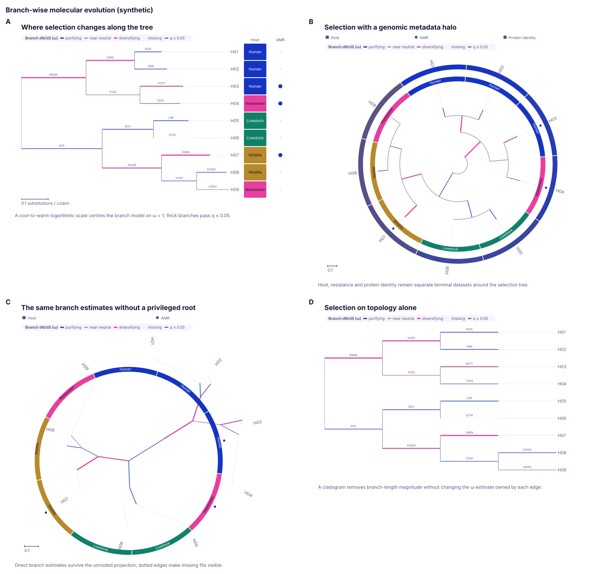

# Phylogenetics

Read a tree with its metadata intact and draw it on branch length or calendar
time, in rectangular, circular or unrooted coordinates, with support,
selection, clades and sample traits on it. Every drawing choice leaves the tree
itself as it was.
{ .k-lead }

!!! note "Command line or library"
    `--tree` reads annotated Newick and reaches metadata strips (`--traits`),
    branch colour (`--color-by`), `--projection`, `--support-style`,
    `--no-scale-bar`, `--shape`, folding (`--max-rows`), `--focus`, `--mutations`
    and `--highlight`; every flag is in [Command line](cli.md). Calendar time,
    rerooting, branch geometry, dN/dS, node glyphs and the ancestral and
    selection layers are library only.

## Read annotations instead of flattening them

```rust
use karyon::{AnnotationValue, Tree};

let tree = Tree::parse_annotated_newick(
    "[&R] (sample_A[&date=2024.25,country=Peru,selected=true]:0.2,\
            sample_B[&date=2024.50,country=Spain]:0.3);",
)?;
let sample = tree.node_named("sample_A").unwrap();

assert_eq!(
    tree.annotation(sample, "date").and_then(AnnotationValue::as_number),
    Some(2024.25),
);
assert_eq!(tree.rooted(), Some(true));
```

Values keep their type: numbers, text, booleans and brace-delimited lists
become `AnnotationValue::Number`, `Text`, `Boolean` and `List`, read back with
`as_number`, `as_text` and `as_bool`.

| Reader | Reads | Annotations |
|:--|:--|:--|
| `Tree::parse_newick` | Newick | discarded |
| `Tree::parse_annotated_newick` | Newick with BEAST `[&key=value]` or NHX `[&&NHX:key=value]` comments | kept and typed, on the node written before them; `[&R]` and `[&U]` set `rooted()` |
| `Tree::parse_nexus` | the first tree of a Nexus `trees` block | kept; the `translate` table renames the tips |

An internal label that reads as a number is taken as support, anything else as
a name. `annotations_mut` adds metadata from Rust. Node indices survive
rotating, ladderising and rerooting; `subtree` and `Tree::collapse` renumber
them, since each leaves a compact tree.

### Changes on branches

=== "Rust"

    ```rust
    use karyon::{Mutations, Tree};

    let tree = Tree::parse_annotated_newick(
        r#"((a[&muts="A123T,S:D614G"]:0.1,b:0.2)[&muts="C241T"]:0.3,c:0.4);"#,
    )?;
    let changes = Mutations::read(&tree, "muts");

    assert_eq!(changes.distinct(), 3);
    // C241T happened once, above a and b: the clade and both tips carry it.
    assert_eq!(changes.carriers(&tree, "C241T").len(), 3);
    ```

=== "Command line"

    ```bash
    karyon --tree outbreak.nwk --mutations muts --carrying S:D614G -o carriers.svg
    ```

A change belongs to the branch above the node that carries it, so `carriers`
answers with the whole subtree below, and a change that happened twice answers
with both. Changes are read from a quoted list or one in braces, spelled
`A123T`, `S:D614G` or either with an `nt:` or `aa:` prefix; anything else is
skipped, not guessed, and `unread` counts it. `--carrying` marks and colours
the carriers, and refuses a change the tree does not carry.

## Draw time, branches and sample traits together

<figure class="k-plate" markdown>
{ width="1540" height="354" loading="lazy" }
</figure>

=== "Rust"

    ```rust
    use karyon::{plot, TraitColumn, TreeTrack};

    let track = TreeTrack::new(tree)
        .time("date")
        .time_unit("year")
        .color_by("country")
        .show_nodes(true)
        .trait_column(TraitColumn::categorical("country").label("Country"))
        .trait_column(TraitColumn::continuous("depth").label("Depth"));

    plot("phylogeny:1-1")?
        .remove_region_label()
        .add_track(track)
        .save("outbreak.svg")?;
    ```

=== "Command line"

    ```bash
    karyon --tree outbreak.nwk --traits samples.tsv --columns country,depth \
      --color-by country --no-region-label -o outbreak.svg
    ```

`time(key)` places every node on a numeric annotation, here a decimal year,
with a calendar axis underneath. The command line has no time axis and draws
branch length instead.

`color_by(key)` uses a ramp when every value in the tree is a number and the
categorical palette otherwise. A branch with no value takes its nearest
annotated ancestor's, or failing that the value all its descendants share, so
a clade of one lineage is coloured whole and not only at its tips.

Each `TraitColumn` is one strip beside the tips. Levels are coloured in the
order the tree meets them, counted over the whole tree, so folding a clade does
not repaint the rest. A column that came from a sample sheet carries the
sheet's order instead (`TraitColumn::levels`), so a lineage is the colour here
that it is beside every other track the sheet is drawn with. `legend(&theme)`
hands back a key read off the same count as the branches and the strips. A
missing value is an empty outline whose tooltip says missing, never a zero, and
`show_values(false)` drops the text inside the cells.

??? info "What a time tree needs"
    Every tip needs a finite number under the `time` key. Internal nodes without
    one are inferred from their children and branch lengths, subtracting lengths
    for dates and adding them for heights before present:

    ```rust
    use karyon::{TimeDirection, TreeTrack};

    let track = TreeTrack::new(tree)
        .time("height")
        .time_direction(TimeDirection::Decreasing)
        .time_unit("years BP");
    ```

    `time_direction`, `time_unit` and `show_time_axis` do nothing without
    `time`, and count the same written before it or after it. If a tip has no
    value the track falls back to its ordinary layout, without a time axis.
    Where a missing date must be an error instead, check `Tree::time_layout`
    first: it returns `None`.

## Change the projection, not the tree

<figure class="k-plate" markdown>
{ width="1400" height="1228" loading="lazy" }
</figure>

=== "Rust"

    ```rust
    use karyon::{RadialDirection, TraitColumn, TreeTrack};

    let outward = TreeTrack::new(tree.clone())
        .time("date")
        .color_by("country")
        .trait_column(TraitColumn::categorical("country").ring_width(12.0))
        .circular()
        .radial_start(-90.0)
        .radial_size(520.0);

    let inward_fan = TreeTrack::new(tree)
        .time("date")
        .fan(250.0)
        .radial_start(-215.0)
        .radial_direction(RadialDirection::Inward)
        .inner_radius(0.32);
    ```

=== "Command line"

    ```bash
    karyon --tree outbreak.nwk --projection circular -o circular.svg
    ```

A projection changes coordinates and nothing else: lengths, dates, annotations
and tip order are not recomputed. In a circle, time ticks become concentric
guides, trait columns become rings and a collapsed clade becomes a wedge.

| Builder | Effect | Default |
|:--|:--|:--|
| `circular()` | a full circle | |
| `fan(degrees)` | a partial clockwise sweep, 10 to 359 degrees | |
| `radial_start(degrees)` | where the first tip sits, clockwise from three o'clock | `-90`, twelve o'clock |
| `radial_sweep(degrees)` | the sweep, 10 to 360 degrees | `360` |
| `radial_direction(RadialDirection::Inward)` | tips towards the centre, root at the rim | `Outward` |
| `inner_radius(fraction)` | a central gap, 0 to 0.85 of the radius | `0.08` |
| `radial_size(pixels)` | fixes the diameter | sized to the tip names |
| `projection(TreeProjection::Circular)` | circular coordinates, other settings kept | `Rectangular` |

`fan`, `radial_start`, `radial_sweep`, `radial_direction` and `inner_radius`
also switch the track to circular coordinates. Left alone, a circle grows until
neighbouring tip names clear each other, from 440 pixels up to the width of the
figure; past that, use a wider figure, [fewer rows](#draw-very-large-trees) or
`show_tips(false)`.

A full circle suits a figure about topology and metadata, a fan leaves a quiet
sector for a key, and an inward tree puts the early branches on the rim. None
of them has rows, so keep the rectangular projection when each tip is read
against the row beside it.

### Without a root

`unrooted()` centres the tree on the node that splits its tips most evenly,
gives every tip an equal share of the angle, and leaves the file's root where
it is in the data. A phylogram keeps branch lengths and a cladogram gives each
edge one unit; `unrooted_start` rotates the drawing and `unrooted_size` fixes
its height. Names sit at their branch ends until they would touch, then gather
onto a ring with a leader each, as they always do when trait rings are drawn.
There is no time axis or root diamond, because both need a root.

## Layer metadata around the tree

<figure class="k-plate" markdown>
{ width="1480" height="712" loading="lazy" }
</figure>

=== "Rust"

    ```rust
    use karyon::{TraitColumn, TreeTrack};

    let view = TreeTrack::new(tree)
        .unrooted()
        .color_by("country")
        .trait_column(TraitColumn::categorical("country").label("Country"))
        .trait_column(TraitColumn::bar("depth").label("Depth"))
        .trait_column(TraitColumn::binary("resistant").label("AMR"))
        .trait_column(TraitColumn::symbol("host").label("Host"));
    ```

=== "Command line"

    ```bash
    karyon --tree outbreak.nwk --traits samples.tsv --projection unrooted -o rings.svg
    ```

A `TraitColumn` is one dataset: a column beside a rectangular tree, a ring
around a circular or unrooted one, with the same key and tooltip either way.

| Constructor | Beside a rectangular tree | Around a circular or unrooted tree | Takes |
|:--|:--|:--|:--|
| `TraitColumn::categorical(key)` | colour strip | ring of colour | any value |
| `TraitColumn::continuous(key)` | heatmap cell | ring of heatmap sectors | a finite number |
| `TraitColumn::bar(key)` | horizontal bar | radial bar | a finite number |
| `TraitColumn::binary(key)` | presence mark | ring of marks | a boolean, or a number where zero is absent |
| `TraitColumn::symbol(key)` | coloured shape | ring of shapes | any value |

A binary column never guesses text into true or false, and a missing value
stays an outline in every mark. `width` sizes a column and `ring_width` a ring,
2 to 24 pixels; `trait_categorical`, `trait_bar` and their siblings on
`TreeTrack` add columns with their defaults. `--traits` picks the mark from the
values: numbers get a ramp, more than six levels get symbols, anything else a
colour strip.

## Choose a tree geometry

<figure class="k-plate" markdown>
{ width="1408" height="2050" loading="lazy" }
<figcaption>A to C: the three rectangular geometries. D and E: circular and unrooted.</figcaption>
</figure>

```rust
use karyon::{BranchGeometry, TreeTrack};

let aligned = TreeTrack::new(tree.clone()).branch_geometry(BranchGeometry::Orthogonal);
let topology = TreeTrack::new(tree.clone()).branch_geometry(BranchGeometry::Diagonal);
let presentation = TreeTrack::new(tree).branch_geometry(BranchGeometry::Curved);
```

| Geometry | Best for | Watch for |
|:--|:--|:--|
| `Orthogonal`, the default | aligned tip rows, events and dense metadata columns | parent risers can dominate a very unbalanced tree |
| `Diagonal` | topology and the direction of change | weaker alignment between a node and its descendants |
| `Curved` | annotated internal nodes and presentation figures | keep node glyphs small so curves do not cross them |
| circular | many tips with metadata rings | root and tip order still carry meaning |
| fan | radial context with a quiet sector | a partial sweep gives tips unequal directions, not unequal weight |
| unrooted | split structure without the file's root | cannot show the direction of time |

`branch_geometry` affects the rectangular projection only, and never reroots,
ladderises or rotates. The rest of the sheet is a tanglegram (F), a selection
scan (G), and the [evolution and surveillance tracks](../tracks/evolution-surveillance.md)
(H).

## Show support, events and distance

<figure class="k-plate" markdown>
{ width="1739" height="630" loading="lazy" }
</figure>

=== "Rust"

    ```rust
    use karyon::{SupportStyle, TreeTrack};

    let view = TreeTrack::new(tree)
        .support_style(SupportStyle::SymbolsAndLabels)
        .support_threshold(0.70)
        .branch_labels("mutation")
        .branch_label_size(7.0)
        .scale_bar_length(0.1)
        .scale_bar_unit("substitutions/site");
    ```

=== "Command line"

    ```bash
    karyon --tree outbreak.nwk --support-style both --threshold 0.7 -o support.svg
    ```

Support, events and branch length answer different questions, so each has a
channel of its own.

`SupportStyle::None`, the default, keeps support in the tooltips; `Symbols`
scales a marker by it, `Labels` prints it and `SymbolsAndLabels` does both.
`support_threshold` hides weaker values in either convention, `0.70` or `70`,
and a label keeps the value as the file wrote it.

`branch_labels(key)` writes a node's own annotation along its incoming branch
and never inherits, so a mutation is not repeated on every descendant. Labels
turn with their branch, and one that does not fit is shortened and kept whole
in its tooltip.

`scale_bar()` picks the largest 1, 2 or 5 step within a fifth of the tree's
span; `scale_bar_length` sets the length and `scale_bar_unit` names the unit.
Cladograms and time trees get no bar, since their axis is not branch length.

### Ancestral states, events and intervals

```rust
use karyon::{AncestralStateLayer, BranchEventLayer, BranchIntervalLayer, TreeTrack};

let reconstruction = TreeTrack::new(tree)
    .ancestral_states(
        AncestralStateLayer::new(["state_human", "state_animal", "state_water"])
            .label("ancestral host posterior")
            .confidence(0.72),
    )
    .branch_event_layer(BranchEventLayer::new("mutations").maximum_events(6))
    .branch_interval(
        BranchIntervalLayer::new("gcf", "gcf_low", "gcf_high")
            .label("gene concordance")
            .range(0.0, 1.0)
            .threshold(0.70),
    );
```

A reconstruction yields three different things, and folding them into one
branch colour would lose both ownership and uncertainty. Each layer keeps one
apart, in every projection, and none inherits values (panel C of the geometry
sheet):

- `AncestralStateLayer`: the state probabilities as a donut on each internal
  node, and a mark where the most probable state changes, only when both ends
  reach `confidence`, 0.70 by default.
- `BranchEventLayer`: one mark per event on its own branch; a brace-delimited
  list is several, up to `maximum_events`, 8 by default.
- `BranchIntervalLayer`: an estimate and its bounds on a small axis, 0 to 1
  unless `range` says otherwise; a reversed interval is dropped, not repaired.

## Choose the root

<figure class="k-plate" markdown>
{ width="1739" height="360" loading="lazy" }
</figure>

```rust
use karyon::TreeTrack;

let by_clade = TreeTrack::new(tree.clone()).reroot_named("lineage_4");
let by_outgroup = TreeTrack::new(tree.clone()).reroot_outgroup(["B03", "B04"]);
let by_midpoint = TreeTrack::new(tree).reroot_midpoint();
```

Rerooting keeps every tip-to-tip distance and keeps support on its split; a
root inside a branch adds one node. A diamond marks the new root in rectangular
and circular coordinates.

| Builder | Accepts | Roots at |
|:--|:--|:--|
| `reroot(node)` | an internal node index | that node |
| `reroot_named(name)` | an internal node's exact name | that node |
| `reroot_outgroup(names)` | existing, distinct tip names forming exactly one clade | halfway along the branch above that clade |
| `reroot_midpoint()` | a tree whose every branch has a finite, non-negative length | halfway along the longest tip-to-tip path |
| `show_root(false)` | | hides the diamond, keeps the root |

A request the tree cannot meet leaves the builder's tree unchanged. Where that
must be an error, call the operation on the `Tree` and check its result:

```rust
use karyon::TreeTrack;

let b03 = tree.node_named("B03").unwrap();
let b04 = tree.node_named("B04").unwrap();
let root = tree.reroot_outgroup(&[b03, b04]).ok_or("the outgroup is not one clade")?;
let track = TreeTrack::new(tree).show_root(true);
```

## Show dN/dS around the neutral point

<figure class="k-plate" markdown>
{ width="1508" height="1390" loading="lazy" }
</figure>

```rust
use karyon::TreeTrack;

let view = TreeTrack::new(tree)
    .dnds("omega")
    .dnds_label("Branch dN/dS (ω)")
    .dnds_neutral_band(0.9, 1.1)
    .dnds_saturation(4.0)
    .dnds_significance("q", 0.05)
    .branch_labels("amino_acid_change");
```

`dnds(key)` colours each branch by its own ω on a diverging scale fixed at
ω = 1, whatever range was observed, and never inherits it. Cool is below the
neutral band, 0.95 to 1.05 by default, grey inside and warm above. Strength
follows `abs(log2(ω))` and saturates symmetrically: with
`dnds_saturation(4.0)`, ω ≤ 0.25 and ω ≥ 4 are the strongest. Zero is the
strongest purifying value; a negative, non-finite or missing estimate is a
dotted branch, not a zero.

`dnds_significance(key, maximum)` thickens a branch whose own test value is at
most `maximum`, so width carries the evidence and colour the effect size.
`dnds` and `color_by` replace each other, and the other `dnds_` settings do
nothing without `dnds` and count the same written before it or after it. The
estimates come from upstream: karyon computes no dN, dS,
tests or corrections, and calls ω above the neutral band diversifying, not
proof of positive selection.

## Keep rate classes and site evidence apart

<figure class="k-plate" markdown>
{ width="1508" height="1053" loading="lazy" }
</figure>

A branch-site model fits several ω classes to one branch, and a single mean
would hide them.

```rust
use karyon::{BranchRateMixture, HomoplasyLayer, TreeTrack};

let rates = BranchRateMixture::new(
    ["omega_1", "omega_2", "omega_3"],
    ["weight_1", "weight_2", "weight_3"],
)
.label("aBSREL ω classes")
.neutral_band(0.9, 1.1)
.saturation(6.0);

let view = TreeTrack::new(tree)
    .branch_rate_mixture(rates)
    .homoplasy_layer(HomoplasyLayer::new("amino_acid_change").label("recurrent amino-acid change"));
```

`BranchRateMixture` pairs rate keys with weight keys in order and draws a
capsule on each branch: segment length is the class weight, segment colour the
class ω on the `dnds` scale. The tooltip keeps the weights as given, and a
class with an invalid rate or weight is left out.

`HomoplasyLayer` joins the branches that carry the same annotation with dashed
curves, once it is on `minimum_occurrences` branches (2 by default), and draws
at most `maximum_connections` curves (96), so a common event cannot turn a
dense tree into a web. A brace-delimited list is read one event at a time, as
`BranchEventLayer` reads it, so a branch carrying `{S45N,E88K}` is joined to
every branch carrying either. It calls them recurrent events: whether they are
convergence or reversal is for the analysis to settle.

Site models belong on the coordinate axis:
[SelectionTrack](../tracks/variation.md#selectiontrack) draws each codon's
evidence above its signed `log2(ω)`, so a well supported purifying site never
looks like a positive-selection hit.

## Collapse, highlight and annotate clades

<figure class="k-plate" markdown>
{ width="1386" height="660" loading="lazy" }
</figure>

=== "Rust"

    ```rust
    use karyon::{CladeHighlight, NodeGlyph, NodeGlyphTarget, TreeTrack};

    let outbreak = tree.node_named("outbreak").unwrap();
    let track = TreeTrack::new(tree)
        .node_glyph(
            NodeGlyph::bubble("isolates")
                .label("Isolate count")
                .target(NodeGlyphTarget::Internal),
        )
        .node_glyph(
            NodeGlyph::donut(["human", "animal", "environment"])
                .label("Host probability")
                .target(NodeGlyphTarget::Internal),
        )
        .clade_highlight(
            CladeHighlight::new(outbreak)
                .label("Transmission cluster")
                .opacity(0.12),
        );
    ```

=== "Command line"

    ```bash
    karyon --tree outbreak.nwk --highlight outbreak -o clades.svg
    ```

`CladeHighlight` shades a clade in any projection and gives its tip count in
the tooltip; `highlight_named` and `--highlight` do it by name. `NodeGlyph`
draws numeric node annotations as small plots:

| Constructor | Needs | Draws |
|:--|:--|:--|
| `NodeGlyph::bubble(key)` | one finite, non-negative number | a circle whose area follows it |
| `NodeGlyph::pie(keys)` | one such number per key | filled sectors |
| `NodeGlyph::donut(keys)` | one such number per key | annular sectors |
| `NodeGlyph::stacked_bar(keys)` | one such number per key | a compact horizontal bar |

A composition is normalised to fill its glyph, and the tooltip keeps every
value as given. `NodeGlyphTarget::Internal` or `Leaves` keeps a dataset where it
means something, and a node missing a key gets no glyph rather than a zero.

### Collapse a clade

```rust
use karyon::TreeTrack;

let outbreak = tree.node_named("PER_outbreak").unwrap();
let track = TreeTrack::new(tree).collapse(outbreak);

assert_eq!(track.tree().clade_size(outbreak), 4);
```

`TreeTrack::collapse` folds a clade into a triangle and leaves the tree
untouched; `Tree::collapse` removes the descendants from the data. A folded
row shows a metadata value only when every tip inside agrees on it: tips that
differ, or one tip with nothing recorded, leave the cell empty.

| Operation on `Tree` | Effect |
|:--|:--|
| `ancestors`, `descendants`, `clade_size`, `leaves`, `leaf_names` | query the rooted topology |
| `mrca(&nodes)` | the most recent common ancestor of a non-empty set |
| `rotate(node)` | reverse one split without changing its clades |
| `ladderize(largest_first)` | order every split by tip count, ties kept in file order |
| `reroot`, `reroot_outgroup`, `reroot_midpoint` | reorient, [as above](#choose-the-root) |
| `subtree(node)` | copy one clade into a tree of its own |
| `collapse(node)` | replace a clade's descendants with one tip |

All of them walk the tree without recursion, so a deep tree cannot overflow the
stack. For stretches of sequence carried by whole clades, see
[CladeTrack](../tracks/phylogeny.md#cladetrack).

## Sort rows by descent

```rust
use karyon::{DomainArchitecture, DomainFeature, DomainTrack, MsaTrack};

let alignment = MsaTrack::new(sequences).tree(tree.clone()).tree_width(110.0);

let architectures = vec![
    DomainArchitecture::new("sample_A", 300)
        .feature(DomainFeature::new(20, 110).label("sensor"))
        .feature(DomainFeature::new(170, 260).label("kinase")),
];
let domains = DomainTrack::new(architectures).tree(tree).tree_width(110.0);
```

[MsaTrack](../tracks/comparison.md#msatrack),
[DomainTrack](../tracks/comparison.md#domaintrack),
[SnpTrack](../tracks/variation.md#snptrack) and
[MatrixTrack](../tracks/variation.md#matrixtrack) take a tree, draw it beside
their rows and sort the rows to match, so a clade's shared changes form one
block (panels C and D above). Rows match tips by exact name, and a row the
tree does not name stays at the bottom rather than disappearing.

## Compare two trees

<figure class="k-plate" markdown>
{ width="760" height="234" loading="lazy" }
</figure>

=== "Rust"

    ```rust
    use karyon::{TangleLabels, TangleTieStyle, TanglegramTrack};

    let comparison = TanglegramTrack::new(core, accessory)
        .names("core genome", "accessory genome")
        .labels(TangleLabels::Both)
        .tie_style(TangleTieStyle::Curved)
        .color_by("ward")
        .untangle();

    assert!(comparison.crossings() <= comparison.initial_crossings());
    ```

=== "Command line"

    ```bash
    karyon --tanglegram core.nwk --against accessory.nwk -o tangle.svg
    ```

Each tip is joined to its twin in the other tree, so a disagreement is a
crossing. `untangle` rotates free clades on both sides and keeps only rotations
that strictly lower the count. It changes no clade or length and is
deterministic, but it is a local search, not a guaranteed minimum. The summary
gives the crossings before and after, the linked tips and the unmatched ones.

Crossing ties are dashed, which leaves colour free for `color_by(key)`: each
tie takes the colour of a tip annotation both trees carry, and a tip they
disagree about keeps both values at its ends. `labels`, `tie_style` (`Curved`, `Straight` or `Ribbon`),
`tree_width` and `row_height` shape the rest. The crossing count describes this
drawing, not the trees. The command line names the trees after their files and
neither untangles nor colours them.

## Draw very large trees

=== "Rust"

    ```rust
    use karyon::TreeTrack;

    // Fold the smallest clades until 200 rows are left.
    let overview = TreeTrack::new(tree.clone()).max_rows(Some(200));

    // One clade as a tree of its own, the library form of --focus.
    let first = tree.node_named("L4_D001").unwrap();
    let last = tree.node_named("L4_H148").unwrap();
    let clade = tree.mrca(&[first, last]).and_then(|node| tree.subtree(node)).unwrap();
    let detail = TreeTrack::new(clade);
    ```

=== "Command line"

    ```bash
    karyon --tree big.nwk --max-rows 200 -o overview.svg
    karyon --tree big.nwk --focus L4_D001,L4_H148 -o clade.svg
    ```

A rectangular tree is a row per tip and `row_height` stops at two pixels:
sixty thousand tips at the default make a figure about 900,000 pixels tall.
`max_rows` folds the smallest clades until the tree fits, so every tip stays on
the figure inside a counted triangle, and `--max-rows 200` brings that tree to
about 3,000 pixels. There is no cap unless you ask for one.

A triangle's tooltip names its first and last tip, as in
`clade (13 tips), L4_D001 to L4_H148`, and that pair is what `--focus` takes.
`--focus` also takes a clade's own label, or one tip for the clade around it,
and refuses a name the tree does not have.

The [tree viewer](../tree.md) does the same by hand, up to a million tips: it
lays the tree out once and repaints only what is on screen. Export saves
karyon's own SVG of the view, and the page prints the command that draws it.
Nothing you open is uploaded.

## What stays upstream

karyon draws what an analysis produced. Tree inference, clocks, population
models, ancestral reconstruction, selection tests and transmission calls belong
upstream; the figure keeps what they produced and states its encodings. Nexus
support is the portable subset, the first tree and its `translate` table, and
[Maps](maps.md#put-a-phylogeny-around-the-map) places tips at coordinates you
supply without inferring any movement between them.

## Where next

<div class="grid cards" markdown>

-   **[Tree viewer](../tree.md)**

    Open a Newick file in the browser and move around a million tips.

-   **[Tracks: phylogeny](../tracks/phylogeny.md)**

    TreeTrack, TanglegramTrack and CladeTrack, option by option.

-   **[Maps](maps.md)**

    Put a phylogeny around the places its samples came from.

-   **[Command line](cli.md)**

    Every flag a `--tree` takes.

</div>
