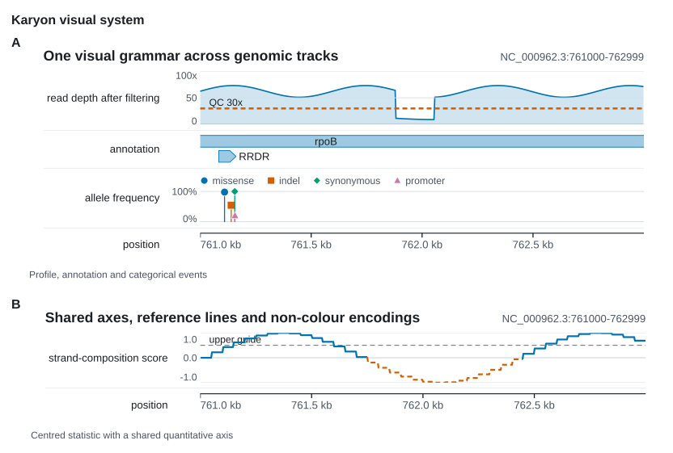

# Visual system

!!! info "Library only"
    Everything on this page is the Rust library. `RenderProfile`,
    `VisualTokens`, `Density` and `Emphasis` have no flag on the command line,
    which reaches the two built-in themes through `--theme` and nothing else
    here.

Karyon has one visual grammar for linear figures, circular plots and panel
sheets. It separates three decisions that used to be mixed together:

- `Theme` selects colours and typefaces.
- `RenderProfile` selects a named output treatment.
- `VisualTokens`, `Density` and `Emphasis` control measured geometry and
  semantic prominence.

{ width="834" height="568" loading="lazy" }

The figure is generated by `cargo run --example visual_system -- assets`.

## Named profiles

```rust
use karyon::RenderProfile;

let figure = plot("chr1:1-10000")?
    .profile(RenderProfile::Manuscript)
    .add_coverage(depth)
    .into_figure();
```

`Compact`, `Manuscript`, `Presentation`, `Web` and `Dark` select type scale,
mark scale and data density together. The same `profile` method is available on
`Plot`, `Figure`, `Rings` and `Panels`. A later `theme`, `visual_scale` or
`density` call can override one part deliberately.

| Profile | Use |
|:--------|:----|
| `Compact` | Dense multi-panel figures and narrow columns. |
| `Manuscript` | Balanced vector artwork for papers. |
| `Presentation` | Larger type and marks for projection. |
| `Web` | Slightly larger browser and documentation figures. |
| `Dark` | Manuscript geometry with the selected dark palette. |

## Tokens and emphasis

`Theme::tokens` is a `VisualTokens` value shared by axes, guides, markers,
features and legends. It contains the ordinary and strong stroke widths,
marker radius, tick and arrow sizes, label and row gaps, feature height, legend
measurements and area opacity. `Theme::scaled` scales these values with the
font sizes and corner radius.

`Emphasis` is semantic rather than chromatic: `Muted`, `Normal`, `Primary` and
`Alert`. `Theme::mark_style` resolves it to stroke width, point size, opacity
and `LinePattern`. This keeps a threshold distinguishable when colour is
removed.

## Shared quantitative axes

`CoverageTrack`, `VariantTrack`, `ManhattanTrack` and `WindowTrack` accept the
same `QuantitativeAxis` contract:

```rust
use karyon::{AxisFormat, Emphasis, QuantitativeAxis, ReferenceLine};

let axis = QuantitativeAxis::new()
    .range(0.0, 100.0)
    .ticks(3)
    .unit("x")
    .format(AxisFormat::Fixed(0))
    .reference(
        ReferenceLine::new(30.0)
            .label("QC 30x")
            .emphasis(Emphasis::Alert),
    );

let depth = CoverageTrack::new(start, values).axis(axis);
```

Pin the same range on figures that will be compared. `AxisFormat::Auto` uses
compact `k` and `M` suffixes; `Fixed` and `Percent` make the intended unit
explicit. Reference lines keep their exact labels and carry a pattern as well
as a colour.

## Labels and legends adapt to space

Track gutters are measured from their content and capped. Long visible labels
use an ellipsis while the document description retains the exact full track
name. Figure headers fit around the locus label, and the exact title remains in
the root SVG title.

Feature labels take part in row collision detection. Circular feature labels
are fitted towards the centre and omitted when their text boxes collide; the
feature arc still retains the exact name and coordinates in its tooltip.

Legends wrap rather than drop keys. A `VariantTrack` grows when a narrow plot
needs additional legend rows, and its legend copies the circle, square, diamond
or triangle used by each category.

## Panels align the data, not the frames

`Panels` aligns the genomic plot origin of linear figures by default. A panel
with a long track label and a panel with no gutter therefore start their data
at the same sheet coordinate. Circular and free-form drawings have no linear
origin and keep their natural left edge.

```rust
use karyon::Panels;

Panels::new()
    .align_plot_areas(true)
    .push(&coverage, "A")
    .push(&variants, "B")
    .save_svg("comparison.svg")?;
```

`Panels::visual_scale` scales nested drawings that were already added, together
with letters, captions, gaps and margins.

`Panels::row_major` makes a regular comparison grid when rows carry meaning;
the default column-major flow remains the more compact choice for a long paper
figure with unequal panel heights.

## Accessibility and exact content

The SVG root is named and described for assistive technology, and pointable
marks use exact `<title>` text. Categorical points cycle shape with colour;
thresholds and comparison lines use solid, dashed or dotted patterns. These
encodings improve greyscale printing and colour-vision accessibility without
changing positions, values, categories, labels or their order.

The CI example job regenerates every deterministic SVG and fails on stale
assets. It also rasterises the complete gallery and uploads the PNG set as the
`visual-gallery` artifact, so a visual review uses the same output that passed
the SVG gate.
