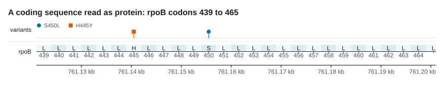

# Coordinates

An off-by-one in a genomic figure does not crash anything. The figure still
draws, the tracks still line up with each other, and the only thing wrong with
it is that every mark is one base from where the data put it. That is why this
page exists, and why the crate has a test file whose whole job is to push a
known base through every reader and check where it lands.

## One convention

Positions are **0-based and half-open** everywhere in the API, the BED
convention: the first base of a sequence is `0`, and `end` is one past the last
base included. Two useful things follow. The length of an interval is
`end - start` with no correction anywhere. And two intervals touch exactly when
one's `end` equals the other's `start`, so a gap of no bases is written as a gap
of zero rather than as a gap of minus one.

Every constructor takes those numbers: `Region::new`, `Feature::new`,
`Variant::new`, `Window::new`, `Read::new`, `Band::new`, `Association::new`,
`CodonTrack::new`, `MethylSite::new`, and the `_at` forms on `Plot` that take an
explicit start. Where a method means something else, its first documentation
line says so.

## The two exceptions

Two places speak the 1-based inclusive dialect that samtools, IGV, GFF3 and VCF
use, and both are places where a person reads the number rather than a program:

- [`Region::parse`](#the-region-api), which takes the locus string you would
  paste into a genome browser, and `Display`, which prints it back.
- Tick labels on `AxisTrack` and codon numbers on `CodonTrack`. `AxisTrack`
  computes its tick positions in 1-based space so the labels come out round, and
  draws each one at `scale.x(pos - 1)`.

```rust
let region = Region::parse("chr1:101-200")?;  // what you type in IGV
assert_eq!(region.start(), 100);              // 0-based
assert_eq!(region.end(), 200);                // exclusive
assert_eq!(region.len(), 100);
assert_eq!(region.to_string(), "chr1:101-200");
```

!!! warning "The conversion, in one line"
    A VCF `POS` or a GFF3 `start` is `pos - 1` on the way in. A GFF3 `end` goes
    in **unchanged**, because a 1-based inclusive end is already one past the
    last base once the count starts at zero. A BED `start` and `end` both go in
    as they are.

Written out, that is:

```rust
// A VCF line at POS 761,155.
let call = Variant::new(761_155 - 1);
assert_eq!(call.pos, 761_154);

// A GFF3 record spanning 1-based 759,807 to 763,325 inclusive.
let gene = Feature::new(759_807 - 1, 763_325);
assert_eq!((gene.start, gene.end), (759_806, 763_325));
assert_eq!(gene.len(), 3_519);

// The same gene as a BED line, 759806 763325, goes in unchanged.
assert_eq!(Feature::new(759_806, 763_325), gene);
```

## The Region API

A `Region` is a sequence name and a half-open interval on it. It is the only
thing a `Figure` needs in order to know what it is drawing, and every track in
the stack is mapped through the one `Scale` built from it.

| Method | Returns | Convention |
|:-------|:--------|:-----------|
| `Region::new(seq, start, end)` | `Result<Region, Error>` | 0-based half-open |
| `Region::parse(locus)` | `Result<Region, Error>` | 1-based inclusive |
| `seq()` | `&str` | |
| `start()` | `u64` | 0-based, first base included |
| `end()` | `u64` | exclusive, one past the last |
| `len()` | `u64` | `end - start`, always at least 1 |
| `contains(pos)` | `bool` | 0-based, false at `end` |
| `display_start()` | `u64` | 1-based, `start + 1` |
| `display_end()` | `u64` | 1-based inclusive, `end` |
| `to_string()` | `String` | `seq:display_start-display_end` |

```rust
let region = Region::parse("chr1:101-200")?;

assert_eq!(region.display_start(), 101);      // what a reader is shown
assert_eq!(region.display_end(), 200);
assert!(region.contains(199));                // the last base
assert!(!region.contains(200));               // the end is not in the region

// The same window, written in the convention the rest of the API uses.
assert_eq!(Region::new("chr1", 100, 200)?, region);
```

`parse` is forgiving about the things a locus string picks up in transit and
strict about the things that would change the answer. Thousands separators,
both `,` and `_`, are ignored. The split happens at the **last** colon, so a
sequence name that contains colons survives.

```rust
assert_eq!(
    Region::parse("NC_000962.3:761,100-761,200")?,
    Region::new("NC_000962.3", 761_099, 761_200)?
);
assert_eq!(Region::parse("gi|123|ref|NC_1.1:5-8")?.seq(), "gi|123|ref|NC_1.1");
```

Everything else is an error rather than a guess, and the error says which of
the two conventions it was reading:

```rust
assert!(Region::parse("chr1:0-200").is_err());   // 1-based coordinates start at 1
assert!(Region::parse("chr1:200-100").is_err()); // end is before start
assert!(Region::parse("chr1:100").is_err());     // expected start-end after the colon
assert!(Region::new("chr1", 100, 100).is_err()); // a figure needs at least one base
```

Those are `Error::InvalidLocus` and `Error::EmptyRegion`. Both convert into
`std::io::Error`, so the region and the file it renders to can share one `?`.

## A base is a span, not a point

`Scale` maps a 0-based position to an x in the output image. A base at position
`p` occupies the pixel span `[x(p), x(p + 1))`, so `Scale::x` returns the **left
edge** of a base and `Scale::x_center` returns its middle.

```rust
let close = Scale::new(&Region::new("chr1", 100, 200)?, 50.0, 500.0);
assert_eq!(close.x(100), 50.0);        // left edge of the first base
assert_eq!(close.x_center(100), 52.5); // and its middle
```

Which of the two a track wants is a real choice. A variant is an event at one
base, so its lollipop uses `x_center`. A feature is an interval, so it is drawn
from `x(start)` to `x(end)` and the half-open end lands exactly on the boundary
of the next base. A ruler marks boundaries, so `AxisTrack` uses `x` by default;
`AxisTrack::center_on_bases(true)` moves the ticks to the middle of the base
they count, which is what a sequence logo or a short motif wants, where a base
is a column you can see rather than a fraction of a pixel.


## What a file's numbers become

`karyon::read` is the one place in the project where the convention is not
uniform, because each format defines its own. Every reader states which it is
reading, every one has a test that pins a known base through the conversion,
and a property checks that all nine formats agree about an interval whichever
base it starts on. What each format
is otherwise expected to look like is on the
[file formats](../guide/formats.md) page.

| Flag | Format | The file's convention | On the way in |
|:-----|:-------|:----------------------|:--------------|
| `--coverage` | bedGraph, four columns | 0-based half-open | passed through, and every base of the interval takes the value |
| `--coverage` | `samtools depth`, three columns | 1-based | `pos - 1` |
| `--coverage` | a bare column of values | none | the first value is the first base of the region |
| `--windows` | bedGraph | 0-based half-open | passed through, kept as intervals rather than flattened |
| `--features` | BED | 0-based half-open | passed through |
| `--features` | GFF3 | 1-based inclusive | `start - 1`, end unchanged |
| `--variants` | VCF | 1-based | `POS - 1` |
| `--manhattan` | position and value table | 1-based | `pos - 1` |
| `--matrix` | positions in the header row | 1-based | `pos - 1` |
| `--pileup` | SAM text | 1-based | `POS - 1`, and the end walked from the CIGAR |
| `--ideogram` | cytoBand | 0-based half-open | passed through |
| `--sequence` | FASTA | none | byte `n` is the base at 0-based `n`, cut down to the region |
| `--msa`, `--snps` | aligned FASTA | none | the coordinate is the alignment column |
| `--tree` | Newick | none | no coordinates at all |

Three consequences are worth knowing.

**A whole genome file is fine to hand over.** Rows naming another sequence are
skipped before the rest of the line is parsed, and rows outside the region are
dropped rather than carried into a track that would not draw them. A bedGraph
interval is clipped to the region before it is expanded, which is what keeps a
genome-wide file from being widened into memory one base at a time.

**Overlap counts, containment does not.** A record is kept when
`end > region.start()` and `start < region.end()`. A gene that runs off both
edges of the window is drawn as a gene that runs off both edges, which is what
`rpoB` does in most figures of that locus.

**A deletion is a call about the window even when its anchor is not in it.** VCF
writes a deletion one base to the left of the bases it removes, so the reader
takes the span `REF` spells rather than the anchor alone. `POS` one base outside
the window with a five base `REF` is a call the window has to show.

## The region is a coordinate system, not a claim about a genome

A `Figure` is one region on one sequence, and the axis counts whatever the data
counts. Three tracks put something other than bases on it, and in each case the
region is written in that unit:

- `MsaTrack` is indexed by **alignment column**, so an alignment 900 columns
  wide is `Region::new("alignment", 0, 900)` and the ruler under it counts
  columns. Ungapping a row back to reference coordinates is a real operation
  with real decisions in it, and the crate does not do it behind your back.
- `SnpTrack` throws the invariant columns away and spaces what is left evenly,
  so its axis is **not linear in the genome**: two neighbouring columns may be
  nine bases or nine kilobases apart. Each column carries its own position
  underneath for that reason, and an `AxisTrack` does not belong under the
  panel.
- `SquiggleTrack` is indexed by **sample number**, which is time.

`Genome` is the other direction: it lays several sequences end to end and hands
back the one region that covers them, so every track works across all of them at
once.

```rust
let genome = Genome::new([("chr1", 1_000_000u64), ("chr2", 600_000)]);
let at = genome.at("chr2", 1_000).unwrap();
assert_eq!(at, 1_001_000);
assert_eq!(genome.locate(at), Some(("chr2", 1_000)));
```

The cost is that the axis is a concatenation, so a distance across a boundary is
not a distance. `GenomeTrack` draws where the joins are and labels each
sequence, because a ruler of global coordinates would be a ruler of a coordinate
system nothing else uses.

## Protein coordinates



A variant in a coding sequence is named by residue rather than by base: BRAF
V600E, TP53 R175H, rpoB S450L. A figure drawn in bases cannot be pointed at with
any of those names. `CodonTrack` is the third coordinate system in the crate,
and the one that can.

It takes the coding sequence as a 0-based half-open span, like everything else,
and numbers the codons **1-based**, like every protein coordinate that has ever
been written down. A GFF3 or GenBank CDS therefore goes in as `start - 1` with
its end unchanged, the same conversion as any other interval.

```rust
// rpoB, forward strand, 0-based half-open.
let ruler = CodonTrack::new(759_806, 763_325, Strand::Forward);
assert_eq!(ruler.codons(), 1_173);
assert_eq!(ruler.codon_of(761_154), Some(450));
assert_eq!(ruler.span_of(450), Some((761_153, 761_156)));
```

The partition is itself the claim. Two changes at different bases of one codon
are competing alleles at one residue rather than a double mutant, and two
changes in neighbouring codons are two substitutions however few bases apart
they are. Neither statement can be made on a ruler of bases.

### The reverse strand

On the reverse strand codon 1 sits at the **highest** coordinate and the
numbering runs right to left. This is the whole reason the track exists rather
than a division by three: roughly half the coding sequences in any annotation
run backwards, and getting their numbering wrong is silent, since the figure
still draws and merely names the wrong residue.

```rust
let ruler = CodonTrack::new(1_000, 1_030, Strand::Reverse);
assert_eq!(ruler.span_of(1), Some((1_027, 1_030)));   // codon 1 at the top
assert_eq!(ruler.span_of(10), Some((1_000, 1_003)));  // the last at the bottom
assert_eq!(ruler.codon_of(1_029), Some(1));
assert_eq!(ruler.codon_of(1_000), Some(10));
```

`span_of` reports its span in reference order on both strands, low coordinate
first, so it can be handed straight to a `Scale` without a second thought. The
chevron the track draws on codon 1 points out of the sequence, away from codon
2, and is the only thing on a reverse strand ruler that says so at a glance.

Translation follows the same rule. Hand in the reference as it is and never the
reverse complement: on the reverse strand the track complements the bases and
reads them backwards itself.

```rust
// The reference reads TTACCACAT. Complemented and read backwards that is
// ATGTGGTAA: methionine, tryptophan, stop.
let cds = CodonTrack::new(0, 9, Strand::Reverse).sequence(0, b"TTACCACAT".to_vec());
assert_eq!(cds.residue_of(1), Some(b'M'));
assert_eq!(cds.residue_of(2), Some(b'W'));
assert_eq!(cds.residue_of(3), Some(b'*'));
```

`residue_of` returns `Some(b'*')` for a stop, and `None` when there is no
sequence attached, when the bases for that codon are not in the slice, or when
one of them is ambiguous. A codon with no letter is drawn without one rather
than guessed at.

### The edges

??? note "A coding sequence whose length is not a multiple of three"
    The trailing partial codon is left out of the count and off the ruler, since
    a third of a residue is not a residue. Which end the leftover sits at
    depends on the strand, because the count starts from the opposite end:

    ```rust
    let forward = CodonTrack::new(0, 11, Strand::Forward);
    assert_eq!(forward.codons(), 3);
    assert_eq!(forward.codon_of(9), None);   // the leftover is at the high end

    let reverse = CodonTrack::new(0, 11, Strand::Reverse);
    assert_eq!(reverse.codon_of(10), Some(1));
    assert_eq!(reverse.codon_of(1), None);   // and here at the low end
    ```

??? note "A genetic code that reassigns a residue"
    Translation is NCBI table 1. Table 11, which bacteria, archaea and plastids
    use, differs only in which codons may start a protein, so the residues are
    identical and nothing needs to be said. The tables that do reassign a
    residue have to be passed in, because translating with the wrong one
    produces a plausible protein that is wrong, which is worse than refusing.

    `genetic_code` takes the sixty-four residues in NCBI order, `TTT` `TTC`
    `TTA` `TTG` `TCT` and so on to `GGG`, which is the `AAs` line of an NCBI
    translation table copied across unchanged.

    ```rust
    // Vertebrate mitochondrial, NCBI table 2: TGA is tryptophan, not a stop.
    let mito = CodonTrack::new(0, 3, Strand::Forward)
        .sequence(0, b"TGA".to_vec())
        .genetic_code(b"FFLLSSSSYY**CCWWLLLLPPPPHHQQRRRRIIMMTTTTNNKKSS**VVVVAAAADDEEGGGG");
    assert_eq!(mito.residue_of(1), Some(b'W'));
    ```

## The short version

- 0-based half-open everywhere, except `Region::parse` and the numbers a reader
  sees.
- `pos - 1` for a VCF `POS`, a GFF3 `start`, a SAM `POS` and a `samtools depth`
  position. Nothing for a BED, bedGraph or cytoBand coordinate.
- A GFF3 `end` is already the half-open end. Do not subtract from it.
- Codons are 1-based, and on the reverse strand codon 1 is at the highest
  coordinate.

## Next

- [Scale](scale.md), for what happens to these numbers once one pixel covers
  more than one of them.
- [File formats](../guide/formats.md), for the conversion each reader performs
  on the way in.
- [Tracks](../tracks.md), for the tracks whose axis is not in bases at all.
