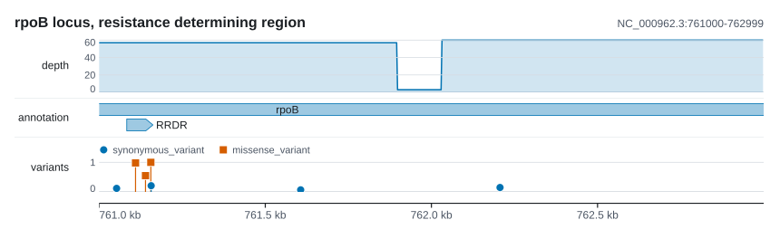
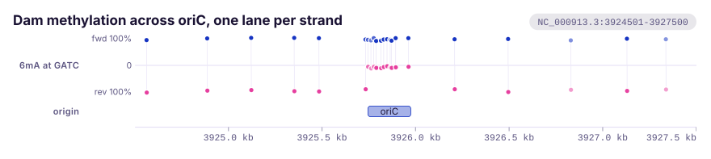
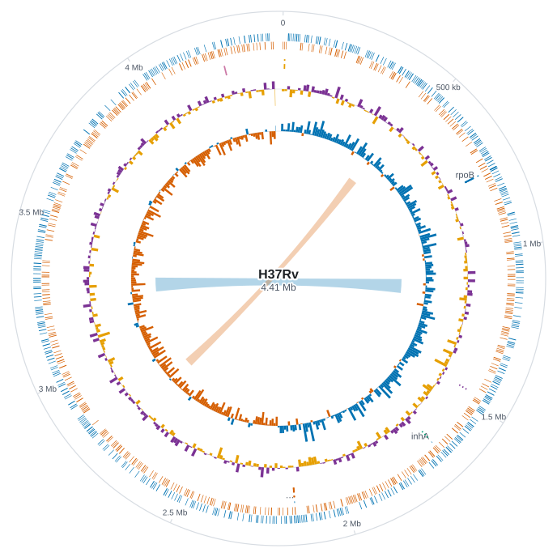

---
hide:
  - navigation
---

<link rel="stylesheet" href="stylesheets/landing.css">

<section class="k-hero" markdown>

{ .k-hero-logo }

<div class="k-hero-say" markdown>

# karyon

Genomic figures, as a Rust library and as a command.
{ .k-lead }

You name a region once and everything you add draws itself on that region, so
the rows line up without being positioned. A row is what the API calls a track.
What comes out is one standalone SVG.
{ .k-sub }

[Get started](getting-started/quickstart.md){ .k-go .k-go--first }
[Playground](playground.md){ .k-go }
[Source](https://github.com/PathoGenOmics-Lab/karyon){ .k-go }
{ .k-actions }

It reads BED, bedGraph, GFF3, VCF, SAM, FASTA, Newick and [fourteen other text
formats](guide/formats.md), and draws [36 track types](plots/index.md), [28 of
them from the command line](guide/cli.md). No runtime dependencies, Rust 1.74
and later, MIT, and not on crates.io yet.
{ .k-meta }

</div>

</section>

<section class="k-band k-intro" markdown>

General plotting libraries know about points and lines. They do not know that a
position is a base, that a gene has a strand, that a pixel at genome scale
covers two thousand bases, or that a figure is worthless if its tracks do not
line up. `karyon` is the small amount of code that does know those things.

## The same four rows, twice

<figure markdown>
{ width="900" height="306" loading="lazy" }
<figcaption><code>NC_000962.3:761000-762999</code>, two thousand bases</figcaption>
</figure>

<figure markdown>
{ width="900" height="223" loading="lazy" }
<figcaption><code>NC_000962.3:761121-761180</code>, sixty bases</figcaption>
</figure>

Depth, reference, variants. The same three rows in both, from the same arrays,
and `Variant::new(761_154)` is the same line of code in both. The reference row
in the first figure says to zoom in; the second is what that looks like when you
do. Both come out of one run of `examples/locus.rs`.

That is the whole idea. A row is handed its numbers and the window works out
where they go, so a box lands inside its gene and a lollipop lands inside its
box without anything being told to. Move the window and they move together.

</section>

<section class="k-band k-live" markdown>

## The same program, running here

The two figures above were drawn before you got here. This one is drawn where
you are. The whole crate compiles to WebAssembly, so the program arrives with
the page and the figure below comes out of it.

Move the window and watch the command. Drag the figure, or give it the keyboard
and use the arrow keys; `+` and `-` change how much is in view, and so does the
wheel once the figure has focus, which is why a wheel over a figure you have not
clicked scrolls the page instead of zooming it. Nothing is transformed and
nothing is cached: every frame rewrites the region in the command and runs the
program again, which is why the rows stay together wherever you take them.

<div class="k-stage">
  <div class="k-stage-head">
    <span class="k-stage-name" data-karyon-name>karyon, drawn in advance</span>
    <span class="k-stage-hint" data-karyon-hint></span>
    <span class="k-stage-keys">
      <button type="button" class="k-key" data-karyon-out disabled>Zoom out</button>
      <button type="button" class="k-key" data-karyon-in disabled>Zoom in</button>
      <button type="button" class="k-key" data-karyon-reset disabled>Reset</button>
    </span>
  </div>
  <pre class="k-stage-command" data-karyon-command><code>NC_000962.3:761,000-762,999 \
  --coverage depth.bg --label depth --aggregate min \
  --features genes.gff3 --label annotation \
  --variants calls.vcf --label variants \
  --title 'rpoB locus, resistance determining region'</code></pre>
  <div class="k-stage-plot" data-karyon-plot>
    
  </div>
  <p class="k-stage-status" data-karyon-status aria-live="polite">Drawn in advance, from the command above. If the program arrives, it is redrawn here.</p>
</div>

Two things the page supplies and the command does not: the width to draw at,
and the dark theme when the page is dark. Writing `--width` or `--theme` into
the command overrules both, since the command is the thing that decides. The
time in the status line is measured here rather than remembered, and nothing
leaves the page: the argument parser, every reader and the renderer are all
inside the program that was fetched.

The three files below are small, so it is easy to take the window somewhere none
of them has anything to say. What comes back then is not an empty figure, it is
the sentence the command prints at a shell, `no variants in the region` or `no
features in the region`, with the flag and the file named. That is
[what it will not do](#what-it-will-not-do), further down this page, and it is
the one part of it you can make happen yourself. Reset puts the window back.

<details class="track-overview k-files" markdown>
<summary>The three files this figure is drawn from</summary>

<div class="k-file" markdown>
<p class="k-file-name">depth.bg</p>
<pre data-karyon-file="depth.bg"><code>NC_000962.3 756999 759999 62
NC_000962.3 759999 760999 58
NC_000962.3 760999 761899 57
NC_000962.3 761899 762029 3
NC_000962.3 762029 763999 60
NC_000962.3 763999 766999 54</code></pre>
</div>

<div class="k-file" markdown>
<p class="k-file-name">genes.gff3</p>
<pre data-karyon-file="genes.gff3"><code>##gff-version 3
NC_000962.3 . gene 759807 763325 . + . Name=rpoB
NC_000962.3 . gene 761082 761162 . + . Name=RRDR</code></pre>
</div>

<div class="k-file" markdown>
<p class="k-file-name">calls.vcf</p>
<pre data-karyon-file="calls.vcf"><code>NC_000962.3 760106 . C T . . AF=0.09;ANN=T|synonymous_variant|LOW|rpoB
NC_000962.3 761052 . C T . . AF=0.12;ANN=T|synonymous_variant|LOW|rpoB
NC_000962.3 761109 . G T . . AF=0.98;ANN=T|missense_variant|MODERATE|rpoB
NC_000962.3 761139 . C T . . AF=0.55;ANN=T|missense_variant|MODERATE|rpoB
NC_000962.3 761155 . T C . . AF=1.00;ANN=C|missense_variant|MODERATE|rpoB
NC_000962.3 761156 . C T . . AF=0.21;ANN=T|synonymous_variant|LOW|rpoB
NC_000962.3 761606 . G A . . AF=0.07;ANN=A|synonymous_variant|LOW|rpoB
NC_000962.3 762206 . C T . . AF=0.15;ANN=T|synonymous_variant|LOW|rpoB</code></pre>
</div>

They are written with spaces rather than tabs, which every reader accepts. Three
things differ from the pair at the top of the page, and they are worth saying
rather than leaving to be found. The depth is six bedGraph rows instead of the
two thousand values the example program computes, so this profile is flat where
that one is noisy and the dropout is in the same place. There is no reference
row, because two thousand bases of FASTA is not a thing to paste into a page,
and it is the one row of the four this figure does not have. The gene and its
resistance determining region are the real ones to the base, out of
`examples/locus.rs`, and five of the calls are that example's; the other three
sit on codon boundaries further along the gene, put there so the window has
something to find when you move it.

</details>

If the figure above is still the one drawn in advance, the program did not
arrive. It is built and published with the site rather than committed, so a
checkout served straight off a disk has the pictures and not the program. The
[playground](playground.md) is this same bridge with a file editor around it,
and every flag the command has except the two a page cannot perform: nothing is
piped into a page, and `--help` prints to a terminal.

</section>

<section class="k-band k-write" markdown>

## What it looks like to write

The command above and the library are one grammar with two spellings, spaces
instead of dots. This is the second spelling, and it is the one that drew the
first figure at the top of the page.

```rust
use karyon::{plot, Aggregate};

plot("NC_000962.3:761000-762999")?
    .title("rpoB locus, resistance determining region")
    .add_coverage(depth)
    .label("depth")
    .adjust(|track| track.aggregate(Aggregate::Min).height(70.0))
    .add_sequence(bases)
    .label("reference")
    .add_features(genes)
    .label("annotation")
    .add_variants(variants)
    .label("variants")
    .save("example.svg")?;
```

That is the chain, unedited. It is not a whole program: `depth`, `bases`,
`genes` and `variants` are built above it, and
[`examples/locus.rs`](https://github.com/PathoGenOmics-Lab/karyon/blob/main/examples/locus.rs)
is the file that runs. Four things in it were never asked for: the ruler along
the bottom, the depth axis, the window printed in the corner, and the key naming
which colour is *missense*. Neither was the `<title>` and `<desc>` a screen
reader is given instead of several thousand unnamed rectangles.

`Aggregate::Min` is the one decision worth pointing at, and it is the
`--aggregate min` in the command above. At this width a pixel covers more than
one base, so a row has to choose what to show, and a maximum would have smoothed
the dropout away, which is the thing the figure is about.

</section>

<section class="k-band k-blocks" markdown>

## The pieces you have to hold in your head

Six, and every figure on this site is built out of them.

<div class="k-block-grid" markdown>

<div class="k-block" markdown>

### The region

One coordinate system, named once.
{ .k-claim }

A region is a sequence name and a span, and it is the first thing a figure is
built from. Its one invariant is that the span is never empty. The name is never
looked up: nothing resolves it and nothing compares it against a file, which is
what lets a region stand for any axis a track can be laid along. `alignment:1-320`
counts columns of an alignment, and a raw current trace is counted in samples. A
region is a coordinate system with a label on it, and the label is for the
reader.

[Coordinates](how-it-works/coordinates.md)
{ .k-block-go }

</div>

<div class="k-block" markdown>

### The scale

One map, shared, that never clamps.
{ .k-claim }

A figure builds one scale and hands the same one to every track. It is four
numbers: where the region starts, how far it runs, where the plotting area
begins, how wide it is. What it has no opinion about is what a unit is. A
position outside the region maps outside the plotting area, and that is a normal
answer rather than a mistake: a gene beginning before the window is drawn as the
whole rectangle it is, and the clip decides how much shows. Clamping would stop
the rectangle at the border and say the gene ends there.

[Scale](how-it-works/scale.md)
{ .k-block-go }

</div>

<div class="k-block" markdown>

### The track

One band, height asked for, position never.
{ .k-claim }

A track owns one horizontal band. It knows how tall it wants to be and how to
draw itself, and it never decides where it sits. It is not told which band it
is, how many others there are, or what any of them asked for, so it has nothing
to negotiate with and no way to disturb its neighbours. That is what entitles a
reader to run a finger down the figure and read every band it crosses at one
position.

[Track API reference](tracks.md)
{ .k-block-go }

</div>

<div class="k-block" markdown>

### The plot and the figure

Two layers, and neither draws what the other cannot.
{ .k-claim }

`plot()` is the short way to write a figure down: one call per track, in the
order they stack, with the region held once and the ruler filled in. `Figure` is
what it builds, and the layer to reach for when a track is made by another
constructor, read back before it is drawn, or passed around. The width is a
setting no track can influence. The height is not a setting at all: it is
whatever the tracks came to.

[Plot API](guide/plot.md) and [Figure API](guide/figure.md)
{ .k-block-go }

</div>

<div class="k-block" markdown>

### Genome, Rings and Panels

Three containers, because three coordinate systems.
{ .k-claim }

A figure is one region on one sequence. `Genome` lays several end to end and
hands back the one region that covers them, so an assembly of two hundred
contigs is an ordinary figure over an unusually long axis, with the cost stated:
a distance measured across a boundary is not a distance. `Rings` maps position
to an angle, because a sequence with no ends drawn as a line invents one.
`Panels` puts several drawings on one sheet and never reorders them, since their
sequence is what the letters mean.

[Whole genomes and geography](plots/whole-genomes-geography.md)
{ .k-block-go }

</div>

<div class="k-block" markdown>

### The readers

Files are text, and text is somebody else's problem.
{ .k-claim }

`karyon::read` turns line based formats into the vectors the tracks take, and
every one of those functions takes a `&str`. Nothing in the crate opens a path,
so where the text came from stays the caller's decision, and the dependency
count stays at zero. It is also why the same code runs at a shell and in this
page: the command hands the grammar something that answers with a source's text,
and a shell answers with a file while a page answers with a string it is holding.

[File formats](guide/formats.md)
{ .k-block-go }

</div>

</div>

</section>

<section class="k-band k-more" markdown>

## Everything else it draws

They compose the way the four at the top do: one call each, in the order they
stack. A phylogeny is a track and so are its sample traits. A circular
chromosome and a world map are containers of their own, because a sequence with
no ends cannot be drawn as a line without inventing one.

<div class="track-gallery">
  <a class="track-card" href="plots/reads-molecules/">
    
    <span><strong>Reads</strong><small>Pileups and single molecules</small></span>
  </a>
  <a class="track-card" href="plots/annotation-coordinates/">
    
    <span><strong>Annotation</strong><small>Ideograms, genes and coordinates</small></span>
  </a>
  <a class="track-card" href="plots/variation-association/">
    
    <span><strong>Variation</strong><small>Association scans and genotypes</small></span>
  </a>
  <a class="track-card" href="plots/comparisons-alignments/">
    
    <span><strong>Comparisons</strong><small>Dotplots, synteny and alignments</small></span>
  </a>
  <a class="track-card" href="plots/phylogeny-clades/">
    
    <span><strong>Phylogeny</strong><small>Three projections of one tree</small></span>
  </a>
  <a class="track-card" href="plots/signal-sequence/">
    
    <span><strong>Signal</strong><small>Coverage, methylation and squiggles</small></span>
  </a>
  <a class="track-card" href="plots/evolution-surveillance/">
    
    <span><strong>Circular</strong><small>Sequences with no ends</small></span>
  </a>
  <a class="track-card" href="plots/">
    
    <span><strong>Maps</strong><small>Where the samples came from</small></span>
  </a>
</div>

<details class="track-overview">
  <summary>All thirty-six on one sheet</summary>
  
</details>

Twenty-eight of the thirty-six are reachable from the command line; the rest are
library only, which is a boundary worth saying out loud because it is the one
readers walk into. The count is thirty-six because three were removed: every
track has to answer *does drawing it read the shared scale*, and three that
could not were taken out rather than kept for the sake of a longer list.
[Extending](how-it-works/extending.md) has that test and what a new track owes.

</section>

<section class="k-band k-refusals" markdown>

## What it will not do

Several tracks encode a claim rather than a picture, and what they do when the
data does not support the claim is what makes them worth having. The refusals
are the interesting part.

<div class="k-block-grid k-refusals-grid" markdown>

<div class="k-block" markdown>

### A tanglegram is two trees

<p class="k-claim"><code>a tanglegram track is drawn from two files, and --against names the second</code></p>

Handed one file it would draw the tree against itself, which has no crossings,
and no crossings is what a perfect result looks like. The two other tracks that
take a second file are refused the same way.

</div>

<div class="k-block" markdown>

### A join that matched nothing

<p class="k-claim">names the first gene that found no match</p>

A homology join with no hits would outline every gene in every genome as having
no counterpart, which reads as a discovery. The names in a search result and the
names in an annotation are routinely not the same strings, so it says which one
it looked for.

</div>

<div class="k-block" markdown>

### A scale it cannot infer

<p class="k-claim"><code>--identity</code> says whether a column is a percentage or a fraction</p>

Left out it is worked out from the values, and a file whose values are all at or
below one could be either. Read the wrong way round, every ribbon in the figure
becomes a perfect match and nothing fails, so it is refused by name rather than
guessed at.

</div>

<div class="k-block" markdown>

### Nought reads is not nought per cent

<p class="k-claim">skipped, and counted</p>

`modkit` writes a row for a position it could not call, with nought in every
count. Passed through, that is a mark on the baseline saying the cytosine is
unmodified, which is a measurement. The position was not measured.

</div>

</div>

All four are the same bug, and it has a name here: **a value given for the
absence of a value**. It is the class this crate is written against, and it is
why several of these tracks would rather draw nothing.

The plainer limits deserve the same sentence. It does not read BAM, CRAM or BCF.
Those come in through a pipe, because `samtools` and `bcftools` already write
what its readers take:

```bash
samtools depth -a -r NC_000962.3:761000-763000 aln.bam \
  | karyon NC_000962.3:761,000-763,000 --coverage - --label depth -o rpoB.svg
```

It is not on crates.io yet, so both the library and the command install from
this repository. And it does not resample, smooth or interpolate: a row draws
the numbers it was given, or says that it could not.

!!! warning "One trap, said here rather than found later"
    `add_coverage` anchors its first value at the left edge of the window. That
    is what you want when the array starts there, and it is wrong the moment it
    does not: change the region string alone and the array silently re-anchors,
    which draws a figure that looks right. `add_coverage_at(start, values)` says
    where the data actually begins, and is the form to reach for whenever the
    window and the array are not the same span.

</section>

<section class="k-band k-resources" markdown>

## Where to go

<div class="k-shelf" markdown>

<div class="k-shelf-group" markdown>

### Start here

[Quickstart](getting-started/quickstart.md)
:   A first figure in one short program, and the same figure without writing
    any Rust.

[Installation](getting-started/installation.md)
:   Point Cargo at the repository for the library, `cargo install` for the
    command. Nothing else to install alongside it.

[Playground](playground.md)
:   The bridge from the figure above with a file editor around it. No install,
    no upload, and it works with the network unplugged.

</div>

<div class="k-shelf-group" markdown>

### The reference

[Plot catalogue](plots/index.md)
:   Eight routes through all thirty-six tracks plus the circular and
    geographic drawings, sorted by biological question rather than by type name.

[Track API reference](tracks.md)
:   For each track: what it draws, when to reach for it, and what it refuses to
    do.

[Plot API](guide/plot.md)
:   What the plot remembers between calls, what it fills in, and where the short
    form stops.

[Command line](guide/cli.md)
:   The same grammar with spaces instead of dots, for the twenty-eight tracks
    that have a file to read. Flag order is stack order, and any track file may
    be `-`, though one track may take it, since there is only one standard
    input to go around.

[File formats](guide/formats.md)
:   One section per format: which columns are read, which coordinate convention
    the file counts in, and what stops the figure rather than being skipped.

[Annotated phylogenetics](guide/phylogenetics.md)
:   BEAST, NHX and Nexus metadata; dated trees, topology operations, branch
    colours, collapsed clades and aligned sample traits.

[Geographic genomics](guide/maps.md)
:   Occurrence maps, explicit geographic links and circular phylogenies around
    an offline, deterministic world map.

</div>

<div class="k-shelf-group" markdown>

### Why it is built this way

[Coordinates](how-it-works/coordinates.md)
:   0-based and half-open everywhere, with two deliberate exceptions, both of
    them places where a person reads the number.

[Scale](how-it-works/scale.md)
:   What a track does when one pixel covers two thousand bases, and why a
    genome-wide figure is still a small file.

[Extending](how-it-works/extending.md)
:   The one question a track has to answer, and the thirty or so lines a new one
    takes.

[Recipes](recipes.md)
:   Short worked figures for the questions that come up repeatedly, each one a
    program that runs.

</div>

</div>

!!! note "Two coordinate systems, on purpose"
    The region string is the 1-based inclusive form samtools and IGV use, and so
    are the tick labels, because those are the two numbers a person reads.
    Everything else, `Feature::new` and `Variant::new` among them, is 0-based and
    half-open like BED, so a VCF `POS` goes in as `POS - 1`.
    [`karyon::read`](guide/formats.md) does that subtraction for you, and
    [Coordinates](how-it-works/coordinates.md) has the whole of it.

</section>

<section class="k-band k-cite" markdown>

## Citing it, and the work it draws on

There is no paper and no archive yet. No Zenodo DOI and no `CITATION.cff`, so
until there is, the thing to cite is the repository and the version you used.

> Ruiz-Rodriguez P, Coscolla M. *karyon: genomic track plots for Rust.*
> PathoGenOmics Lab. <https://github.com/PathoGenOmics-Lab/karyon>

Record the version as well. Rendering is deterministic, so the same input
produces byte-identical output and a figure can be regenerated exactly, but only
against the version that drew it. A new default or a changed layout is a
different figure from the same data. `karyon --version` prints it.

Most of what karyon draws is a standard representation, and the ones that are
not have somebody else's idea in them. Those are worth citing in their own right
when a figure leans on them.

<ul class="k-refs" markdown>
<li markdown>Sequence logos scaled by information content are Schneider and Stephens's. <span>Schneider TD, Stephens RM. *Sequence logos: a new way to display consensus sequences.* Nucleic Acids Research. 1990;18(20):6097-6100.</span></li>
<li markdown>The enrichment and depletion logo, and the shrinkage behind `LogoTrack::stabilize`, are both from the Logolas paper. <span>Dey KK, Xie D, Stephens M. *A new sequence logo plot to highlight enrichment and depletion.* BMC Bioinformatics. 2018;19:473.</span></li>
<li markdown>Drawing only the columns that vary is the idea [snipit](https://github.com/aineniamh/snipit) is built around. The implementation in `SnpTrack` and the drawing are this crate's own.</li>
<li markdown>The default nucleotide colours are IGV's, because a figure that recolours the bases surprises every reader. <span>Robinson JT, Thorvaldsdottir H, Winckler W, Guttman M, Lander ES, Getz G, Mesirov JP. *Integrative Genomics Viewer.* Nature Biotechnology. 2011;29(1):24-26.</span></li>
</ul>

[Citation](about/citation.md) has the whole list, the specifications behind
every format the readers take included. Written by **Paula Ruiz-Rodriguez** and
**Mireia Coscolla**, I²SysBio, University of Valencia-CSIC, FISABIO Joint
Research Unit Infection and Public Health, Valencia, Spain. Released under
[MIT](https://github.com/PathoGenOmics-Lab/karyon/blob/main/LICENSE).

</section>

<script src="assets/karyon-wasm.js" defer></script>
<script src="assets/karyon-live.js" defer></script>