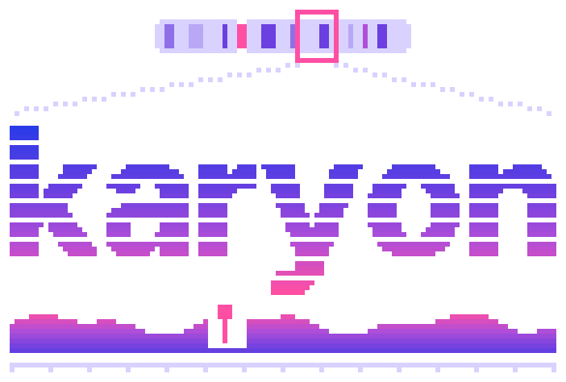

---
hide:
  - navigation
  - toc
---

<link rel="stylesheet" href="stylesheets/landing.css">

<section class="k-hero" markdown>

<div class="k-hero-say" markdown>

<p class="k-hero-mark">
  
  
</p>

# Genome figures for Rust, from code or from the shell

Name a region once, add tracks such as coverage, genes, variants, reads or a
phylogeny, and get one standalone SVG in which every row lines up.
{ .k-lead }

[Get started](getting-started/quickstart.md){ .k-go .k-go--first }
[Browse the gallery](plots/index.md){ .k-go }
[Try it in your browser](playground.md){ .k-go }
{ .k-actions }

<ul class="k-chips">
  <li>36 track types</li>
  <li>Reads BED, VCF, GFF3, SAM, FASTA, Newick and more</li>
  <li>No runtime dependencies</li>
  <li>Rust 1.74+ · MIT</li>
</ul>

</div>

</section>

<section class="k-band k-showcase" markdown>

<figure class="k-showcase-figure" markdown>
{ width="900" height="306" }
</figure>

<div class="k-showcase-code" markdown>

The figure above is these lines. Each call adds one track, in the order they
stack, and every track is drawn on the same coordinate axis.

=== "Rust"

    ```rust
    use karyon::{plot, Aggregate};

    plot("NC_000962.3:761000-762999")?
        .title("rpoB locus, resistance determining region")
        .add_coverage(depth).label("depth")
        .adjust(|track| track.aggregate(Aggregate::Min).height(70.0))
        .add_sequence(bases).label("reference")
        .add_features(genes).label("annotation")
        .add_variants(variants).label("variants")
        .save("example.svg")?;
    ```

=== "Command line"

    ```bash
    karyon NC_000962.3:761,000-762,999 \
      --coverage depth.bg --label depth --aggregate min \
      --sequence reference.fa --label reference \
      --features genes.gff3 --label annotation \
      --variants calls.vcf --label variants \
      --title 'rpoB locus, resistance determining region' \
      -o example.svg
    ```

The ruler, the depth axis, the colour key and the accessible title and
description are added for you. The full program is
[`examples/locus.rs`](https://github.com/PathoGenOmics-Lab/karyon/blob/main/examples/locus.rs).

</div>

</section>

<section class="k-band k-features" markdown>

## Why karyon

<div class="k-feature-grid" markdown>

<div class="k-feature" markdown>
### Tracks that line up
Every track is drawn on one shared coordinate axis, so a gene, its depth and its
variants land at the same position without being placed by hand.
</div>

<div class="k-feature" markdown>
### 36 kinds of track
Coverage, genes, variants, read pileups, alignments, sequence logos, synteny,
trees, methylation, raw nanopore signal and more, plus circular plots and maps.
</div>

<div class="k-feature" markdown>
### Reads the files you have
BED, bedGraph, GFF3, VCF, SAM, FASTA, Newick and fourteen other text formats.
BAM, CRAM and BCF come in through `samtools` and `bcftools`.
</div>

<div class="k-feature" markdown>
### One standalone SVG
Plain SVG 1.1 that opens unchanged in a browser, Inkscape or Illustrator, with a
title and description a screen reader can use.
</div>

<div class="k-feature" markdown>
### Nothing else to install
No runtime dependencies at all, so a Rust toolchain is the only requirement, and
the same code runs in this page as WebAssembly.
</div>

<div class="k-feature" markdown>
### Honest about missing data
When the data cannot support a picture, karyon says so instead of drawing
something that looks right. [Core concepts](getting-started/concepts.md)
explains how.
</div>

</div>

</section>

<section class="k-band k-gallery" markdown>

## What it draws

<div class="track-gallery">
  <a class="track-card" href="plots/reads-molecules/">
    
    <span><strong>Reads and molecules</strong><small>Pileups, split reads and single molecules</small></span>
  </a>
  <a class="track-card" href="plots/annotation-coordinates/">
    
    <span><strong>Annotation</strong><small>Ideograms, genes and transcripts</small></span>
  </a>
  <a class="track-card" href="plots/variation-association/">
    
    <span><strong>Variation and association</strong><small>Variants, variable sites and scans</small></span>
  </a>
  <a class="track-card" href="plots/comparisons-alignments/">
    
    <span><strong>Comparisons</strong><small>Dotplots, synteny and alignments</small></span>
  </a>
  <a class="track-card" href="plots/phylogeny-clades/">
    
    <span><strong>Phylogeny</strong><small>Trees, clades and sample traits</small></span>
  </a>
  <a class="track-card" href="plots/signal-sequence/">
    
    <span><strong>Signal and sequence</strong><small>Coverage, logos, methylation and signal</small></span>
  </a>
  <a class="track-card track-card--centre" href="plots/whole-genomes-geography/">
    
    <span><strong>Whole genomes</strong><small>Circular plots and assemblies</small></span>
  </a>
  <a class="track-card" href="plots/whole-genomes-geography/">
    
    <span><strong>Maps</strong><small>Where the samples came from</small></span>
  </a>
</div>

[Browse the gallery](plots/index.md){ .k-more } [Every track type](tracks.md){ .k-more }
{ .k-more-row }

</section>

<section class="k-band k-live" markdown>

## Try it here

This figure is drawn by karyon itself, compiled to WebAssembly and running in
this page. Drag it to move along the genome, and use the buttons, the `+` and
`-` keys or the scroll wheel (after clicking the figure) to zoom. The command
above the figure changes as you move, because each frame is a new run of it.

<div class="k-stage">
  <div class="k-stage-head">
    <span class="k-stage-name" data-karyon-name>karyon, drawn in advance</span>
    <span class="k-stage-hint" data-karyon-hint></span>
    <span class="k-stage-keys">
      <button type="button" class="k-key" data-karyon-out disabled>Zoom out</button>
      <button type="button" class="k-key" data-karyon-in disabled>Zoom in</button>
      <button type="button" class="k-key" data-karyon-reset disabled>Reset</button>
    </span>
  </div>
  <pre class="k-stage-command" data-karyon-command><code>NC_000962.3:761,000-762,999 \
  --coverage depth.bg --label depth --aggregate min \
  --features genes.gff3 --label annotation \
  --variants calls.vcf --label variants \
  --title 'rpoB locus, resistance determining region'</code></pre>
  <div class="k-stage-plot" data-karyon-plot>
    
  </div>
  <p class="k-stage-status" data-karyon-status aria-live="polite">Drawn in advance from the command above. It becomes interactive once the program has loaded.</p>
</div>

<details class="track-overview k-files" markdown>
<summary>The three input files</summary>

These are the files the command reads, written out in full. Move the window
somewhere none of them has data and the command answers the way it would in a
terminal, for example `no variants in the region`, instead of drawing an empty
figure.

<div class="k-file" markdown>
<p class="k-file-name">depth.bg</p>
<pre data-karyon-file="depth.bg"><code>NC_000962.3 756999 759999 62
NC_000962.3 759999 760999 58
NC_000962.3 760999 761899 57
NC_000962.3 761899 762029 3
NC_000962.3 762029 763999 60
NC_000962.3 763999 766999 54</code></pre>
</div>

<div class="k-file" markdown>
<p class="k-file-name">genes.gff3</p>
<pre data-karyon-file="genes.gff3"><code>##gff-version 3
NC_000962.3 . gene 759807 763325 . + . Name=rpoB
NC_000962.3 . gene 761082 761162 . + . Name=RRDR</code></pre>
</div>

<div class="k-file" markdown>
<p class="k-file-name">calls.vcf</p>
<pre data-karyon-file="calls.vcf"><code>NC_000962.3 760106 . C T . . AF=0.09;ANN=T|synonymous_variant|LOW|rpoB
NC_000962.3 761052 . C T . . AF=0.12;ANN=T|synonymous_variant|LOW|rpoB
NC_000962.3 761109 . G T . . AF=0.98;ANN=T|missense_variant|MODERATE|rpoB
NC_000962.3 761139 . C T . . AF=0.55;ANN=T|missense_variant|MODERATE|rpoB
NC_000962.3 761155 . T C . . AF=1.00;ANN=C|missense_variant|MODERATE|rpoB
NC_000962.3 761156 . C T . . AF=0.21;ANN=T|synonymous_variant|LOW|rpoB
NC_000962.3 761606 . G A . . AF=0.07;ANN=A|synonymous_variant|LOW|rpoB
NC_000962.3 762206 . C T . . AF=0.15;ANN=T|synonymous_variant|LOW|rpoB</code></pre>
</div>

</details>

For your own files, the [playground](playground.md) is the same program with an
editor around it. Nothing you type there leaves your browser.

</section>

<section class="k-band k-install" markdown>

## Install

karyon is not on crates.io yet, so both the command and the library install
straight from the repository. All you need is a Rust toolchain, version 1.74 or
newer, from [rustup.rs](https://rustup.rs).

=== "Command line"

    ```bash
    cargo install --git https://github.com/PathoGenOmics-Lab/karyon
    karyon --help
    ```

=== "Rust library"

    ```toml
    [dependencies]
    karyon = { git = "https://github.com/PathoGenOmics-Lab/karyon" }
    ```

[Installation](getting-started/installation.md) covers pinning a version,
building from a clone and checking what you installed.

</section>

<section class="k-band k-next" markdown>

## Where to go next

<div class="k-next-grid" markdown>

[**Quickstart**<span>Your first figure, from the shell and from Rust, in a few minutes.</span>](getting-started/quickstart.md){ .k-next-card }

[**Core concepts**<span>Regions, tracks and the shared scale: the ideas behind every figure.</span>](getting-started/concepts.md){ .k-next-card }

[**Gallery**<span>Find the right plot by the question you are asking of your data.</span>](plots/index.md){ .k-next-card }

[**Track reference**<span>What each of the 36 track types draws and how to configure it.</span>](tracks.md){ .k-next-card }

[**Command line**<span>Every flag, file format and option of the `karyon` command.</span>](guide/cli.md){ .k-next-card }

[**Tree viewer**<span>Open a Newick tree of up to a million tips right in your browser.</span>](tree.md){ .k-next-card }

</div>

</section>

<section class="k-band k-cite" markdown>

Using karyon in a paper? Cite the repository and the version you used; the
[citation page](about/citation.md) has the reference and the methods karyon
builds on.

Built at I²SysBio, University of Valencia-CSIC, and the FISABIO Joint Research
Unit Infection and Public Health, Valencia, Spain.
{ .k-colophon }

</section>

<script src="assets/karyon-wasm.js" defer></script>
<script src="assets/karyon-live.js" defer></script>
