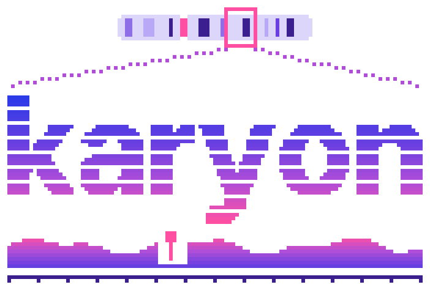

---
hide:
  - navigation
  - toc
---

<div class="hero" markdown>

{ .hero-logo }

# karyon

Genomic figures, as a Rust library and as a command. You name a region once and
everything you add draws itself on that region, so the rows line up without
being positioned. What comes out is one standalone SVG.

</div>

## The same four rows, twice

<figure markdown>

<figcaption><code>NC_000962.3:761000-762999</code>, two thousand bases</figcaption>
</figure>

<figure markdown>

<figcaption><code>NC_000962.3:761121-761180</code>, sixty bases</figcaption>
</figure>

Depth, reference, variants. The same three rows in both, from the same arrays,
and `Variant::new(761_154)` is the same line of code in both. The reference row
in the first figure says to zoom in; the second is what that looks like when you
do. Both come out of one run of `examples/locus.rs`.

That is the whole idea. A row is handed its numbers and the window works out
where they go, so a box lands inside its gene and a lollipop lands inside its
box without anything being told to. Move the window and they move together.

## What it looks like to write

```rust
use karyon::{plot, Aggregate};

plot("NC_000962.3:761000-762999")?
    .title("rpoB locus, resistance determining region")
    .add_coverage(depth)
    .label("depth")
    .adjust(|track| track.aggregate(Aggregate::Min).height(70.0))
    .add_sequence(bases)
    .label("reference")
    .add_features(genes)
    .label("annotation")
    .add_variants(variants)
    .label("variants")
    .save("example.svg")?;
```

That is the chain that drew the first figure, unedited. It is not a whole
program: `depth`, `bases`, `genes` and `variants` are built above it, and
[`examples/locus.rs`](https://github.com/PathoGenOmics-Lab/karyon/blob/main/examples/locus.rs)
is the file that runs. Four things in it were never asked for: the ruler along the bottom, the depth axis,
the window printed in the corner, and the key naming which colour is *missense*.
Neither was the `<title>` and `<desc>` a screen reader is given instead of
several thousand unnamed rectangles.

`Aggregate::Min` is the one decision worth pointing at. At this width a pixel
covers more than one base, so a row has to choose what to show, and a maximum
would have smoothed the dropout away, which is the thing the figure is about.

!!! warning "One trap, said here rather than found later"
    `add_coverage` anchors its first value at the left edge of the window. That
    is what you want when the array starts there, and it is wrong the moment it
    does not: change the region string alone and the array silently re-anchors,
    which draws a figure that looks right. `add_coverage_at(start, values)` says
    where the data actually begins, and is the form to reach for whenever the
    window and the array are not the same span.

## What it will not do

It does not read BAM, CRAM or BCF. Those come in through a pipe, because
`samtools` and `bcftools` already write what its readers take:

```bash
samtools depth -a -r NC_000962.3:761000-763000 aln.bam \
  | karyon NC_000962.3:761,000-763,000 --coverage - --label depth -o rpoB.svg
```

It is not on crates.io yet, so both the library and the command install from
this repository. And it does not resample, smooth or interpolate: a row draws
the numbers it was given, or says that it could not.

## Everything else it draws

<details class="track-overview">
  <summary>Thirty-three track types, twenty-two panels, one sheet</summary>
  
</details>

They compose the way the four above do: one call each, in the order they stack.
A phylogeny is a track and so are its sample traits. A circular chromosome and a
world map are containers of their own, because a sequence with no ends cannot be
drawn as a line without inventing one.

The count is thirty-three because three were removed. Every track has to answer
one question, *does drawing it read the shared scale*, and three that could not
were taken out rather than kept for the sake of a longer list.
[Extending](how-it-works/extending.md) has that test and what a new track owes.

## Where to go

<div class="grid cards" markdown>

-   :material-rocket-launch: **[Quickstart](getting-started/quickstart.md)**

    A first figure in a dozen lines, and the same figure without writing any
    Rust.

-   :material-download: **[Installation](getting-started/installation.md)**

    Point Cargo at the repository for the library, `cargo install` for the
    command. Nothing else to install alongside it.

-   :material-view-grid-outline: **[Plot catalogue](plots/index.md)**

    Eight visual routes through all thirty-three tracks plus circular and
    geographic drawings. Choose by biological question or data shape.

-   :material-code-braces: **[Plot API](guide/plot.md)**

    One call per track, in the order they stack. What the plot remembers
    between calls, what it fills in, and where the short form stops.

-   :material-console: **[Command line](guide/cli.md)**

    The same grammar with spaces instead of dots, for the thirteen tracks that
    have a file to read. Flag order is stack order, and any track file may be
    `-`, so the pipeline is the parser.

-   :material-file-document-outline: **[File formats](guide/formats.md)**

    bedGraph, BED, GFF3, VCF, FASTA, Newick, cytoBand and SAM text, each read
    with the coordinate convention its own specification defines.

-   :material-family-tree: **[Annotated phylogenetics](guide/phylogenetics.md)**

    BEAST, NHX and Nexus metadata; dated trees, topology operations, branch
    colours, collapsed clades and aligned sample traits.

-   :material-map: **[Geographic genomics](guide/maps.md)**

    Occurrence maps, explicit geographic links and circular phylogenies around
    an offline, deterministic world map.

-   :material-ruler: **[Coordinates](how-it-works/coordinates.md)**

    0-based and half-open everywhere, with two deliberate exceptions, both of
    them places where a person reads the number.

-   :material-magnify-scan: **[Scale](how-it-works/scale.md)**

    What a track does when one pixel covers two thousand bases, and why a
    genome-wide figure is still a small file.

-   :material-book-open-variant: **[Recipes](recipes.md)**

    Short worked figures for the questions that come up repeatedly, each one a
    program that runs.

</div>

!!! note "Two coordinate systems, on purpose"
    The region string is the 1-based inclusive form samtools and IGV use, and so
    are the tick labels, because those are the two numbers a person reads.
    Everything else, `Feature::new` and `Variant::new` among them, is 0-based and
    half-open like BED, so a VCF `POS` goes in as `POS - 1`.
    [`karyon::read`](guide/formats.md) does that subtraction for you, and
    [Coordinates](how-it-works/coordinates.md) has the whole of it.
