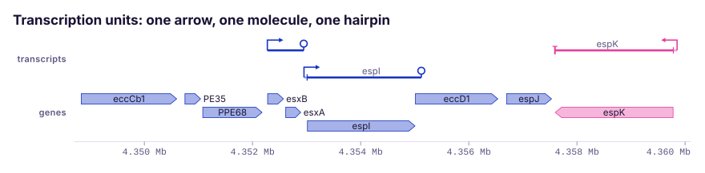
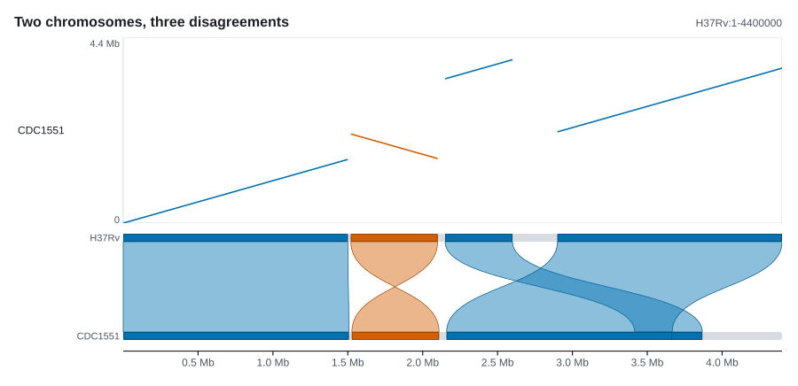
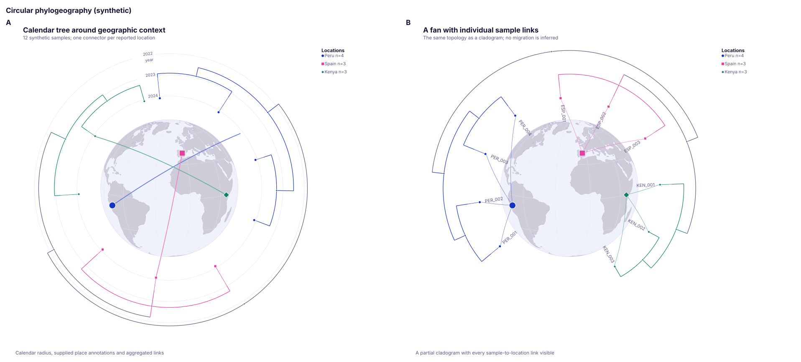
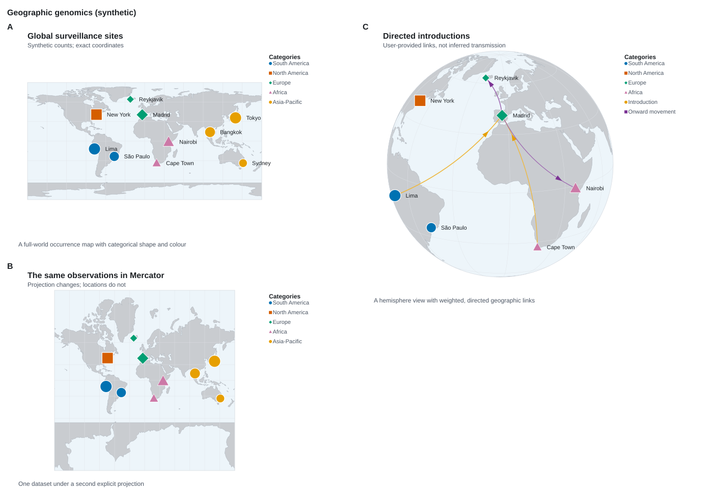

Visual catalogue

# Find the plot that matches the question

Start from the biological structure in the data, not from a Rust type name.
Each route below leads to a small family of plots, a visual example and the
exact reference entry for every component.

  <strong>30</strong> genomic tracks
  <strong>3</strong> standalone drawings
  <strong>7</strong> biological routes

## Browse by biological task

  <a class="plot-category-card plot-category-card--signal" href="signal-sequence/">
    
    
      <small>5 track types</small>
      <strong>Signal and sequence</strong>
      Depth, signed windows, bases, methylation and motifs.
      <b>Explore signal plots →</b>
    
  </a>
  <a class="plot-category-card plot-category-card--annotation" href="annotation-coordinates/">
    
    
      <small>6 track types</small>
      <strong>Annotation and coordinates</strong>
      Genes, transcripts, reading frames, rulers and keys.
      <b>Explore annotation plots →</b>
    
  </a>
  <a class="plot-category-card plot-category-card--variation" href="variation-association/">
    
    
      <small>5 track types</small>
      <strong>Variation and association</strong>
      Variants, structural events, variable sites and genotypes.
      <b>Explore variation plots →</b>
    
  </a>
  <a class="plot-category-card plot-category-card--reads" href="reads-molecules/">
    
    
      <small>4 track types</small>
      <strong>Reads and molecules</strong>
      Pileups, split alignments, methylation patterns and raw signal.
      <b>Explore molecule plots →</b>
    
  </a>
  <a class="plot-category-card plot-category-card--comparison" href="comparisons-alignments/">
    
    
      <small>4 track types</small>
      <strong>Comparisons and alignments</strong>
      MSAs, dotplots, synteny and homologous loci.
      <b>Explore comparison plots →</b>
    
  </a>
  <a class="plot-category-card plot-category-card--phylo" href="phylogeny-clades/">
    
    
      <small>3 tracks + 1 drawing</small>
      <strong>Phylogeny and clades</strong>
      Trees, tanglegrams, clade intervals and phylogeography.
      <b>Explore phylogeny plots →</b>
    
  </a>
  <a class="plot-category-card plot-category-card--world" href="whole-genomes-geography/">
    
    
      <small>2 tracks + 2 drawings</small>
      <strong>Whole genomes and geography</strong>
      Assemblies, ideograms, circular genomes and world maps.
      <b>Explore context plots →</b>
    
  </a>

## Choose from the shape of the data

  <a href="reads-molecules/"><strong>I have SAM alignments or molecules</strong>Start with pileups, split reads or per-molecule calls.</a>
  <a href="variation-association/"><strong>I have VCF calls, sites or genotypes</strong>Start with variants, variable sites, matrices or association statistics.</a>
  <a href="phylogeny-clades/"><strong>I have Newick, BEAST, NHX or Nexus</strong>Start with a tree, aligned clade blocks or circular phylogeography.</a>
  <a href="comparisons-alignments/"><strong>I have two or more sequences</strong>Start with an MSA, dotplot, synteny view or homologous locus.</a>
  <a href="signal-sequence/"><strong>I have a value for every base or window</strong>Start with coverage, a signed window track or per-site methylation.</a>
  <a href="whole-genomes-geography/"><strong>I need global context</strong>Start with an assembly track, ideogram, circular genome or map.</a>

## Tracks, drawings and sheets

  
Track<strong>Shares a figure band</strong>
Usually maps genomic position through the same horizontal scale as its neighbours.

  
Drawing<strong>Own coordinate system</strong>
`Rings`, `Map` and `PhyloMap` render a complete circular or geographic document.

  
Panels<strong>Composes finished views</strong>
Places figures and drawings on one labelled, aligned manuscript sheet.

Need the exhaustive API behaviour rather than a visual route? Open the
[alphabetical track reference](../tracks.md), or jump to the [worked
recipes](../recipes.md) when the desired output is already clear.
