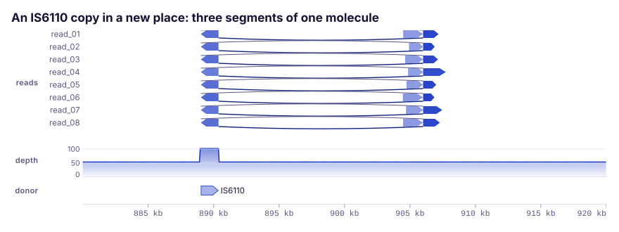

# Reads and molecules

Plots that keep the evidence one molecule at a time, before reads are
collapsed into depth, a call or an average per site.
{ .k-lead }

## How to choose

| Your question | Plot | Build it with |
|:--|:--|:--|
| Does a call hold up in the reads behind it? | [Read pileup](../tracks/reads-molecules.md#pileuptrack) | `PileupTrack`, `--pileup` |
| Did one molecule align to several places, and in what order? | [Split reads](../tracks/reads-molecules.md#splitreadtrack) | `SplitReadTrack`, `--split-reads` |
| Are the methylated sites on the same molecules, or scattered across them? | [Methylation by molecule](../tracks/reads-molecules.md#bisulfitetrack) | `BisulfiteTrack`, `--bisulfite` |
| How many reads crossed each intron? | [Splice junctions](../tracks/reads-molecules.md#junctiontrack) | `JunctionTrack`, `--junctions` |
| What did the current look like before basecalling? | [Nanopore signal](../tracks/reads-molecules.md#squiggletrack) | `SquiggleTrack`, Rust only |

## Plots

-   [{ width="920" height="473" loading="lazy" }](../tracks/reads-molecules.md#pileuptrack)

    **[Read pileup](../tracks/reads-molecules.md#pileuptrack)**
    Reads placed by their real CIGAR and packed into rows, with mismatches found against the reference and the reads past the row limit counted on the band.

-   [{ width="880" height="330" loading="lazy" }](../tracks/reads-molecules.md#splitreadtrack)

    **[Split reads](../tracks/reads-molecules.md#splitreadtrack)**
    One row per molecule and one bar per alignment, joined in the order the molecule ran, with any step back down the reference drawn under the row.

-   [{ width="880" height="303" loading="lazy" }](../tracks/reads-molecules.md#bisulfitetrack)

    **[Methylation by molecule](../tracks/reads-molecules.md#bisulfitetrack)**
    One row per read, a filled circle where a site is methylated, an open one where it is not and nothing where the read did not reach, so two alleles show as stripes.

-   [{ width="811" height="788" loading="lazy" }](../tracks/reads-molecules.md#junctiontrack)

    **[Splice junctions](../tracks/reads-molecules.md#junctiontrack)**
    One arc per intron, weighted and labelled by the reads that crossed it; arcs sit in lanes, so their height means nothing.

-   [{ width="880" height="185" loading="lazy" .k-wide }](../tracks/reads-molecules.md#squiggletrack)

    **[Nanopore signal](../tracks/reads-molecules.md#squiggletrack)**
    Raw current against sample number, an envelope of the extremes when zoomed out and the samples themselves when zoomed in; a move table adds the called bases.

## Related

-   **[Signal and sequence](signal-sequence.md)**

    After the reads have become depth or a methylated fraction per site.

-   **[Variation and association](variation-association.md)**

    After the evidence has become a call.

-   **[File formats](../guide/formats.md)**

    SAM and its `SA` tag, STAR junction tables and Bismark extractor files,
    and how BAM comes in through `samtools`.

-   **[Recipes](../recipes.md)**

    Complete programs that stack several tracks into one figure.

