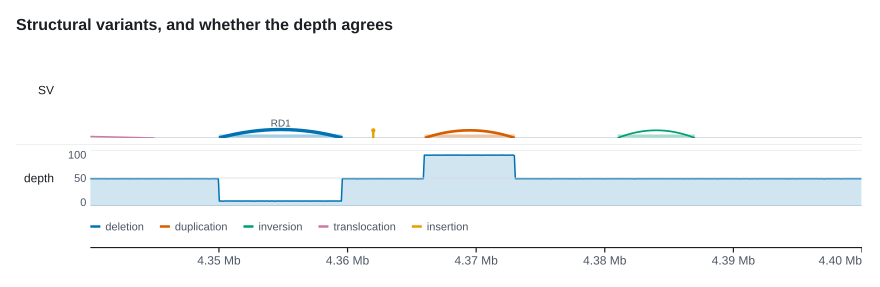
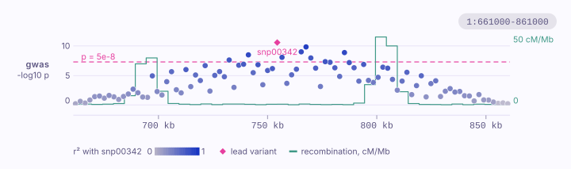
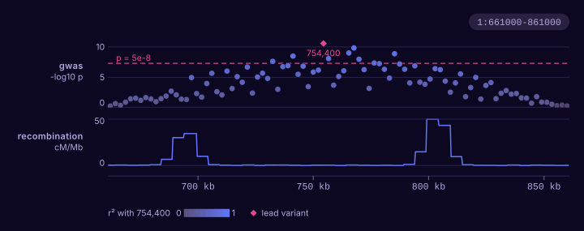
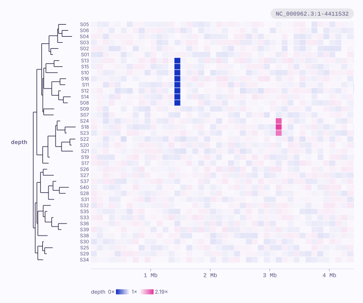
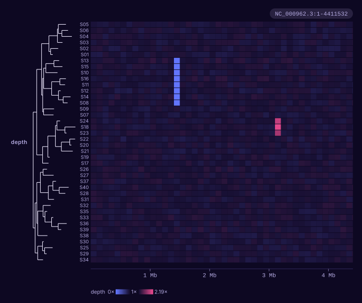
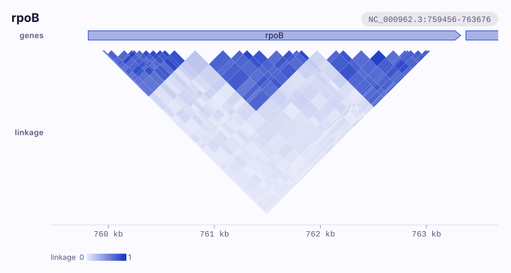
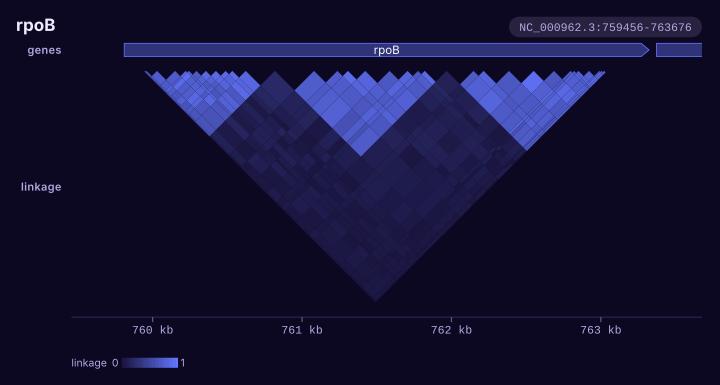

# Variation and association

Plots for calls and the patterns they make across samples: point and
structural variants, copy number, variable sites, genotype matrices and
heatmaps, association scans, linkage and other pairs, and site-wise
selection.
{ .k-lead }

## How to choose

Choose by what carries the result: one position, two breakpoints, a fitted
segment, a variable column, a cell for each sample and site, or one test per
position.

| Your question | Plot | Build it with |
|:--|:--|:--|
| Where are the calls, and how strong is each one? | [Point variants](../tracks/variation.md#varianttrack) | `VariantTrack`, `--variants` |
| Which two positions does a rearrangement join? | [Structural variants](../tracks/variation.md#structuraltrack) | `StructuralTrack`, `--structural` |
| How many copies are there, and has one allele been lost? | [Copy number](../tracks/variation.md#copynumbertrack) | `CopyNumberTrack`, `--copy-number` with `--ploidy` |
| Which sites tell closely related samples apart? | [Variable sites](../tracks/variation.md#snptrack) | `SnpTrack`, `--snps` |
| Which samples carry what, site by site? | [Genotype matrix](../tracks/variation.md#matrixtrack) | `MatrixTrack`, `--matrix` |
| Which samples lost or gained a stretch, window by window? | [Heatmap of samples](../tracks/variation.md#matrixtrack) | `MatrixTrack::windows`, `--heatmap` |
| Where does a scan cross its significance line? | [Association scan](../tracks/variation.md#manhattantrack) | `ManhattanTrack`, `--manhattan` |
| Which markers of a peak travel with its strongest? | [Scan coloured by linkage](../tracks/variation.md#manhattantrack) | `ManhattanTrack::linkage`, `--manhattan` with `--ld` |
| Which variants are inherited together, or which places are in contact? | [Pairs of positions](../tracks/variation.md#pairtrack) | `PairTrack`, `--pairs` |
| Which codons are under selection, and in which direction? | [Site-wise selection](../tracks/variation.md#selectiontrack) | `SelectionTrack`, `--selection` |

## Plots

-   [{ width="900" height="305" loading="lazy" }](../tracks/variation.md#varianttrack)

    **[Point variants](../tracks/variation.md#varianttrack)**
    Point events as lollipops whose height is a value, or as plain ticks when there are too many for heads, with categories coloured in the order they first appear.

-   [{ width="880" height="288" loading="lazy" }](../tracks/variation.md#structuraltrack)

    **[Structural variants](../tracks/variation.md#structuraltrack)**
    Each call as an arc between its two breakpoints, heavier with more supporting reads; a coverage track beneath shows whether the depth agrees.

-   [{ width="900" height="341" loading="lazy" }](../tracks/variation.md#copynumbertrack)

    **[Copy number](../tracks/variation.md#copynumbertrack)**
    Fitted segments drawn at their level on a ladder of whole copies, loss of heterozygosity in a lane of its own, and balanced wherever you say it is.

-   [{ width="900" height="388" loading="lazy" }](../tracks/variation.md#snptrack)

    **[Variable sites](../tracks/variation.md#snptrack)**
    Only the columns that vary, evenly spaced and each labelled with its position; a tree beside the rows lines a clade's shared changes up into a block.

-   [{ width="940" height="348" loading="lazy" }](../tracks/variation.md#matrixtrack)

    **[Genotype matrix](../tracks/variation.md#matrixtrack)**
    One row per sample and one cell per site at its real coordinate, where a sample without the allele, a sample never typed and a stretch with no site all look different.

-   [{ width="940" height="264" loading="lazy" .k-wide }](../tracks/variation.md#matrixtrack)

    **[Presence and absence by descent](../tracks/variation.md#matrixtrack)**
    The same matrix sorted by a tree drawn beside it, which turns a speckle into blocks a clade carries.

-   [{ width="940" height="289" loading="lazy" }](../tracks/variation.md#manhattantrack)

    **[Association scan](../tracks/variation.md#manhattantrack)**
    One point per test, a threshold you set and the points above it ringed; laid over a `Genome`, the scan runs across a whole assembly.

-   [{ .k-light width="720" height="214" loading="lazy" }{ .k-dark width="720" height="214" loading="lazy" }](../tracks/variation.md#manhattantrack)

    **[Scan coloured by linkage](../tracks/variation.md#manhattantrack)**
    A peak as LocusZoom draws one: every marker coloured by its r² with the lead, so a second signal beside the first stands out grey.

-   [{ .k-light width="720" height="602" loading="lazy" }{ .k-dark width="720" height="602" loading="lazy" }](../tracks/variation.md#matrixtrack)

    **[Heatmap of samples](../tracks/variation.md#matrixtrack)**
    A value per sample per window, each sample read against its own usual value, in the order of a tree.

-   [{ .k-light width="720" height="386" loading="lazy" }{ .k-dark width="720" height="386" loading="lazy" }](../tracks/variation.md#pairtrack)

    **[Pairs of positions](../tracks/variation.md#pairtrack)**
    Linkage or contacts as a triangle hung under the axis, and a few pairs far apart as arcs.

-   [{ width="1508" height="1075" loading="lazy" }](../tracks/variation.md#selectiontrack)

    **[Site-wise selection](../tracks/variation.md#selectiontrack)**
    Evidence, as a p-value or a posterior, in one tier and the signed log2(ω) effect in another, so a significant purifying site still reads as purifying.

## Related

-   **[Reads and molecules](reads-molecules.md)**

    The reads and molecules behind a call.

-   **[Phylogeny and clades](phylogeny-clades.md)**

    Calls read on a tree, and spans painted onto the clades that carry them.

-   **[Annotation and coordinates](annotation-coordinates.md)**

    The genes and codons a call lands in.

-   **[Whole genomes and maps](whole-genomes-geography.md)**

    A whole assembly laid end to end under a genome-wide scan.

