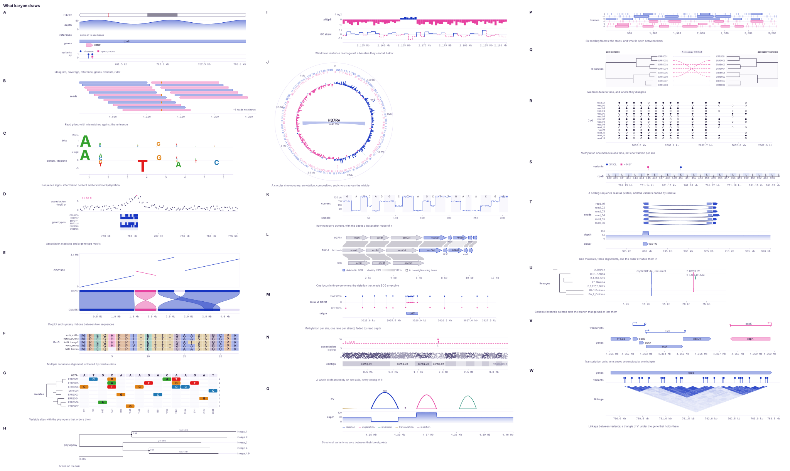
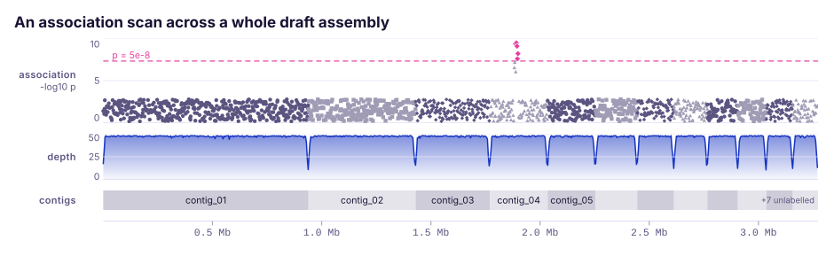
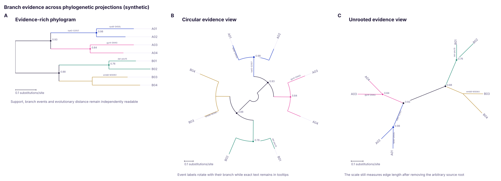
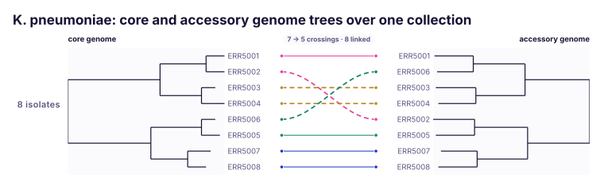

# Recipes

Short, complete answers to the things people actually ask a plotting library
for, half of them from the shell and half from Rust. Every command on this page
was run and every snippet was compiled.

Two conventions run through all of it. A locus string is the 1-based inclusive
form samtools and IGV use, while everything inside the API is 0-based and
half-open, so `chr1:101-200` starts at 100 and ends at 200. And the order of
the tracks is the order they were written, whether that is `add_` calls or
command line flags.

## From the shell

### Depth over one gene, straight from a BAM

The gene's coordinates are already in the annotation, and GFF3 columns 4 and 5
are 1-based inclusive, which is exactly what a locus string is. So the same
string can be handed to samtools and to karyon without any arithmetic in
between:

```bash
locus=$(awk -F'\t' '$3 == "gene" && /Name=katG/ { print $1 ":" $4 "-" $5 }' genes.gff3)

samtools depth -a -r "$locus" aln.bam \
  | karyon "$locus" --coverage - --label depth --title katG -o katG.svg
```

`-a` is what asks samtools for the positions no read covered. The figure comes
out the same without it, because a position the file never mentions is read as
depth zero, which is what a depth of zero means; `-a` only makes the file say
it.

BAM is not read here. `samtools depth` already writes the three columns the
reader takes, so the pipeline is the parser, and `karyon` keeps its zero
dependencies.

!!! note "One track may read standard input"
    Any track file may be `-`, and exactly one track per command may take it,
    since there is only one standard input to go round.

### A locus from the files a pipeline already wrote

Each track flag starts a track and the flags after it describe that one, so the
order of the flags is the order of the stack:

```bash
karyon chr7:140,753,000-140,754,000 \
  --coverage depth.bedgraph --label depth --aggregate min \
  --sequence chr7.fa \
  --features genes.gff3     --label annotation \
  --variants calls.vcf      --label variants \
  --title 'BRAF exon 15' -o braf.svg
```

`--aggregate min` because when a pixel column covers several bases a dropout is
the thing worth not smoothing away; the default is `max`. The ruler goes on the
bottom without being asked for.


The same stack over a different locus, rendered from the crate's own example
data with `cargo run --example locus -- assets`.

!!! warning "What `--sequence` takes"
    The first record of the FASTA is used, and it is cut down to the region by
    position, so it has to be the sequence the region names. A multi-record
    file does not select by name.

### The reads themselves, when a call looks wrong

```bash
samtools view aln.bam chr7:140,753,000-140,754,000 \
  | karyon chr7:140,753,000-140,754,000 --pileup - --label reads -o reads.svg
```

The reader walks the real CIGAR, so an insertion upstream does not shift the
bases after it, and it keeps what the record carries: `SEQ`, the strand from
flag bit 16, and `MAPQ`.

What it cannot do is paint mismatches. Finding one means comparing a read to
the reference, and no reference reaches the track from the command line. That
is `PileupTrack::reference` in the library:

```rust
PileupTrack::new(reads)
    .reference(4_000, reference)   // without this, no mismatch can be found
    .coloring(ReadColoring::Strand)
    .fade_by_quality(true)
```


The library version, from `cargo run --example pileup -- assets`. The reference
is attached, which is why the mismatches are there.

### Only the sites that vary

```bash
karyon sites:1-40 --snps core.aln \
  --label isolates --no-axis --no-region-label -o sites.svg
```

`--snps` takes an aligned FASTA, treats the first record as the reference,
drops every column the other records agree on, and spaces what is left evenly.
The panel divides its own band into columns, so the region here is a name and a
coordinate system rather than a measurement, and `--no-axis` is not optional
housekeeping: a linear ruler under a panel whose columns are not linearly
spaced would be a lie. Each column carries its own position instead.

Those positions are alignment column indices. `SnpTrack::offset` is what turns
them into genomic coordinates, and it is in the library.

### An association scan and the genotypes under it

```bash
karyon chr1:1,000-2,000 \
  --manhattan scan.tsv     --label association \
  --matrix genotypes.tsv   --label genotypes \
  -o association.svg
```

`scan.tsv` is a position and a value per line, optionally with a sequence name
in front, and a header naming the columns is allowed. `genotypes.tsv` has the
site positions across its header and a sample name at the start of every row.
Positions are 1-based in both, the way every association tool writes them.

A cell that is empty, `.` or `NA` is missing data and gets its own grey. Zero
is a genotype, not an absence, and the two have to look different.


Both panels share the figure's x axis, so the haplotype block sits under its own
tower. This one is `cargo run --example association -- assets`.

### A cohort copy number landscape, without a track for it

How often each part of a genome is gained across a cohort, and how often it is
lost, is two numbers over the same place. There is no track type for this and
there is not going to be one, because a `WindowTrack` already draws it: `Window`
holds one number per row, and nothing says one row per place.

```rust
use karyon::{plot, QuantitativeAxis, Window, WindowTrack};

// Two rows over every span. A locus gained in a third of the cohort and lost
// in a fifth of it is both, and a net of the two would put it where a locus
// gained in an eighth and lost in none also lands.
let mut landscape = Vec::new();
for i in 0..40u64 {
    let (from, to) = (i * 100_000, (i + 1) * 100_000);
    landscape.push(Window::new(from, to, gained[i as usize]));
    landscape.push(Window::new(from, to, -lost[i as usize]));
}

let svg = plot("chr8:1-4,000,000")?
    .add_track(
        WindowTrack::new(landscape)
            // Warm for gained and cool for lost, the field's convention, which
            // is the other way round from the default.
            .colors("#d55e00", "#0072b2")
            .axis(QuantitativeAxis::new().range(-1.0, 1.0).ticks(3))
            .label("120 samples"),
    )
    .to_svg();
# Ok::<(), Box<dyn std::error::Error>>(())
```

`WindowTrack::columns` accumulates the lowest and the highest value in each
pixel column and `WindowStyle::Steps` draws both, one up from the baseline and
one down, so a place that went both ways is drawn going both ways at any zoom.
Losses arrive negative because the baseline is what separates them, and each
row is a fraction of the cohort rather than a count, so the axis reads the same
whatever the cohort's size.

The [copy number example](https://github.com/PathoGenOmics-Lab/karyon/blob/main/examples/copy_number.rs)
puts one sample's segmentation under a landscape drawn this way.

### A signed statistic in windows

```bash
karyon contig_01:1-900,000 \
  --windows gc-skew.bedgraph --label 'GC skew' --style steps \
  --coverage depth.bedgraph  --label depth --log \
  -o skew.svg
```

A window track draws against a line rather than up from the floor of its band,
and colours a window by which side of that line it fell on. GC skew, Tajima's D
and pN/pS are all signed, and drawn upwards from zero they lose the one thing
they were computed to say. A read depth has no such problem, which is why
`--coverage` is a different track and not a style.

bedGraph is 0-based and half-open and is passed straight through; GFF3, VCF,
SAM and `samtools depth` are 1-based and have one taken off the start on the
way in. Both come out at the same place in the figure, and
[Formats](guide/formats.md) is the table of which reader takes what.

`--style` takes `steps` or `line` for a window track and `area`, `line` or
`bars` for a coverage track, and saying one of the wrong ones is an error that
names what the track does take.

### Dark, wide, and on standard output

```bash
karyon chr1:1,000-2,000 --coverage depth.txt --label depth \
  --theme dark --width 1400 > wide.svg
```

Without `-o` the document goes to standard output, so it can be piped into
whatever converts or embeds it. The dark theme is a selected set of colours
rather than an inversion of the light one, because a dark background wants a
narrower lightness band than a flipped palette lands in.

`karyon --help` is the whole grammar in one screen, and
[The command line](guide/cli.md) is the long form of it.

## From Rust

### The same stack, light and dark

`Plot::save` writes the figure and hands the plot back, which is what lets one
stack be rendered twice:

```rust
use karyon::{plot, Feature, Strand, Theme};

plot("chr7:140,753,000-140,753,999")?
    .title("BRAF exon 15")
    .add_coverage(depth)
    .label("depth")
    .add_features(vec![Feature::new(140_753_200, 140_753_500)
        .name("exon 15")
        .strand(Strand::Reverse)])
    .label("annotation")
    .save("locus.svg")?
    .theme(Theme::dark())
    .save("locus-dark.svg")?;
```

A save closes the stack: the pending track is put away and the axis is filled
in, so saving twice does not draw two rulers. A track added after a save sits
below the ruler rather than above it.


### One track per sample

Every arm of a loop has to have one type, and a plot's type names the track it
is holding. `done` puts that track away and gives the type back:

```rust
use karyon::{plot, Aggregate};

let mut figure = plot("chr2:1-4,000")?.title("Depth across the cohort");
for (name, depth) in samples {
    figure = figure
        .add_coverage(depth)
        .label(name)
        .adjust(|track| track.height(48.0).aggregate(Aggregate::Min))
        .done();
}
figure.save("cohort.svg")?;
```

`samples` here is a `Vec<(String, Vec<f64>)>`. The same shape works for a track
added behind a condition, which is the other place the types have to agree.

### Zooming to base resolution

Nothing about the tracks changes. Only the region does, and the arrays are cut
to match it:

```rust
use karyon::plot;

// The window the arrays cover, 0-based.
let window_start = 760_999u64;

// Sixty bases of it. The locus string is 1-based inclusive, so 761,121 there
// is 761,120 here.
let zoom_start = 761_120u64;
let zoom_len = 60usize;
let offset = (zoom_start - window_start) as usize;

plot("NC_000962.3:761,121-761,180")?
    .title("Sixty bases")
    .add_coverage(depth[offset..offset + zoom_len].to_vec())
    .label("depth")
    .add_sequence(bases[offset..offset + zoom_len].to_vec())
    .label("reference")
    .save("zoom.svg")?;
```

`add_coverage` and `add_sequence` start their array at the left edge of the
region, which is why the slice has to line up with it. The `_at` forms take a
start of their own when it does not.


The sequence track follows the zoom the way a genome browser does: letters once
a base is at least seven pixels wide, plain coloured blocks when it is
narrower, and a hint to zoom in when a base is thinner than 0.6 of a pixel,
where a million rectangles would draw as a smear.

### A tree beside the variable sites

The tree's leaf order is the row order, which is what turns a clade's shared
substitutions into a block instead of scattering them down the panel:

```rust
use karyon::tree::Tree;
use karyon::{Figure, Region, SnpTrack};

let tree =
    Tree::parse_newick("((ERR01:0.01,ERR02:0.012)0.98:0.04,(ERR03:0.02,ERR04:0.03):0.05);")?;

// Row 0 of the alignment is the reference the sites are called against.
let panel = SnpTrack::from_alignment(0, &alignment)
    .offset(1_472_000)
    .tree(tree)
    .label("isolates");

// The axis counts sites, not bases, so the region is as wide as the panel has
// columns and nothing is pushed under it.
let region = Region::new("sites", 0, panel.sites().len() as u64)?;
Figure::new(region)
    .title(format!("{} variable sites", panel.sites().len()))
    .show_region_label(false)
    .push(panel)
    .save_svg("sites.svg")?;
```

This is the case `Figure` exists for. The track has to be a variable because it
is read before it is drawn: `panel.sites()` is what the region is built from.

Rows are matched to leaves by name, and a sample the tree does not mention
keeps its place at the bottom rather than vanishing.

The figure below has one more thing in it than the code above: three strips of
[metadata](tracks.md#metadata-columns) between the names and the panel, added
with `.traits(..)` out of a sample sheet. They are worth having here because
they are read against the tree beside them. Lineage runs in three blocks,
because a lineage is inherited and the tree put the rows in that order.
Resistance does not, and that is the finding: the same phenotype in two clades
that did not get it from each other.


Thirty-four differences in thirty kilobases, from
`cargo run --example snps -- assets`. Drawing all thirty thousand columns would
have spent 99.9% of the pixels on the agreement.

### A sheet of panels

A paper figure is usually several figures with letters on them. `Panels` takes
finished drawings, so a linear stack and a circular one go on the same sheet:

```rust
use karyon::{plot, Panels};

// A panel is a finished figure, which is what `into_figure` hands back.
let coverage = plot("NC_000962.3:761,000-762,999")?
    .add_coverage(depth)
    .label("depth")
    .into_figure();

let annotation = plot("NC_000962.3:761,000-762,999")?
    .add_features(genes)
    .label("genes")
    .into_figure();

Panels::new()
    .title("Figure 1")
    .columns(2)
    .push_captioned(&coverage, "A", "Depth over the locus")
    .push_captioned(&annotation, "B", "The annotation under it")
    .save_svg("figure-1.svg")?;
```

Each panel is nested whole, inside a group that moves it, and rendered with an
id prefix of its own. Ids in SVG belong to the whole document, so without that
the second panel's clip would resolve to the first panel's rectangle and crop
its tracks to somebody else's band.

Panels fill each column before starting the next, so the letters still read in
order, and the column breaks are chosen to leave the columns roughly level.



Twenty-two panels, three columns, one document:
`cargo run --example gallery -- assets`.

### A scan across a whole assembly

A figure is one region on one sequence, which is right for a locus and wrong
for an assembly. `Genome` lays the sequences end to end and hands back the one
region that covers them:

```rust
use karyon::{Association, Genome, Plot};

let genome = Genome::checked([
    ("contig_01", 900_000u64),
    ("contig_02", 460_000),
    ("contig_03", 310_000),
])?;

// The scan reports per contig, in its own coordinates. Anything naming a
// sequence the genome has not got is counted rather than dropped in silence.
let (mapped, dropped) = genome.map(hits);
eprintln!("{dropped} points named a sequence that is not in the assembly");

let points: Vec<Association> = mapped
    .iter()
    .map(|(at, value)| Association::new(*at, *value))
    .collect();

Plot::over(genome.region())
    .title("An association scan across a draft assembly")
    .remove_region_label()
    .add_manhattan(points)
    .label("association")
    .adjust(|track| {
        track
            .bands(genome.boundaries())
            .genome_wide_threshold()
            .unit(" -log10 p")
    })
    .add_genome(genome)
    .label("contigs")
    .save("scan.svg")?;
```

`hits` is an iterator of `(String, u64, f64)`: the sequence name, the position
on it, and the value. `Genome::checked` refuses two sequences with the same
name, since `Genome::at` would otherwise place everything on the first of them.



Twelve contigs over 3.27 Mb, from `cargo run --example genomewide -- assets`.

!!! warning "`genome_wide_threshold` is a convention, not a result"
    It is the Bonferroni correction for a million independent tests, which is
    the convention in human GWAS and frequently the wrong number everywhere
    else. A shorter genome, or stronger linkage between neighbouring sites,
    leaves far fewer than a million. Use `threshold` when you know yours.

### Put support, mutations and distance on one phylogram

```rust
use karyon::{Figure, Region, SupportStyle, TreeTrack};

Figure::new(Region::new("phylogeny", 0, 1)?)
    .show_region_label(false)
    .push(
        TreeTrack::new(tree)
            .reroot_outgroup(["outgroup_A", "outgroup_B"])
            .color_by("lineage")
            .support_style(SupportStyle::SymbolsAndLabels)
            .support_threshold(70.0)
            .branch_labels("mutation")
            .branch_label_size(7.0)
            .scale_bar()
            .scale_bar_length(0.1)
            .scale_bar_unit("substitutions/site"),
    )
    .save_svg("branch-evidence.svg")?;
```

`color_by` may inherit a lineage from an ancestor. `branch_labels` never does:
a gain, loss or mutation is printed only on the edge whose node carries that
annotation. Support stays exact in labels and tooltips even though symbol size
uses a normalised 0–1 value. A scale bar is meaningful on a phylogram and is
therefore omitted automatically after switching to `TreeShape::Cladogram` or a
calendar-time layout. The outgroup call changes nothing unless both names exist
as distinct leaves and form exactly one clade; use `reroot_midpoint` instead
when the root should bisect a complete weighted tree.



### A figure with no coordinate ruler

A plot appends an axis at the bottom because a figure without coordinates along
it is rarely what anyone meant. A tanglegram has no coordinate to put ticks on,
so it says so:

```rust
use karyon::{plot, tree::Tree};

plot("taxa:1-4")?
    .title("Core and accessory trees over one collection")
    .remove_region_label()
    .remove_axis()
    .add_tanglegram(core, accessory)
    .label("4 isolates")
    .adjust(|track| {
        track
            .names("core genome", "accessory genome")
            .color_by("ward")
            .untangle()
    })
    .save("tanglegram.svg")?;
```

`remove_axis` suppresses the automatic ruler only. An axis put somewhere on
purpose with `add_axis` stays where it was put. `remove_region_label` goes with
it here, because the locus in the corner would be describing an axis that is
not genomic.



From `cargo run --example shapes -- assets`. The header reports the crossing
count before and after `untangle`, the linked taxa and unmatched tips. The
heuristic rotates free clades but never changes their membership or branch
lengths. Dashed ties still identify crossings when colour is being used for a
terminal annotation such as hospital ward.

### One figure inside another document

`Figure::to_svg` is a standalone document with its own `<svg>` root, which is
what you want on disk and not what you want pasted into a page that already has
figures in it. `to_svg_with_id_prefix` gives every id it generates a prefix, so
two figures in one document stop competing for `karyon-clip-0`:

```rust
use std::io::Write;

let figure = plot("chr1:1-1,000")?
    .add_coverage(depth)
    .label("depth")
    .add_variants(variants)
    .label("variants")
    .into_figure();

let (width, height) = figure.dimensions();
let svg = figure.to_svg_with_id_prefix("depth-");

let mut page = std::fs::File::create("report.html")?;
writeln!(
    page,
    "<figure style=\"width:{width}px\">{svg}\
     <figcaption>Depth over the first kilobase, {width} by {height}.</figcaption></figure>"
)?;
```

The height is computed rather than configured, so `dimensions` lays the figure
out to answer. `Panels` does the prefixing for you; do it yourself when you are
assembling the page.

The output is plain SVG 1.1 with no scripts, no external references and no
embedded fonts, so it also goes straight into Inkscape or Illustrator with
every element still selectable.

## Next

- [Tracks](tracks.md), for the track types these recipes did not reach for.
- [Plot API](guide/plot.md), for what the Rust half of the page was doing.
- [Command line](guide/cli.md), for the whole grammar the shell half used.
