# Track API reference

Thirty-six track types ship across thirty-five focused modules. Every one of
them is an implementation of the same small trait, `Track`, and none of them has
privileged access to the figure: a track reports how tall it wants to be, then
draws inside the band it is handed, already clipped. A track type the crate does
not have is about thirty lines, and it is added the same way these are. See
[extending](how-it-works/extending.md).

This page says, for each of them, what it draws, when to reach for it, and what
it refuses to do. The refusals are the interesting part. Several of these tracks
encode a claim rather than a picture, and the way they behave when the data does
not support the claim is what makes them worth having.

!!! tip "Looking for the right plot?"
    Start with the [visual plot catalogue](plots/index.md). It groups tracks and
    standalone drawings by biological question, data shape and coordinate
    system. Return here once you know the component whose complete behaviour
    you need.

<div class="track-gallery">
  <a class="track-card" href="#coveragetrack">
    
    <span><strong>Locus</strong><small>Signal, sequence and annotation</small></span>
  </a>
  <a class="track-card" href="#pileuptrack">
    
    <span><strong>Read pileup</strong><small>Alignments and variants</small></span>
  </a>
  <a class="track-card" href="#logotrack">
    
    <span><strong>Sequence logo</strong><small>Conservation and motifs</small></span>
  </a>
  <a class="track-card" href="#manhattantrack">
    
    <span><strong>Association</strong><small>Statistics and genotypes</small></span>
  </a>
  <a class="track-card" href="#syntenytrack">
    
    <span><strong>Synteny</strong><small>Genome comparison</small></span>
  </a>
  <a class="track-card" href="#msatrack">
    
    <span><strong>Alignment</strong><small>Multiple sequences</small></span>
  </a>
  <a class="track-card" href="#windowtrack">
    
    <span><strong>Selection</strong><small>Windowed statistics</small></span>
  </a>
  <a class="track-card" href="#genometrack">
    
    <span><strong>Circular genome</strong><small>Whole-genome context</small></span>
  </a>
  <a class="track-card" href="#bisulfitetrack">
    
    <span><strong>Methylation</strong><small>Reads and molecules</small></span>
  </a>
  <a class="track-card" href="#phylodynamictrack">
    
    <span><strong>Evolution</strong><small>Inference and surveillance through time</small></span>
  </a>
</div>

<details class="track-overview">
  <summary>See the main track gallery on one sheet</summary>
  
</details>

**Signal and sequence**
[CoverageTrack](#coveragetrack) &middot;
[WindowTrack](#windowtrack) &middot;
[MethylationTrack](#methylationtrack) &middot;
[SequenceTrack](#sequencetrack) &middot;
[LogoTrack](#logotrack)

**Annotation**
[FeatureTrack](#featuretrack) &middot;
[TranscriptionUnitTrack](#transcriptionunittrack) &middot;
[OrfTrack](#orftrack)

**Variation**
[VariantTrack](#varianttrack) &middot;
[StructuralTrack](#structuraltrack) &middot;
[SnpTrack](#snptrack) &middot;
[MatrixTrack](#matrixtrack) &middot;
[ManhattanTrack](#manhattantrack) &middot;
[SelectionTrack](#selectiontrack)

**Reads and molecules**
[PileupTrack](#pileuptrack) &middot;
[SplitReadTrack](#splitreadtrack) &middot;
[BisulfiteTrack](#bisulfitetrack) &middot;
[SquiggleTrack](#squiggletrack)

**Comparison**
[MsaTrack](#msatrack) &middot;
[DomainTrack](#domaintrack) &middot;
[DotplotTrack](#dotplottrack) &middot;
[SyntenyTrack](#syntenytrack) &middot;
[LocusTrack](#locustrack)

**Phylogeny**
[TreeTrack](#treetrack) &middot;
[TanglegramTrack](#tanglegramtrack) &middot;
[CladeTrack](#cladetrack)

**Evolution and surveillance**
[PhylodynamicTrack](#phylodynamictrack) &middot;
[SurveillanceTrack](#surveillancetrack)

**Whole genome**
[IdeogramTrack](#ideogramtrack) &middot;
[GenomeTrack](#genometrack)

**Scales and keys**
[AxisTrack](#axistrack) &middot;
[CodonTrack](#codontrack) &middot;
[LegendTrack](#legendtrack)

## The entry test

A track has to live on the figure's shared integer coordinate axis. Usually
that is a genomic position; `PhylodynamicTrack` and `SurveillanceTrack`
deliberately use it for aligned time pivots. In code that reads: its `draw` has
to use `ctx.scale`, the shared mapping from position to pixel that every band
in the figure is drawn through. That is the whole reason this crate exists
rather than a general plotting library. A track whose x is a list of samples
or a count of genomes is a bar chart, a line chart or a heatmap that happens to
have been handed genomic data, and matplotlib draws those better.

Three track types were in the crate and are not any more. `AccumulationTrack`,
`DistanceTrack` and `FrequencyTrack` all failed this test: their x axes were a
count of genomes, a count of genomes and a list of sample names, so what they
actually drew was a bar chart, a line chart with a quantile ribbon and a
clustered heatmap. Removing them broke the public API, which was the cost of
being honest about it. The analyses they carried are still worth having: a
rarefaction over a presence matrix is a statistic rather than a plot type, and
it does not need a `Track` to compute it.

Thirty-one of the thirty-six draw through `ctx.scale`. The five that do not
each answer for it, and each says so in its own module:

- [IdeogramTrack](#ideogramtrack) draws the whole sequence across the plotting
  area on purpose. A track that showed only the region on display could not say
  where the region is: it would be a picture of the window, drawn inside the
  window.
- [TreeTrack](#treetrack) and [TanglegramTrack](#tanglegramtrack) measure
  evolutionary distance across, which has nothing to do with position. What they
  share with their neighbours is the other axis, because a leaf is a row.
- [SnpTrack](#snptrack) lays its own columns out. Its x is a site index, since
  throwing the invariant columns away is the point of the panel, and no shared
  ruler survives that.
- [LegendTrack](#legendtrack) carries no coordinates at all. It is a horizontal
  band that has to be stacked, sized and clipped like every other one, which is
  exactly what a track is.

### And a thing that is not a track

Metadata columns fail the entry test in the other direction, and the answer was
not to make an exception for them. A sample's lineage is not at a base, and
there is no zoom level at which more of it comes into view. Drawn as a track it
would need an x nobody has, and the first pan would slide a sample's lineage off
the end of that sample's own row.

So [`Traits`](https://docs.rs/karyon/latest/karyon/track/traits/struct.Traits.html)
is not a track. It attaches to the six tracks drawn as a row per named thing,
and is drawn in the strip those tracks already reserve to the left of the
plotting area, beside the row names and the dendrogram. It survives every pan
and zoom untouched, because nothing in it was placed at a coordinate to begin
with. It is described in full under [metadata columns](#metadata-columns).

!!! warning "Coordinates"
    Every position on this page is 0-based and half-open, the BED convention, so
    a GFF interval `759806..763325` is `Feature::new(759_805, 763_325)` and a VCF
    `POS` is `POS - 1`. The two exceptions are the ones a reader sees:
    `Region::parse` accepts the 1-based inclusive locus strings samtools and IGV
    use, and the tick labels an [AxisTrack](#axistrack) prints are in that same
    form. Some tracks are not in genomic coordinates at all: MsaTrack counts
    alignment columns, SnpTrack counts variable sites, SquiggleTrack counts
    signal samples, and the two tree tracks measure branch length. Each entry
    below says which. The full argument is in
    [coordinates](how-it-works/coordinates.md).

Every track type has a matching `add_` on `Plot` and can equally be pushed onto
a `Figure`, which is what you want when the track is built by an alternative
constructor or read back before it is drawn:

```rust
use karyon::{AxisTrack, CoverageTrack, Figure, Region};

Figure::new(Region::parse("NC_000962.3:761000-763000")?)
    .push(CoverageTrack::new(760_999, depth).label("depth"))
    .push(AxisTrack::new())
    .save_svg("rpoB.svg")?;
```

The two layers are described in [plot](guide/plot.md) and
[figure](guide/figure.md).

## Signal and sequence

Most figures made with this crate are a stack of several tracks. The one below
holds four of them: a depth profile with a dropout in it, the reference bases,
two gene models and a set of variant calls, all over one axis.


### CoverageTrack

A quantitative signal sampled once per base: read depth, GC content,
mappability, anything with one number per position. Values are stored densely
from a start position, which is the shape `samtools depth` output arrives in,
and `CoverageTrack::from_pairs` builds the same thing from sparse
`(position, value)` pairs, with a buffer that spans the region on display
rather than the genome.

When a pixel covers more than one base the column is reduced with `Aggregate`,
and the choice is a claim about what you are looking for. `Max` is the default
and keeps a narrow spike visible, which is what you want when hunting
duplications. `Min` is the one to use when hunting dropouts, because a mean
smooths a dropout away. Whatever the region, the SVG carries at most one point
per pixel column.

It draws upward from the floor of its band, and that is the refusal: zero is
the floor in fact and not by convention, which is true of read depth and false
of a signed statistic. A number that can fall below its baseline belongs in a
[WindowTrack](#windowtrack).

### WindowTrack

A statistic computed in windows, drawn against a line it may fall below. pN/pS
is centred on one, GC skew and Tajima's D cross zero wherever the thing they
measure changes direction, and drawn up from the bottom of a band all of those
lose the one thing they were computed to say, which is which side of the line a
window fell on.

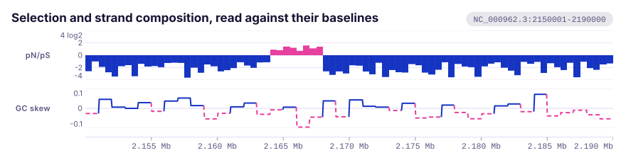

`WindowStyle::Steps` is the default and the honest one, because a window is an
interval and a block says so; `WindowStyle::Line` is for a statistic read as a
curve, GC skew being the usual case. A ratio needs one more step, and
`WindowTrack::ratios` takes it: on a linear axis a pN/pS of 0.5 sits half a unit
under the line while a 2.0 sits a whole unit over it, so the same twofold
departure looks twice as big in one direction. Plotting log2 of the ratio puts
them at equal distances.

Two constructors compute the statistic for you from the sequence itself:

```rust
use karyon::WindowTrack;

let skew = WindowTrack::gc_skew(0, genome, 10_000).label("GC skew");
```

`WindowTrack::gc_content` is the same shape without the sign.

### MethylationTrack

Per-site methylation, one lane per strand: forward calls above the line,
reverse below. A methylation call is not a variant, because the base is the same
base and the measurement is a fraction of reads rather than a genotype, and the
two things that follow from that are why this is not a
[VariantTrack](#varianttrack).


The first is strand. Methylation belongs to one strand of a duplex, so the two
strands of a palindromic site are two measurements and the asymmetry is often
the finding. The track refuses to average them, and the disagreement is a query
rather than something to read off by eye:

```rust
use karyon::{MethylSite, MethylationTrack, Strand};

let sites = vec![
    MethylSite::new(1_010, Strand::Forward, 0.95, 40),
    MethylSite::new(1_011, Strand::Reverse, 0.08, 38),
];
let track = MethylationTrack::new(sites);
assert_eq!(track.hemimethylated(0.5), vec![1_010]);
```

The partner is the nearest reverse call within `pair_within`, one base by
default, because the two modified bases of a `GATC` or a `CpG` are a base apart
and never on the same coordinate.

The second is coverage. A site called from four reads and a site called from
four hundred are the same size to anything that plots the fraction alone, so
sites under `min_coverage` are dropped, five by default and counted by
`discarded()`, and the rest fade with depth up to `saturating_coverage`.

### SequenceTrack

The reference bases themselves, drawn the way a genome browser draws them:
coloured letters once a base is at least seven pixels wide, plain coloured
blocks below that, and a hint to zoom in once the bases would be thinner than
0.6 of a pixel.


That last case is the refusal. Five million one-pixel rectangles is a file no
viewer will open, so once the bases are that thin the track prints the hint
instead of drawing them. Base colours follow the IGV convention by default,
which is not colour vision safe and has an alternative that is; see
[theming](guide/theming.md).

### LogoTrack

A sequence logo over consecutive positions, built from aligned sequences with
`LogoTrack::from_sequences`, from a position weight matrix with
`LogoTrack::from_matrix`, or column by column.


A logo has to decide what a letter's height means, and `LogoScore` offers seven
answers. Five of them measure a symbol against a background and can therefore
hang it below the baseline, which is the thing a classic logo cannot do: a
column that is nearly uniform is flat in bits, and a base that is missing from
it is invisible. `LogoTrack::edlogo` is the one to reach for first.

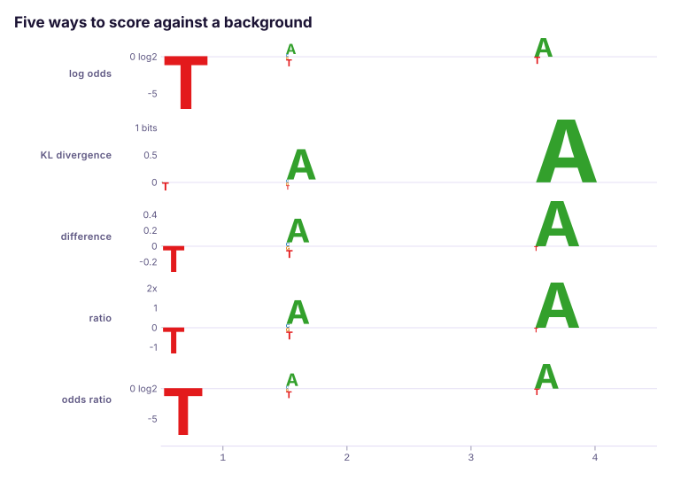

Which one is chosen changes the reading, not just the drawing: the same four
columns scored five ways put the emphasis in five different places.

Two things are worth knowing before believing one. Left alone the alphabet is
the set of symbols that actually appear, which is wrong for a DNA motif where
one base never shows up, since information content is measured against
`log2(K)` and a uniform background is `1/K`: `alphabet_size(4)` says the
alphabet is four letters whatever the alignment happened to contain. And a logo
drawn from four sequences looks identical to one drawn from four thousand, which
is an estimation problem rather than a plotting one, so `LogoTrack::stabilize`
shrinks each column towards the background by the amount its sample size
supports, and `dash_fit` reports how far each column moved.

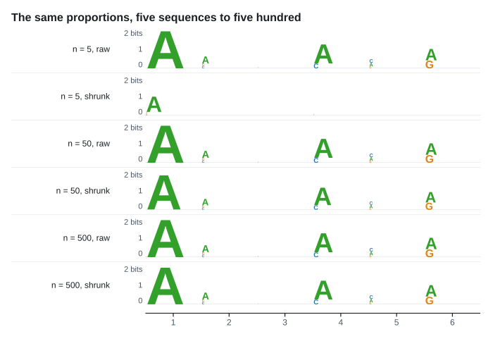

Symbols are arbitrary strings, so three letter amino acid codes and k-mers plot
as readily as bases:

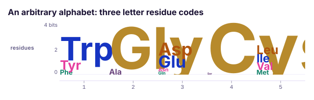

### DynseqTrack

Per-base model attribution, drawn as the bases themselves at a height
proportional to their score, hanging below the line where the score is negative.

A model that predicts something from a sequence can be asked which bases it
used, and the answer is one signed number per base. Drawn this way a motif
appears as a word, which is the reason the figure is read at all.

It is not a [LogoTrack](#logotrack), and the reason is measurable rather than
stylistic. A logo normalises within a column, so one symbol carrying one weight
takes the whole column whatever the number was: with four bases and one symbol
per column, `0.1` and `0.9` both come out at height `1.0` under `Probability`
and both at `8.65` under `LogOdds`. And `LogoColumn::add` clamps a negative
weight to zero before any score is chosen, so a base the model pulled away from
draws as nothing. The magnitude and the sign are the whole measurement.

It is not a [WindowTrack](#windowtrack) either, which is the closer call, since
that also draws a signed statistic against a line and also reduces a pixel
column to its extremes. A window is an interval carrying a statistic and a base
is not an interval: a megabase of per-base scores would be a million one-base
windows to say what a sequence and a vector of numbers say. And a base has an
identity, which is what the letter is.

Three regimes and the zoom picks: letters where a letter fits, boxes down to a
pixel a base, and below that an envelope of the extremes in one neutral ink,
never a base colour, because a column spanning forty bases has no base. There is
no aggregate to choose, and that is a decision: a maximum hides a strong
negative, a minimum hides a strong positive, and a mean cancels a `+2` against a
`-2` into a nought that says the model ignored the place.

The rule is one line per run of scored bases rather than one across the band. A
base scoring exactly nought draws no glyph and so does a base nobody scored, so
the rule under it is the only thing that tells them apart.

## Annotation

### FeatureTrack

Annotated intervals: genes, exons, repeats, primers, anything from a BED or GFF
file. Features that would collide on screen are pushed onto extra rows and the
track grows to fit them. Collisions are measured in pixels and include the room
a label takes, so the number of rows changes with zoom, which is why
`Track::height` takes a `Scale` at all.

Strand is drawn as an arrowhead, and the head never eats more than eight pixels
of a long feature, so an interval stays a bar with a point on it rather than
becoming a triangle. The colour follows the strand through `strand_color`, one
convention for the whole crate: a figure with a pileup two bands down would
otherwise have blue meaning forward in one place and reverse in the other, with
nothing on the page saying so.

What it refuses to say is that two genes are on one molecule. A feature is an
interval and an interval is all it is; co-transcription is
[TranscriptionUnitTrack](#transcriptionunittrack).

### TranscriptionUnitTrack

Where transcription starts, how far the leader runs, and where it stops: a bent
arrow at the start site, a hollow 5' leader, and a hairpin or a plain bar at the
terminator depending on whether it is intrinsic or Rho dependent.


The span is the claim. From the arrow to the terminator is one RNA molecule, so
the genes under it are co-transcribed and a promoter mutation upstream of the
arrow changes all of them at once. Put a [FeatureTrack](#featuretrack) below it
to draw the genes; this draws only what a gene model cannot say.

A leaderless transcript, one whose `cds_start` is its `tss`, has no hollow
segment at all and its arrowhead lands flush on the start codon. It is a
different picture rather than a differently labelled one, and how much of a
collection is leaderless is usually the observation the figure exists to make.
A start codon on the wrong side of the start site reads as no leader rather than
a negative one, because that input is a contradiction and not a measurement.

### OrfTrack

The six reading frames of a stretch of sequence: three lanes above a line for
the frames read left to right and three below for the other strand, with each
stop codon a tick across its lane and each open reading frame the bar between
two of them.

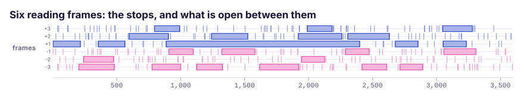

Open means a run of at least `min_codons` codons with no stop in it, thirty by
default. Whether it starts at a methionine is a separate question and a separate
switch, `require_start`, which is off by default because the first thing you
want from a six frame map is where the stops are not. `ATG`, `GTG` and `TTG` all
count as starts.

The frames are numbered against the sequence you hand it, not against the
chromosome: frame `-1` is read from the far end of that slice. Hand it the
sequence of the region on display and the reverse frames are the reverse frames
of what is on screen, which is what every ORF finder does and what a reader
assumes.

## Variation

### VariantTrack

Point events along the sequence: SNPs, indels, insertion sites, peaks. A
lollipop whose stem height is the value, or a plain tick once the variants are
dense enough that heads would smear into each other. A variant with no value
gets a full-height stem, which is right when there is no quantity to show.

Categories drive the colour and the legend entry, and they are coloured in order
of first appearance rather than by hash. That determinism is the refusal: a
figure that recolours itself when a sample is added is not one you can put in a
paper.

### StructuralTrack

Structural variant calls as arcs between their two breakpoints, springing from
the axis at both ends, with arch height following how far apart the ends are and
stroke weight following the supporting read count.


The arc is the point. A structural variant is not a mark at a position, it is a
statement that two positions belong together: the two ends of a deletion, the
source and destination of a duplication, the pair of junctions an inversion
creates. A [VariantTrack](#varianttrack) draws one point per call and cannot say
that, and a bar spanning the event says only that something happened in the
middle, which is usually the one place nothing happened.

Put a [CoverageTrack](#coveragetrack) under it. Half of reading an SV call is
whether the depth agrees, and a deletion with no drop under it is a call to
argue with.

### CopyNumberTrack

Segmented copy number, on a ladder of whole copies, with what the two alleles
did along the foot.

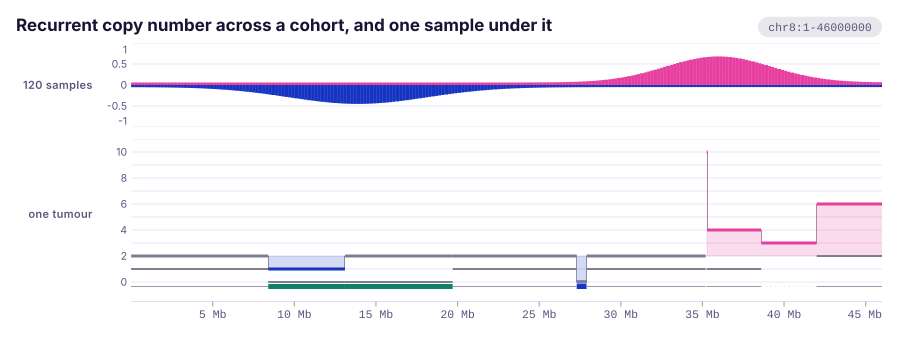

A caller reports intervals, each carrying how many copies it found, and the good
ones carry two numbers rather than one: the total, and how many of those copies
came from the quieter of the two alleles.

The reason this is not a [WindowTrack](#windowtrack) is what the two draw where
nothing happened. A window track fills from its baseline out to the value, so a
segment called at exactly the ploidy is neither above nor below and draws
nothing at all. That is not an edge case: a balanced segment is most of a
genome, and a figure whose quiet arms are blank cannot be told apart from one
whose quiet arms were never called. Measured, on four windows at two copies, no
call, seven and nought with the baseline at two, two marks come out and the two
that vanish are the balanced one and the missing one. So a level here is a bar
drawn at the level, and only a segment nobody called is blank.

The other half is loss of heterozygosity. A minor allele of nought with copies
still present is a finding, and it must not look like the absence of one, so the
absence is not representable: `CopyNumber::Total` has no field to put a minor
allele in and `minor()` answers with `None`. Copy-neutral loss of heterozygosity
is the case the lane along the bottom exists for, since two copies both from one
allele put the bar exactly on the rule that means unchanged.

Where balanced sits has no default. `at_ploidy` takes it, because this crate
does not know what it is drawing and a rule in the wrong place does not
mis-scale the ladder, it swaps every gain for a loss.

Copies are continuous, since subclonal and purity-adjusted calls are fractional.
The rungs are at whole copies because whole copies are where the interpretable
states are, and an evenly divided axis would print three and a half copies,
which is a number of copies nobody has.

### SnpTrack

The variable columns of an alignment and nothing else, spaced evenly, one row
per sample.


An alignment of closely related genomes is almost entirely agreement: thirty
kilobases carrying thirty-four differences would spend 99.9% of its pixels on
the part that says nothing. So the invariant columns go, and a smear becomes
thirty-four legible columns. Everything else in the panel is reading aid: a cell
that matches the reference is a quiet bar because the matches are the noise,
alternating columns are tinted so the eye can cross a wide panel, and each row
carries its own count of differences on the right.

`SnpTrack::tree` puts a phylogeny in the strip beside the rows and sorts the
rows to match, so a clade's shared substitutions line up into a block instead of
being scattered down the panel in whatever order the samples were listed. Rows
are matched to leaves by name, and a sample the tree does not mention keeps its
place at the bottom rather than vanishing, because a row silently dropped from a
figure is worse than a row out of order.

The refusal is a ruler. Two adjacent columns here may be nine bases apart or
nine kilobases apart and nothing about the spacing says which, so every column
carries its own position turned on end underneath and an
[AxisTrack](#axistrack) does not belong under this panel. The figure's region is
the site index space: a panel of twenty sites is `Region::new("sites", 0, 20)`.

### MatrixTrack

One row per sample, one column per site, and a cell saying what that sample had
there. A genotype matrix out of a VCF is exactly this shape, and so is a
pangenome presence and absence matrix once its genes have coordinates. The
columns sit at their real coordinates, so the matrix shares the figure's axis
with whatever is above it.


Three things have to look different in a matrix: a sample that does not carry
the allele, a sample that was never typed, and empty page. So the sequential
ramp starts a step off the surface rather than on it, and missing data has its
own grey. `f64::NAN` is missing; zero is a genotype. `CellScale::Sequential` is
one hue light to dark, because two hues would imply a meaningful middle and zero
to one has no middle to mean anything; `CellScale::Categorical` reads the value
as an index into the palette instead.

`MatrixTrack::tree` sorts the rows by descent the same way the SNP panel does,
which is what turns a speckle into rectangles:

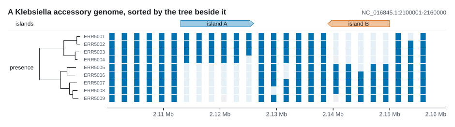

Cells never merge, and that is the refusal. Six carriers drawn as six cells are
six observations. One rectangle covering six rows would be one claim, and that
claim is [CladeTrack](#cladetrack).

### ManhattanTrack

Association statistics: one point per test, height by significance, a line where
significance starts, and the hits above it coloured and ringed. The plot is
named for the skyline that appears when a real signal stacks a run of
neighbouring markers into a tower.

`genome_wide_threshold` is a Bonferroni correction for a million independent
tests. It is the convention in human GWAS and frequently the wrong number
everywhere else, because the right one follows from how many independent tests
were really run: a shorter genome, or stronger linkage between neighbouring
sites, leaves far fewer than a million. `threshold` sets your own.

The x axis is genomic, so this draws one sequence or one region of one. A
genome-wide plot laying every sequence end to end is a different coordinate
system and the crate does not pretend otherwise: build it with `Genome`, hand
`Genome::boundaries` to `ManhattanTrack::bands` so the alternating shading falls
on the sequence edges, and put a [GenomeTrack](#genometrack) underneath.

### SelectionTrack

One tested coding position can carry two different results: evidence against a
null model and a synonymous-to-nonsynonymous rate effect. `SelectionTrack`
draws them in aligned tiers rather than letting one colour stand for both. The
upper tier is either `-log10(p)` or posterior probability; the lower tier is a
signed `log2(ω)` effect centred on ω = 1.

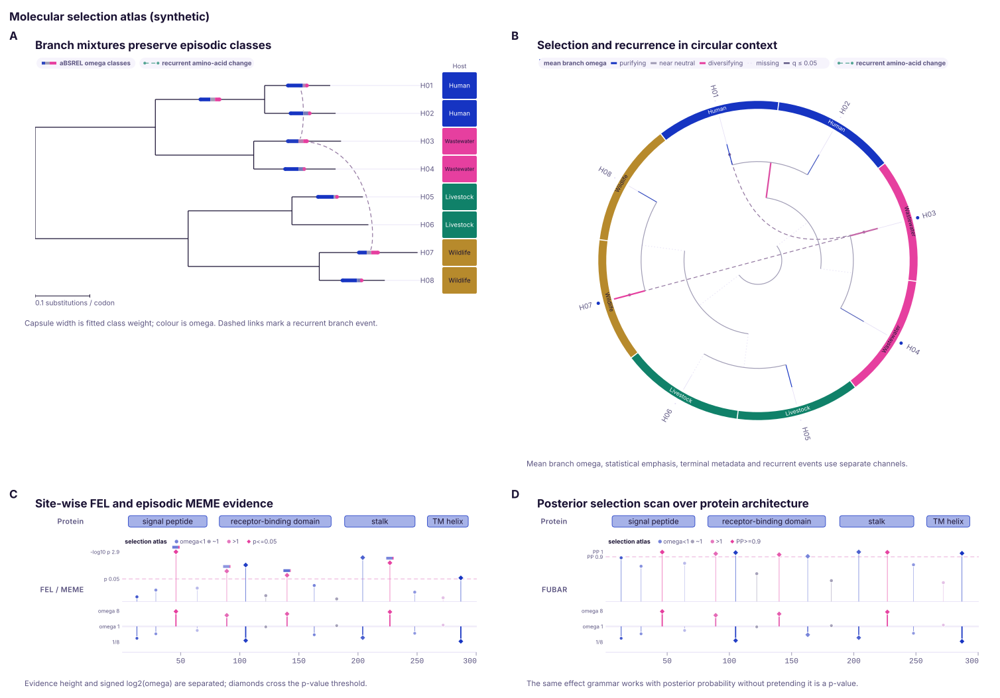

```rust
use karyon::{SelectionEvidence, SelectionSite, SelectionTrack};

let sites = vec![
    SelectionSite::new(44)
        .rates(0.18, 1.52)
        .p_value(0.0014)
        .episodic_rates(0.05, 3.8, 0.18),
    SelectionSite::new(103).rates(0.50, 0.07).p_value(0.008),
];

let track = SelectionTrack::new(sites)
    .evidence(SelectionEvidence::PValue)
    .p_threshold(0.05)
    .neutral_band(0.85, 1.15)
    .saturation(8.0);
```

`SelectionEvidence::Posterior` and `posterior_threshold` switch the evidence
axis without changing the effect grammar. Threshold-crossing sites use a
diamond as well as stronger emphasis. Cool and warm colours still encode rate
direction, so a significant purifying site remains cool. Missing evidence or
rates are omitted, exact supplied values remain in tooltips, and an infinite
ratio caused by `dS = 0` is capped only in visible geometry.

`SelectionSite::episodic_rates` stores the two nonsynonymous rate classes and
their positive-class weight used by an episodic site model. The evidence point
gets a compact two-part capsule, while the tooltip retains both rates and the
weight. The track accepts already fitted results; it does not perform a codon
model or decide a multiple-testing correction.

## Reads and molecules

### PileupTrack

Aligned reads, stacked the way a genome browser stacks them. This is the track
you open when a variant call looks wrong.


A read is not an interval, so the track takes a real CIGAR and walks it. `M`,
`=` and `X` all become `Match` and the track compares the sequences itself
rather than trusting the operation; `I`, `D`, `N`, `S` and `H` each consume what
the specification says they consume. That is what puts a mismatched base at the
right position when there is an insertion upstream of it. Without
`PileupTrack::reference`, no mismatch can be found at all.

Two defaults are worth knowing, and both are refusals. A pileup at thousandfold
depth is a thousand rows tall and useful to nobody, so it stops at forty rows
and writes `+N reads not shown` on the band rather than dropping them quietly.
And mismatches are only hunted once a base is worth at least a fifth of a pixel,
because below that finding one means walking every base of every read to draw
something invisible. Reads fade with mapping quality when `fade_by_quality` is
on, with the ramp topping out at 30, which is as good as most aligners report.

### SplitReadTrack

One row per molecule, one bar per alignment, and connectors between the bars
saying in what order and in which orientation that single piece of DNA visited
those coordinates. A connector that runs backwards is drawn under the row rather
than over it, so a read crossing an inversion looks different from a read
crossing a deletion instead of merely being annotated differently.


This is the evidence, and neither neighbour can hold it. A
[PileupTrack](#pileuptrack) read is one start, one CIGAR and one strand, so a
molecule that visits three places cannot be written down in it at all. A
[StructuralTrack](#structuraltrack) arc starts from a finished two-breakpoint
call, so by the time there is an arc the evidence has been summarised away. A
transposition is three segments and not an arc.

Colour ramps along the read from its 5' end, which is the other half of the
claim: it distinguishes a molecule that went A then B then C from one that went
C then B then A across the same three places.

```rust
use karyon::{SplitRead, SplitSegment, Strand};

let read = SplitRead::new(vec![
    SplitSegment::new(1_000, 1_600, Strand::Forward),
    SplitSegment::new(9_000, 9_400, Strand::Reverse),
    SplitSegment::new(1_600, 2_100, Strand::Forward),
])
.name("m64011_1");
assert!(read.goes_backwards());
```

### BisulfiteTrack

Methylation one molecule at a time: one row per read, one column per site,
filled for modified and open for not.

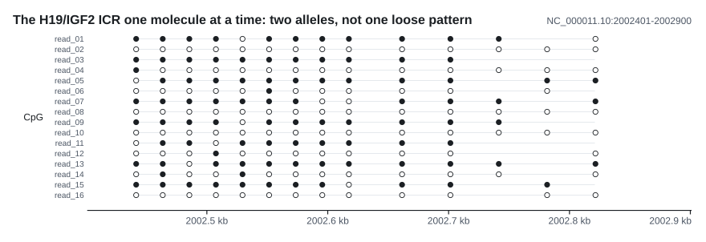

A [MethylationTrack](#methylationtrack) gives a fraction per site, and half the
reads methylated at every site has two very different explanations. Either every
molecule is methylated at about half its sites, scattered, or half the molecules
are methylated at all of them and half at none. The first is a region modified
loosely; the second is two populations of cells, or an allele-specific pattern.
The site fractions are identical in both cases. One row per molecule tells them
apart at a glance: the first is confetti, the second is stripes, and
`discordance()` puts a number on it.

The refusal is in the marks. An unmethylated call gets a ring and a site the
molecule did not cover gets no mark at all, because "measured and not
methylated" and "not measured" are different statements and must not look the
same. Columns sit at the real distances between the cytosines, which matters
when the question is whether an island is uniformly modified.

### JunctionTrack

Splice junctions as arcs, each weighted by the reads that crossed it and
labelled with the count.

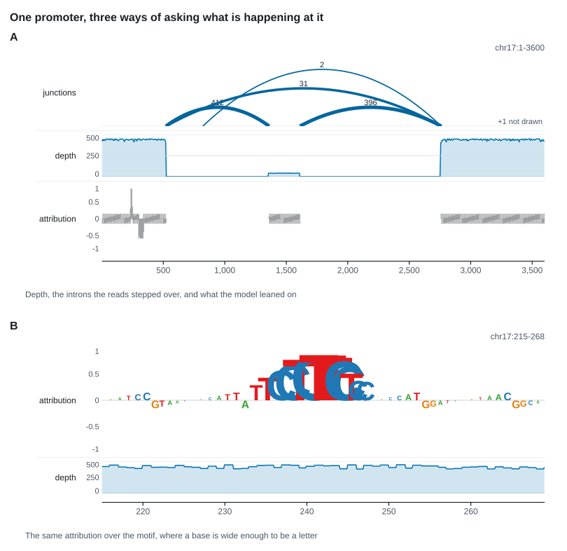

Three things separate this from [StructuralTrack](#structuraltrack), which also
draws arcs and also weights them by support, and none of the three is a setting.

What the arc joins. A structural variant joins two breakpoints, which are bases.
An intron is not at a base, it is the boundary between two, so the feet here are
at the left edge of a base rather than at its middle. At twenty pixels a base
that is ten pixels of drift, and the arc stops meeting the step in the coverage
profile underneath it.

How high it goes. A structural variant arcs by the distance between its ends,
because reaching further is what it did. An intron reaching further is not a
bigger event, so height carries nothing at all here: arcs go in lanes so they
miss each other, and `y_axis_width` answers with nought so that nothing invites
a reader to measure one.

What is printed. A structural variant keeps its support in a tooltip and says in
its own words that stroke weight is an ordering and never a length. That is not
enough here, because the ratio between two junctions is the finding, so the
count is printed over the apex. Thickness is logarithmic for the same reason:
counts inside one gene span three or four orders of magnitude, and on a linear
ramp every minor isoform sits on the floor together.

It is not a [SplitReadTrack](#splitreadtrack) either, and that one cannot hold
the data at all. A spliced alignment is one primary record whose CIGAR steps
over the intron and it carries no `SA` tag, so `read::split::reads` counts it as
not split and emits nothing: measured, three spliced records in, nought
molecules out. A split read track is also one row per molecule, and four hundred
reads over one exon are four hundred rows there. Here they are one arc labelled
400, and the collapsing is the point.

A junction no read crossed is not an observation. It reaches the track, is not
drawn, and the figure prints how many it held back, since a filter nobody can
see is worse than no filter.

### SquiggleTrack

Raw nanopore current, before it was ever a base. A read starts life as a few
hundred thousand current measurements in picoamperes, and basecalling turns that
into letters and throws the rest away. When a basecall is in doubt, or a
modification is the thing being measured, the current is the evidence and the
letters are the summary.

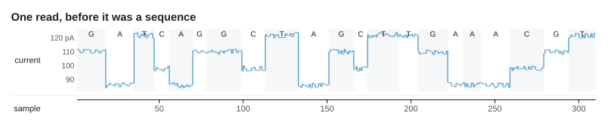

The x axis is sample number, which is time and not position, so the figure goes
over `Region::new("read", 0, samples)`. Above one sample per pixel each column
is drawn as the range of the samples underneath it, the way an oscilloscope and
an audio editor draw the same problem: the extremes are honest and the shape
between them is not there. Zoom in far enough and the samples are drawn as
themselves.

`SquiggleTrack::moves` attaches the basecaller move table, which is the only
thing in the plot connecting time to sequence, and `dwells()` reports how many
samples each called base held the pore for.

## Comparison

### MsaTrack

A multiple sequence alignment, row by row.


The coordinates are alignment columns, not genomic positions. They are two
different things, so the figure's region is the column space, an alignment 900
columns wide being `Region::new("alignment", 0, 900)`, and the ruler under it
counts columns. Ungapping a row back to reference coordinates is a real
operation with real decisions in it, and the crate does not do it behind your
back.

A wall of coloured residues is pretty and says very little, because in a real
alignment most cells agree and the agreement is the noise. So the default is
`MsaDisplay::Differences`: rows are a quiet bar and only what disagrees with the
comparison row is painted. Compare against a named row when one of them is the
reference, or leave it and the consensus is used. Conservation belongs above the
alignment rather than inside it, and [LogoTrack](#logotrack) takes the same
sequences this track does.

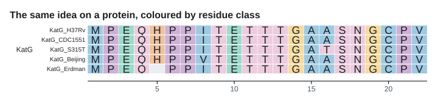

Protein alignments colour by physicochemical class, six of them, which is how
many hues the validated palette has. Neighbouring cells of the same colour are
merged into one rectangle, which is the difference between a figure and a file
no viewer will open.

`tree` matches sequence names to leaves, sorts rows by descent and draws a
phylogram or cladogram in the same gutter. A selected comparison row follows
the sequence when rows move; unmatched sequences remain at the bottom rather
than being discarded.

### DomainTrack

Domains, motifs, exons, introns or repeats as labelled half-open intervals,
one sequence per row.

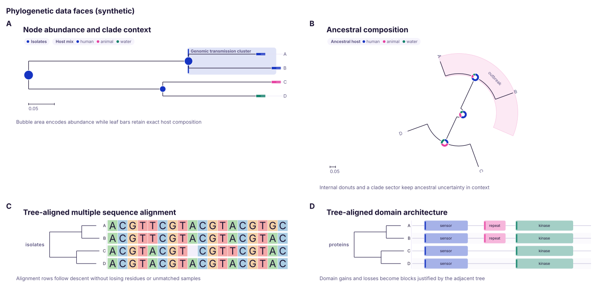

`DomainArchitecture` holds one named sequence length and its `DomainFeature`
intervals. Features with the same label share a stable palette colour across
rows; `DomainFeature::color` overrides it when a source already defines a
colour. Labels are drawn only when they fit, while tooltips retain the complete
name and exact boundaries.

`tree` matches architecture names to terminal taxa and reorders rows by
descent. The tree occupies the left part of the row-name strip, so its leaves,
names and interval backbones share exact row centres. Samples absent from the
tree stay at the bottom. The horizontal axis remains the sequence coordinate,
so this track uses the shared figure scale unlike `TreeTrack` itself.

### DotplotTrack

Two sequences on two axes, with each alignment block drawn as a diagonal. A
forward block runs bottom left to top right, a reversed one the other way, and a
rearrangement is whatever shape those make: a translocation sits off the main
diagonal, an inversion is an anti-diagonal.


The figure's region is always the query. The target keeps its own scale, either
its whole length through `target_length` or a slice of it through
`target_range`, and gets the height of the band. Blocks are given with both
spans ascending and the strand as a flag, which is how PAF records them.

### SyntenyTrack

The same `AlignmentBlock`s as ribbons between two bars. Compact, follows one
block at a time, and an inversion becomes a twist rather than a shape you read
off two axes.

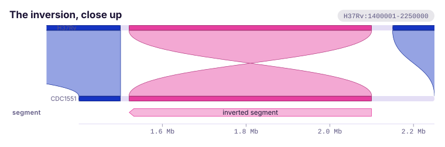

Neither form is a summary of the other, which is why both ship. The dotplot
shows the shape of a rearrangement at a glance and costs a tall panel; the
ribbons cost one band. Ribbons are translucent so two crossing ones read as two,
and each block is also drawn solid on both bars, so a thin ribbon still shows
exactly what it connects.

### LocusTrack

Several loci from several genomes, one row each, genes drawn as arrows and
joined to their matches in the row below by identity ribbons.

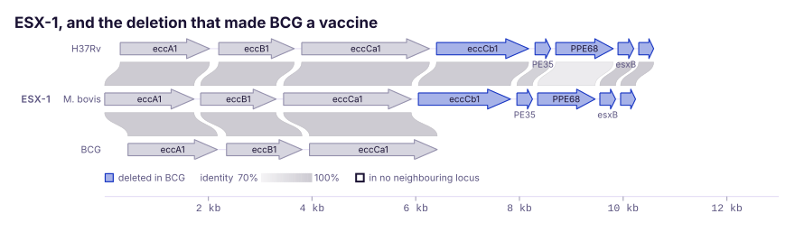

The question asked of a gene cluster, an operon, a viral genome or a syntenic
block is almost never "what is in it" but "what is in it that the other one has
not". So the genes with no homolog are outlined by default: the missing ribbon
says it too, but only to a reader who thought to look for an absence, and an
absence is the hardest thing to notice.

The x axis is the figure's own, shared with every other track, so a kilobase is
a kilobase in every row and the loci can be compared for length as well as for
content. Give each `Locus` its genes in whatever coordinates they came in and
shift a row with `Locus::offset` to line it up with its neighbour.

Homologies are between neighbouring rows only. That is a limit of the reading
rather than of the drawing: a ribbon that skips a row crosses one it has nothing
to do with, and a figure of those is a figure of crossings.

## Phylogeny

### TreeTrack

A phylogeny from a Newick string, drawn as a phylogram when the branch lengths
mean something or a cladogram when they do not. The projection can be
rectangular, a complete circle, a partial fan or an equal-angle unrooted view,
with branches radiating outwards or inwards where the root is meaningful.

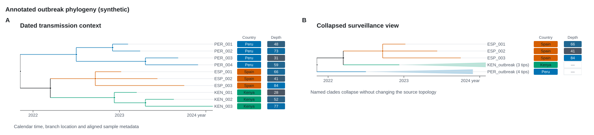

Annotated Newick, BEAST, NHX and the first tree in a Nexus trees block retain
typed metadata. `time` places nodes on a numeric date or height, `color_by`
maps inherited branch metadata, and `TraitColumn` aligns colour strips,
heatmaps, bars, binary marks or shaped categories to the visible tips.
`TreeTrack::collapse` replaces a
visible clade with a triangle without changing the `Tree` it owns.


In circular coordinates, time ticks are concentric guides, trait columns are
annular rings and collapsed clades are wedges. `circular`, `fan`,
`radial_start`, `radial_sweep`, `radial_direction` and `inner_radius` control
the geometry without changing topology, branch values or terminal order.

In rectangular coordinates, `branch_geometry` chooses orthogonal, diagonal or
curved parent-to-child connections. The choice changes only the SVG path:
topology, branch length, terminal order and metadata ownership remain
identical. Circular, fan and unrooted projections retain their own geometry.

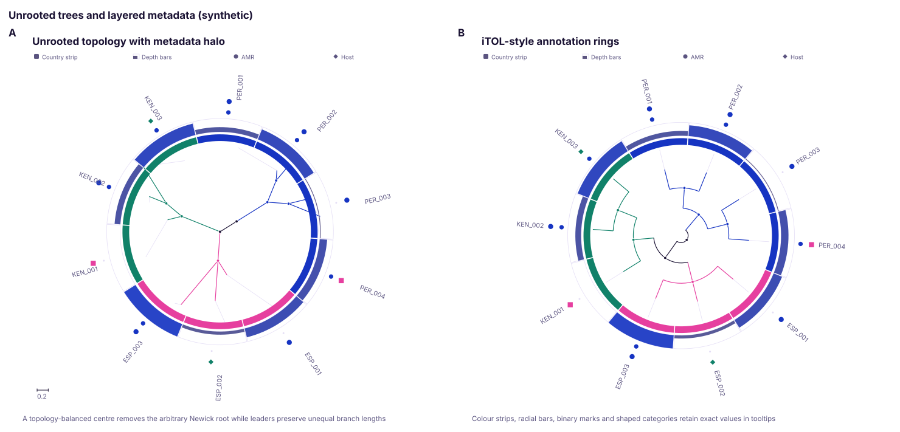

`unrooted` chooses a topology-balanced centre rather than the source Newick
root. `TraitColumn::bar`, `binary` and `symbol` add iTOL-style datasets to both
the circular and unrooted projections while preserving exact values in SVG
tooltips.


`BranchRateMixture` preserves several fitted ω classes on the same branch:
capsule segment width follows class weight and colour follows the neutral-
centred ω scale. `branch_rate_mixture` reads the paired rate and weight keys
directly from the branch-owning node. `HomoplasyLayer` and the `homoplasy`
convenience builder connect equal direct event annotations with dashed curves
across rectangular, circular and unrooted projections. They visualise
recurrence without claiming that an upstream ancestral reconstruction proved
convergence.

`AncestralStateLayer` reads one direct probability per supplied state, draws
their composition as an internal-node donut and can mark a parent-to-child
maximum-posterior state change when both endpoints cross its confidence floor.
`BranchEventLayer` places ordered mutation or amino-acid event symbols on the
owning edge, while `BranchIntervalLayer` adds a compact estimate-and-whisker
axis for concordance, rate uncertainty or transition support. All three work
in rectangular, circular and unrooted projections, preserve exact source
values in tooltips and never inherit missing branch annotations.


`NodeGlyph::bubble`, `pie`, `donut` and `stacked_bar` attach numeric data to
nodes. `NodeGlyphTarget` restricts marks to internal nodes or leaves, and
missing values suppress a glyph rather than becoming zero. `CladeHighlight`
projects one descendant set as a band, annular sector or unrooted field without
changing topology. Exact values and descendant counts remain in tooltips.


`support_style` makes internal support visible as scaled symbols, exact labels
or both, and `support_threshold` accepts either fractions or percentages.
`branch_labels` prints a node's own event annotation along its incoming edge;
it deliberately does not inherit ancestral values. `scale_bar` adds an
automatic or exact branch-length ruler to any phylogram projection and refuses
to imply those units on a cladogram or explicit time tree.


`reroot`, `reroot_named`, `reroot_outgroup` and `reroot_midpoint` expose the
common rooting choices without changing tip-to-tip distances. Outgroup rooting
checks exact monophyly; midpoint rooting refuses missing or invalid lengths.
Successful builders show a root diamond by default, controlled with
`show_root`, and unrooted coordinates omit it by definition.

The [annotated phylogenetics guide](guide/phylogenetics.md) covers input
semantics, time requirements, topology operations and the distinction between
visual and destructive collapse.

In the rectangular projection its x is evolutionary distance, so it does not
use the shared scale. Its y does mean something to its neighbours, because a
leaf is a row, and that is the whole point: [SnpTrack](#snptrack),
[MatrixTrack](#matrixtrack), [MsaTrack](#msatrack) and
[DomainTrack](#domaintrack) each take a tree of
their own and sort their rows to match it, which is what turns a scatter of
shared substitutions into a block.

### TanglegramTrack

Two trees over the same taxa, drawn facing each other with every shared tip
joined across the middle. A gene tree against a species tree, a core tree
against an accessory tree, two methods over one alignment: drawn side by side
the disagreement is something you have to hold in your head, and drawn this way
the disagreement is the crossings, which are a thing you can point at.


```rust
use karyon::tree::Tree;
use karyon::TanglegramTrack;

let core = Tree::parse_annotated_newick(
    "((A[&ward=ICU]:0.1,B[&ward=ICU]:0.1):0.2,\
       (C[&ward=Ward]:0.1,D[&ward=Ward]:0.1):0.2);",
)?;
let accessory = Tree::parse_annotated_newick(
    "((A[&ward=ICU]:0.1,C[&ward=Ward]:0.1):0.2,\
       (B[&ward=ICU]:0.1,D[&ward=Ward]:0.1):0.2);",
)?;

let track = TanglegramTrack::new(core, accessory)
    .names("core", "accessory")
    .color_by("ward")
    .untangle();

assert!(track.crossings() <= track.initial_crossings());
```

`crossings()` is worth putting in a caption, and it is not a statistic. The
count depends on how each tree happened to rotate its clades, and a clade
rotates freely without changing what the tree says. `untangle` alternates
greedy rotations on both sides and retains only strict improvements. It never
changes a clade or branch length and never increases the count, but it is a
deterministic local heuristic rather than a global optimum.

`labels` chooses left, right, both or tooltip-only terminal names;
`tie_style` selects curves, straight lines or translucent ribbons; and
`color_by` maps matching terminal annotations. When the two trees disagree on
that annotation, endpoint marks retain each value and the tie becomes dashed.
The header reports the before-and-after crossing count, linked taxa and taxa
present in only one tree.

A tip only one of the trees has is drawn on that tree and joined to nothing,
because a taxon missing from one analysis is a fact about the analysis.
`shared()` lists the tips both trees have and `unshared()` the ones they do
not.

### CladeTrack

Genomic intervals painted onto a phylogeny: a block whose width is a coordinate
span and whose height is a clade.

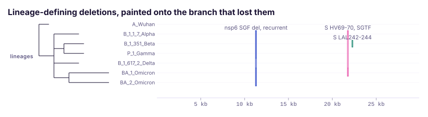

A [MatrixTrack](#matrixtrack) cell is one base wide and cells never merge, so a
matrix can only say that these six samples each carry something here. That is
six observations. This says one: a rectangle covering a whole clade asserts a
single acquisition or loss on the branch below which every carrier sits. The
difference between those two claims is most of what a comparative genomics
figure is arguing about.

The track can only lie in one way, and it refuses to. When the carriers are not
every leaf under their common ancestor, the block is still drawn across the rows
it spans, but every row inside it that does not carry the block is cut out, so a
paraphyletic set can never pass for a clade:

```rust
use karyon::tree::Tree;
use karyon::{CladeBlock, CladeTrack};

let tree = Tree::parse_newick("(((A:1,B:1):1,C:2):1,D:3);")?;
let track = CladeTrack::new(
    tree,
    vec![
        CladeBlock::new(1_000, 4_000, ["A", "B"]).name("RD1"),
        CladeBlock::new(6_000, 7_000, ["A", "C"]).name("recurrent"),
    ],
);

assert!(track.is_clade(0));
assert!(!track.is_clade(1));
assert_eq!(track.cut_rows(1), 1);
```

In the figure above that is the nsp6 SGF deletion, which five lineages carry and
Delta, sitting between them, does not: one block with a row cut out of it rather
than one ancestral event. Because the horizontal extent is a real
coordinate span, the questions a reader asks of the block are coordinate
questions: does it cover this gene, do two blocks on different branches share an
endpoint, does the deletion stop where a repeat element sits. `unmatched()` and
`unplaced()` report the taxa the tree does not have and the blocks that
therefore could not be placed.

## Evolution and surveillance

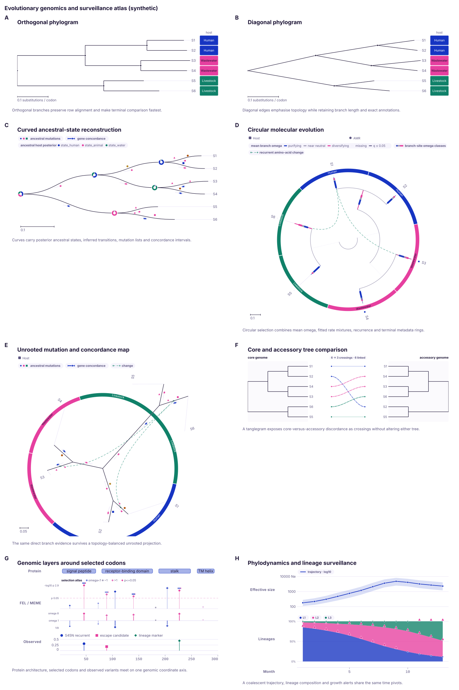

These two tracks use the shared integer x axis for time. That lets an inferred
population trajectory, observed lineage composition, sampling annotations and
an ordinary `AxisTrack` share exact pivots without pretending they are the same
kind of evidence. Encode calendar years, days since an epoch or another
project-wide integer time unit consistently in the surrounding `Region`.

### PhylodynamicTrack

A time-varying point estimate with an optional uncertainty interval. Reach for
it for an effective population size skyline, reproductive number or lineage
growth result fitted upstream.

```rust
use karyon::{PhylodynamicPoint, PhylodynamicScale, PhylodynamicTrack};

let skyline = PhylodynamicTrack::new(vec![
    PhylodynamicPoint::new(2020, 120.0).interval(70.0, 210.0),
    PhylodynamicPoint::new(2021, 430.0).interval(250.0, 760.0),
    PhylodynamicPoint::new(2022, 260.0).interval(150.0, 480.0),
])
.label("effective population size")
.unit("Ne")
.scale(PhylodynamicScale::Log10)
.show_points(true);
```

The estimate is a line, bounds form a quiet ribbon and `reference` adds an
independent guide such as `R = 1`. Linear and base-ten logarithmic scales are
explicit. Log mode omits non-positive estimates instead of manufacturing a
small positive value. Reversed, missing or non-finite bounds do not produce a
ribbon, while every accepted source estimate and interval remains exact in its
SVG tooltip. The track does not fit a clock, skyline, coalescent or birth-death
model.

### SurveillanceTrack

Observed lineage, clade, genotype or mutation counts through time, drawn as
stacked composition or independent trajectories.

```rust
use karyon::{
    SurveillanceMetric, SurveillanceObservation, SurveillanceStyle,
    SurveillanceTrack,
};

let composition = SurveillanceTrack::new(vec![
    SurveillanceObservation::new(2021, "L1", 34, 100),
    SurveillanceObservation::new(2021, "L2", 66, 100),
    SurveillanceObservation::new(2022, "L1", 72, 120),
    SurveillanceObservation::new(2022, "L2", 48, 120),
])
.label("lineage frequency")
.metric(SurveillanceMetric::Frequency)
.style(SurveillanceStyle::Stacked)
.minimum_total(20)
.frequency_alert(0.50)
.growth_alert(0.15);
```

`Frequency` divides each supplied count by its supplied denominator; `Count`
keeps the raw observation. `minimum_total` is a visible sampling floor rather
than a pseudocount. Frequency and stepwise-growth alerts use small symbols and
state their exact reason in the tooltip; they never replace the underlying
count and denominator. Supply an explicit zero count when absence was
observed: a missing lineage/time pair is not converted to zero. Stacked views
omit an incomplete time pivot and line views break at gaps; duplicate
lineage/time observations receive an ambiguity mark rather than being summed
or silently joined. The track deliberately performs no smoothing,
interpolation, forecasting or anomaly test.

## Whole genome

### IdeogramTrack

The whole chromosome drawn end to end across the plotting area, with a marker
showing which part of it the tracks below are showing.


Of the five tracks that do not use the shared scale, this is the only one whose
x is still a genomic coordinate, and it is not the figure's. The reason is the
question it answers: "where am I" cannot be answered by a track that only shows
the region on display, so it maps the whole sequence across the plotting area
instead. That makes it worth knowing before you put a ruler under it.

A row of the UCSC cytoBand table converts into a
`Band` without a lookup table of your own, the grey ladder is mixed from the
theme's own ink and page so a dark figure gets a dark ladder, and a tiny window
still gets a marker with a minimum width, because a pointer too thin to see is
neither a pointer nor a measurement.

Most sequences have no cytogenetics to speak of: plasmids, organelle genomes,
viruses, draft assemblies and bacterial chromosomes among them.
`IdeogramTrack::bare` gives an outline instead, which still answers the only
question the track was ever asked.

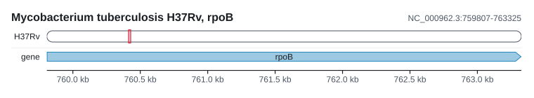

### GenomeTrack

The sequences of a `Genome` laid end to end, as alternating blocks with their
names on them. A figure is one region on one sequence, which is right for a
locus and wrong for an assembly; `Genome` hands back the single region that
covers all of them, and every other track then works across the lot at once.


What it refuses to be is a ruler. A ruler of global coordinates under a
concatenated genome would be a ruler of a coordinate system nothing else uses,
since nobody has ever quoted a position as "1,437,902 bases into the assembly".
So it labels the sequences and marks where each one ends instead. An assembly of
two hundred contigs has two hundred names and room for perhaps twelve, so the
ones that do not fit are left out rather than overprinted, and
`GenomeTrack::named` says how many were written and how many were not.

## Scales and keys

### AxisTrack

The coordinate ruler. Ticks land on round 1-based coordinates, the numbers a
reader would type into a genome browser, with the step rounded to 1, 2 or 5
times a power of ten so the labels stay round. `plot()` puts one at the bottom
without being asked; a tall figure is worth giving one at the top as well.

One unit, bp or kb or Mb, is chosen for the whole ruler, because an axis that
switches from kb to Mb half way across is unreadable. `center_on_bases` moves
each tick to the middle of its base rather than its left edge, which is right
once a base is a column you can see, as in a logo or a short motif: a ruler
marks boundaries, but a number under a visible column belongs under the column
it counts.

### CodonTrack

A ruler in codons, so a coding sequence can be read in protein coordinates.


A variant in a coding sequence is named by residue rather than by base: BRAF
V600E, TP53 R175H, rpoB S450L. A figure drawn in bases cannot be pointed at with
any of those names. This is the sibling of [AxisTrack](#axistrack) that can. It
partitions the sequence into codons, numbers them, and translates them where
there is room for a letter, and the partition is itself the claim: two changes
at different bases of one codon are competing alleles at one residue rather than
a double mutant, and two changes in neighbouring codons are two substitutions
however few bases apart they are.

On the reverse strand codon 1 sits at the highest coordinate and the numbering
runs right to left, which is the whole reason this is a track and not a division
by three. Roughly half the coding sequences in any annotation run backwards, and
getting their numbering wrong is silent: the figure still draws, it just names
the wrong residue. Hand it the reference as it is and it complements and reverses
the bases itself.

```rust
use karyon::{CodonTrack, Strand};

let ruler = CodonTrack::new(759_806, 763_325, Strand::Forward);
assert_eq!(ruler.codon_of(761_154), Some(450));
assert_eq!(ruler.span_of(450), Some((761_153, 761_156)));
```

Translation is NCBI table 1, and table 11 gives the same residues, so bacteria,
archaea and plastids need nothing. `genetic_code` takes any other table in the
same form, which is what a mitochondrial or ciliate sequence needs to avoid
being translated into a plausible protein that is wrong. A codon whose bases
were not supplied is drawn without a letter rather than guessed at.

### LegendTrack

A key to the colours as a band of its own. Keys can be a filled square, a dot, a
line, an area, an outline or a continuous ramp between two colours.

A legend is a horizontal strip of the figure that carries no coordinates, which
is exactly what a track is. Making it one means it stacks, clips and lays itself
out like everything else, and it goes where the caller puts it rather than where
a track decided to squeeze it. It also means the figure reserves room for it: a
legend drawn into a corner that already has data in it is a legend with a line
through it.

Entries are laid across the band and wrap onto another row when they run out of
width, so its height depends on how wide the figure is. Nothing is ever dropped
for want of room, because a key that is not drawn is worse than a legend that is
two rows tall.

## Metadata columns

Six tracks are drawn as a row per named thing: [MatrixTrack](#matrixtrack),
[MsaTrack](#msatrack), [SnpTrack](#snptrack), [CladeTrack](#cladetrack),
[DomainTrack](#domaintrack) and [LocusTrack](#locustrack). Each of them answers
"which ones". `Traits` answers what they were.

```rust
use karyon::read;
use karyon::track::traits::Traits;
use karyon::{plot, MatrixRow, MatrixTrack};

let sheet = read::sheet::sheet(
    "sample\tlineage\thost\tdepth\n\
     S1\tL4\thuman\t72.5\n\
     S2\tL2\tbovine\t61\n\
     S3\tL4\t\t48.2\n",
)?;
let columns = sheet.columns.clone();
let traits = Traits::new(sheet.rows).spread(columns);

let rows = vec![
    MatrixRow::new("S1", vec![1.0, 0.0]),
    MatrixRow::new("S2", vec![0.0, 1.0]),
    MatrixRow::new("S3", vec![1.0, 1.0]),
];
let svg = plot("chr1:1-1,000")?
    .add_track(MatrixTrack::new(vec![120, 340], rows).traits(traits))
    .to_svg();
assert!(svg.contains("S1; lineage L4"));
// S3 has no host, and the figure says so rather than colouring it.
assert!(svg.contains("S3; host missing"));
# Ok::<(), Box<dyn std::error::Error>>(())
```

The join is names, so the strips follow whatever order the rows are in,
including the order a phylogeny put them in. A row the sheet says nothing about
gets an empty outline, which is the one mark in a strip that cannot be mistaken
for a level.

These are the same columns a [TreeTrack](#treetrack) has always drawn beside its
leaves, and they are drawn by the same code. The difference is where the values
come from: a tree reads them off its own annotated nodes, and a row-based track
reads them off [a sample sheet](guide/formats.md#the-sample-sheet). The one
vocabulary is deliberate, so that the same lineage is the same colour in a tree
and in the matrix under it, which is most of the reason to put them in one
figure.

`TraitColumn` decides how a column is drawn, and `Traits::spread` picks for you:
a column whose every stated value is a number gets a ramp, anything else gets
the categorical palette, and a column of more levels than the palette holds gets
`TraitStyle::Symbol`, which carries the level in a shape as well as a hue and
separates twenty-four instead of six. `TraitStyle::Bar` and `TraitStyle::Binary`
are there for the iTOL-style datasets, on a matrix as much as on a tree.

Levels are numbered as they are first met, never sorted, so a figure redrawn
from the same file colours the same way and one more sample does not repaint the
samples that were already there.

`Traits::legend` builds a key naming every level and both ends of every ramp.
Nothing calls it for you: a legend is a judgement about a figure rather than
about a column, so where it goes and whether the figure needs one stay yours.

From the command line this is `--traits`, described in
[command line](guide/cli.md#what-is-known-about-the-rows).

## From the command line

Twenty-eight of the thirty-six tracks have a standard text format to read, and those
are the ones `karyon` the command can build. Each flag starts a track and the
flags after it describe that one, so the order of the flags is the order of the
stack.

| Flag | Track | Format |
|:-----|:------|:-------|
| `--coverage` | [CoverageTrack](#coveragetrack) | bedGraph, `samtools depth`, or one value per line |
| `--copy-number` | [CopyNumberTrack](#copynumbertrack) | a segment table: CNVkit `.cns`, ASCAT, or `.seg` |
| `--dynseq` | [DynseqTrack](#dynseqtrack) | bedGraph of per-base scores, with `--with-sequence` |
| `--junctions` | [JunctionTrack](#junctiontrack) | an aligner's `SJ.out.tab` |
| `--sequence` | [SequenceTrack](#sequencetrack) | FASTA |
| `--features` | [FeatureTrack](#featuretrack) | BED or GFF3 |
| `--variants` | [VariantTrack](#varianttrack) | VCF |
| `--windows` | [WindowTrack](#windowtrack) | bedGraph |
| `--manhattan` | [ManhattanTrack](#manhattantrack) | a table of position and value |
| `--tree` | [TreeTrack](#treetrack) | Newick |
| `--msa` | [MsaTrack](#msatrack) | aligned FASTA |
| `--snps` | [SnpTrack](#snptrack) | aligned FASTA |
| `--ideogram` | [IdeogramTrack](#ideogramtrack) | a cytoBand table |
| `--matrix` | [MatrixTrack](#matrixtrack) | a table of a value per sample per site |
| `--pileup` | [PileupTrack](#pileuptrack) | SAM text, as `samtools view` writes it |

An [AxisTrack](#axistrack) is added at the bottom without being asked for, and
`--axis` puts one wherever the flag sits instead. Any track file may be `-` for
standard input, which is how the binary formats get in: `samtools` and
`bcftools` already write exactly what these readers take.

`AxisTrack` is also available to the command: `--axis` places the ruler, which
reads no file because it has nothing to read. [OrfTrack](#orftrack) and
[LogoTrack](#logotrack) are reachable too, off the same FASTA and the same
aligned FASTA that `--sequence` and `--msa` already take, and
[SyntenyTrack](#syntenytrack) and [DotplotTrack](#dotplottrack) off one PAF
from `minimap2`, which is the one format in the crate that needs no coordinate
conversion at all. [BisulfiteTrack](#bisulfitetrack) reads a `bismark_methylation_extractor` file
through `--bisulfite`, and [DomainTrack](#domaintrack) an `InterProScan` table
through `--domains`. That last one is the only track here whose axis is not
bases: a domain is at a place in a protein, so the window is a residue range and
the ruler underneath counts amino acids.

Three more are reachable through a flag that names a second file:
[TanglegramTrack](#tanglegramtrack) through `--tanglegram left.nwk --against
right.nwk`, [CladeTrack](#cladetrack) through `--clades gubbins.gff --with-tree
tree.nwk`, and [LocusTrack](#locustrack) through `--loci genes.bed --links
hits.tsv`.

That leaves eight in the library only, and the reasons are not the same one.
[CodonTrack](#codontrack), [GenomeTrack](#genometrack),
[PhylodynamicTrack](#phylodynamictrack), [SelectionTrack](#selectiontrack),
[SurveillanceTrack](#surveillancetrack) and
[TranscriptionUnitTrack](#transcriptionunittrack) would need a table with no
single standard behind it.

Two belong here for good. [SquiggleTrack](#squiggletrack) reads raw current,
and the formats that carry it, POD5 and FAST5, are binary. [LegendTrack](#legendtrack)
is built from what the other tracks decided rather than from a file at all. The
reasoning, and the whole grammar, is in [the command line guide](guide/cli.md).

!!! note "Not a track"
    A circular sequence is not a stack of bands, so it is not a track and not a
    `Figure` either. `Rings` maps position to an angle, puts annotation,
    composition and variants on concentric rings, and uses the middle for chords
    joining the two ends of a rearrangement. A `Rings` plot and a `Figure` can
    share one `Panels` sheet. See [figure](guide/figure.md).

## Next

- [Plot API](guide/plot.md), for the `add_` method that builds each of these.
- [Writing a track](how-it-works/extending.md), for adding another one.
- [Recipes](recipes.md), for worked figures that stack several of them.
