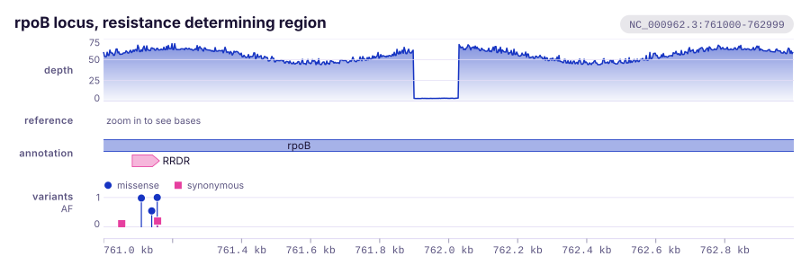
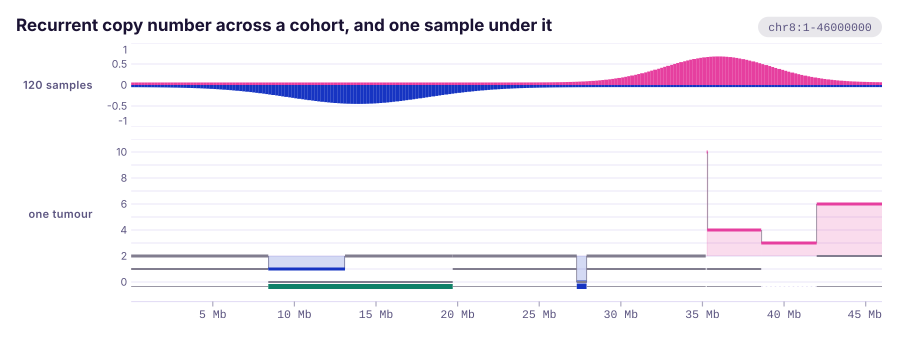
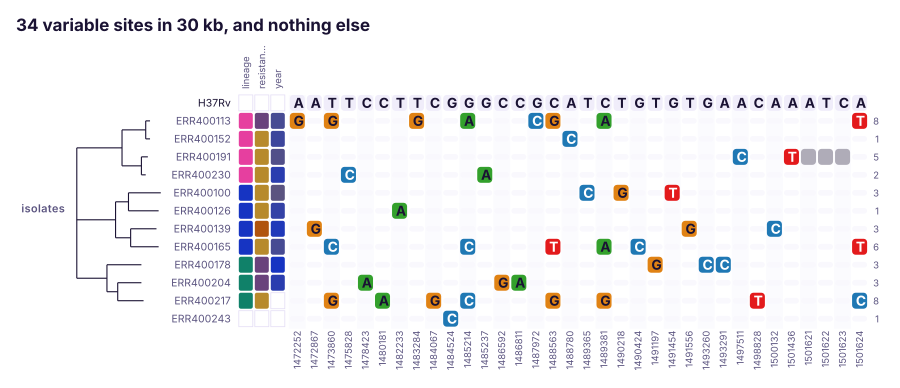
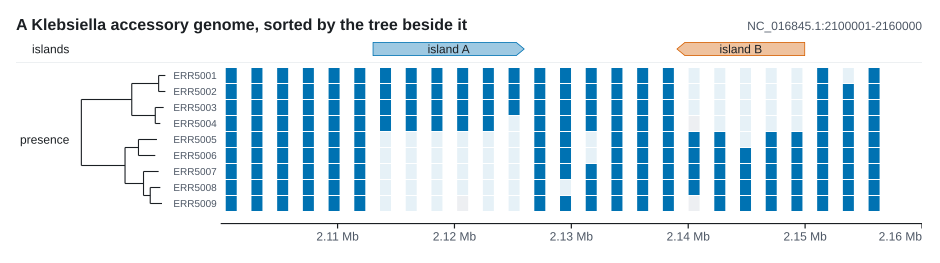
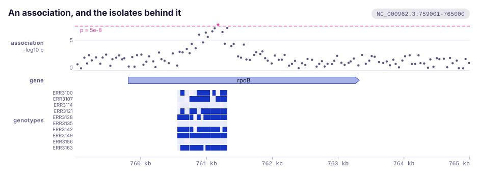
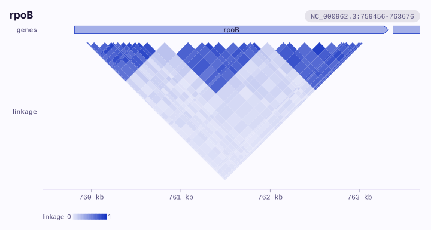
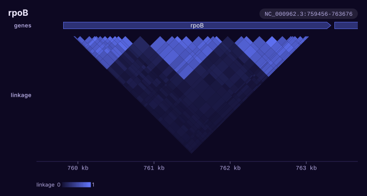
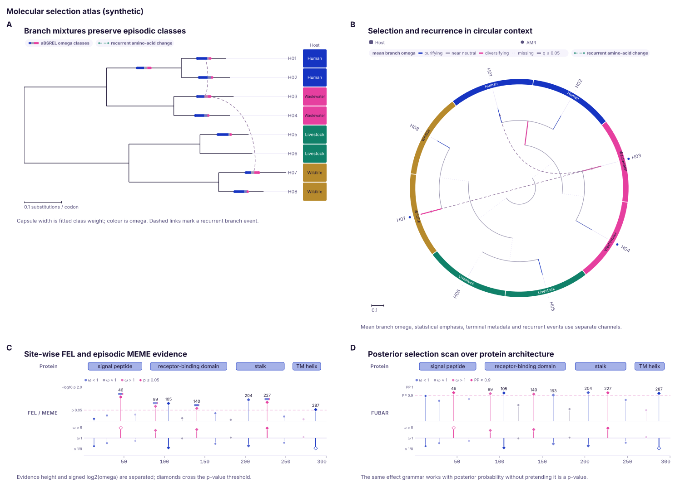

# Variation tracks

Draw how samples differ from a reference and from each other: point calls, the genotypes of a cohort, structural calls, copy number, variable sites, genotype matrices, association scans and site-wise selection.
{ .k-lead }

The Rust snippets use `?`, so they belong in a function that returns `Result<(), Box<dyn std::error::Error>>`, and names such as `tree` stand for data you already hold. To choose a track by its picture, start from the [gallery](../plots/variation-association.md).

## VariantTrack { #varianttrack }

Point events along the sequence, drawn as lollipops whose height is a value, or as plain ticks once they are too dense for heads: SNPs, indels, insertion sites, peaks. Colour and the legend follow each call's category.

<figure class="k-plate" markdown>
{ width="900" height="305" loading="lazy" }
</figure>

| | |
|:--|:--|
| Rust | `.add_variants(variants)` on `plot()`; `VariantTrack::new(variants)` |
| Command line | `--variants FILE`, with `--style`, `--height` |
| Reads | VCF: `AF` as the value, and the `ANN` or `BCSQ` consequence, or the shape of the call, as the category (`read::point::variants`); bgzipped with a `.tbi` or `.csi` beside it, only the rows over the window (`read::tabix`); a BCF, its sites over the window through the `.csi` beside it, as the VCF `bcftools view -G` prints (`read::bcf::window`) |

=== "Rust"

    ```rust
    use karyon::{plot, Variant};

    plot("NC_000962.3:761,001-763,000")?
        .add_variants(vec![
            Variant::new(761_108).value(0.98).category("missense"),
            Variant::new(761_154).value(1.00).category("missense"),
            Variant::new(761_155).value(0.21).category("synonymous"),
        ])
        .label("variants")
        .adjust(|track| track.max(1.0))
        .save("variants.svg")?;
    ```

=== "Command line"

    ```bash
    karyon NC_000962.3:761,001-763,000 --variants calls.vcf --label variants -o calls.svg
    ```

#### Options

| Method | What it does | Default |
|:--|:--|:--|
| `.label("variants")` | Names the track in the left gutter (`--label`) | none |
| `.height(70.0)` | Band height in pixels (`--height`) | `55` |
| `.style(VariantStyle::Tick)` | `Lollipop` or `Tick` (`--style lollipop` or `tick`) | `Lollipop` |
| `.radius(3.0)` | Radius of a lollipop head | `4` |
| `.max(1.0)` | Pins the value that reaches the top of the band | the largest value on screen |
| `.axis(QuantitativeAxis::new())` | Replaces the value axis | automatic |
| `.show_legend(false)` | Shows or hides the category legend | shown |
| `.show_scale(false)` | Shows or hides the value axis | shown |
| `.axis_title("AF")` | What the stems measure, under the track's name while the axis is drawn (set by the command line) | none |
| `.color("#555555")` | Colour of variants without a category | theme accent |
| `.uniform_color("#8b0000")` | Paints every variant this colour, whatever its category; each category keeps its shape, on the marks and in the key (`--color`) | a colour each category |
| `.category_order(["stop_gained", "missense_variant"])` | Gives each category named the palette slot of its place in the list, drawn or not; the rest follow by first appearance (the command line passes the consequences in view, most damaging first) | first appearance |

#### Notes

Categories take palette colours in order of first appearance, not by hash, so the same list always gives the same figure. That determinism is the refusal: a figure that recolours itself when a sample is added is not one you can put in a paper. Sorting the same variants differently hands out different colours, so two figures that must agree on what red means need their variants in one order, or one `category_order`, which fixes a category's slot whatever the window holds. The command line ranks the consequences in view from the most damaging down, in Ensembl's order of the Sequence Ontology terms, then the shapes of calls nothing annotated, then any other word alphabetically. By first appearance, missense was the second colour across a gene whose first call was synonymous and the first in a zoom holding only missense calls; ranked, a colour moves only when a zoom leaves a more damaging consequence out.

A variant with no value gets a full-height stem, which is right when there is no quantity to show. Ticks ignore values altogether, and the value axis is drawn only when the stems are measuring something. Pin `max` whenever two panels carry the same quantity.

Lollipops read well up to a few hundred calls; past that the heads smear, and `Tick` is the answer. Ticks carry no tooltip, since a mark nobody can isolate is not worth naming.

From VCF, `POS` becomes `POS - 1`, a row with several alternates gives one call per allele, and a call with no `AF` has no value, and stands full height. A gVCF's reference blocks are skipped: rows whose `ALT` is `.`, or only the placeholder for an allele, `<NON_REF>` as GATK writes it or `<*>` as bcftools does. A variant row of a gVCF names the placeholder after its own allele, as `T,<NON_REF>`, and draws its `T` alone. The samples of a cohort's VCF are a [GenotypeTrack](#genotypetrack).

## GenotypeTrack { #genotypetrack }

The call of each sample at each site of a cohort's VCF: one row per sample and one cell per record, each at its own position on the shared axis, so a column of calls stands under the lollipop a [VariantTrack](#varianttrack) draws for the same record and under the gene it falls in. Put a phylogeny beside it and the alleles a clade shares line up into a block.

<figure class="k-start" markdown>
{ .k-light width="720" height="697" loading="lazy" }
{ .k-dark width="720" height="697" loading="lazy" }
</figure>

| | |
|:--|:--|
| Rust | `.add_genotypes(samples, sites)` on `plot()`; `GenotypeTrack::new(samples, sites)` |
| Command line | `--genotypes FILE`, with `--sample`, `--with-tree`, `--traits`, `--columns`, `--row-height`, `--max-rows`, `--no-names` |
| Reads | a VCF with samples: `GT` from the column of each sample the `#CHROM` line names (`read::point::genotypes`); bgzipped with a `.tbi` or `.csi` beside it, its header and the rows over the window (`read::tabix`); a BCF, each sample's `GT` alone over the window through the `.csi` beside it, the samples named by its header (`read::bcf::window`) |

=== "Rust"

    ```rust
    use karyon::{plot, Genotype, GenotypeSite};

    let samples = vec!["S1".to_string(), "S2".to_string(), "S3".to_string()];
    let sites = vec![
        GenotypeSite::new(761_154, "C", ["T"], vec![
            Genotype::diploid(0, 1),
            Genotype::diploid(1, 1),
            Genotype::diploid(0, 0),
        ]),
        GenotypeSite::new(762_367, "G", ["A", "T"], vec![
            Genotype::diploid(1, 2), // no copy is the reference
            Genotype::parse("./.").unwrap(),
            Genotype::diploid(0, 1),
        ]),
    ];

    // tree: a Tree whose leaves are named S1, S2 and S3
    plot("NC_000962.3:759,001-765,000")?
        .add_genotypes(samples, sites)
        .label("cohort")
        .adjust(|track| track.tree(tree))
        .save("genotypes.svg")?;
    ```

=== "Command line"

    ```bash
    karyon rpoB genes.gff3 --genotypes cohort.vcf.gz --with-tree tree.nwk \
      --traits samples.tsv --columns lineage -o genotypes.svg
    ```

#### Options

| Method | What it does | Default |
|:--|:--|:--|
| `.label("cohort")` | Names the track in the left gutter (`--label`) | none; on the command line, the file's name and `genotypes` |
| `.row_height(8.0)` | Height of one row (`--row-height`) | `11` |
| `.row_gap(2.0)` | Gap between rows, in the page colour | `1` |
| `.min_cell_width(4.0)` | Narrowest a cell is drawn, which is also how close two sites can be before they are pooled | `3` |
| `.max_rows(Some(100))` | Caps the sample rows drawn; `None` lifts the cap (`--max-rows`) | `Some(40)` |
| `.show_names(false)` | Shows or hides sample names (`--no-names`) | shown |
| `.color("#d55e00")` | The hue of an alternate call | the theme's ink, a colour no category of a strip takes |
| `.tree(tree)` | Draws a phylogeny beside the rows and puts them in the order of its tips (`--with-tree`) | none |
| `.tree_width(120.0)` | Width of the tree strip in pixels | `90` |
| `.tree_shape(TreeShape::Cladogram)` | Phylogram or cladogram for that tree | `Phylogram` |
| `.traits(traits)` | Metadata columns between the names and the calls (`--traits`, `--columns`) | none |

#### Notes

A cell is the share of the call's copies that are not the reference, which is the one reading that means the same thing whatever the ploidy. A haploid `1` and a diploid `1/1` are both all alternate and drawn in the full hue, `0/1` at half strength and `0/0/0/1` at a quarter. A multi-allelic `1/2` carries no copy of the reference, so it is all alternate too, and its tooltip names both alleles. A copy that names `*`, the base a deletion upstream took away, or a placeholder such as `<NON_REF>` is not the reference either, and counts as alternate; the tooltip spells it out, and says what a `*` is.

Four marks, because four things can be true of a sample at a site: a reference call is a short quiet bar, as an agreement is in a [SnpTrack](#snptrack); a heterozygous call and an alternate call are full cells at two strengths of the hue; and a sample with no call is a pale full cell. A stretch with no record in it is the page. A call with any copy unknown, `./1` say, is no call: counted over its known copies it would be all alternate, and a heterozygote would be drawn as a homozygote. The quiet marks are mixed from the theme's muted ink and not from its rule, since a bar mixed from the rule is 1.06 to one against the light page and close to not there; mixed from the ink it is 2.07 to one, the pale cell of no call 1.31, and the two are 1.58 apart as well as different shapes.

A cell is drawn at a floor width, centred on its base, which at the zoom a cohort is read at is wider than the gap between sites. So the track works out which cells would overlap before drawing any. A site whose cell touches no other is a cell, with a tooltip of its own when it carries an alternate allele. Sites whose cells overlap are a cluster, and a cluster is painted a pixel at a time: each pixel takes the share of alternate copies among the calls under it, in eight steps, and any alternate copy is at least the first step, so one heterozygote among forty references is not drawn as a reference. The cluster runs from the left edge of its first cell to the right edge of its last, and runs of one shade are one rectangle. A run of at most eight sites that carries an alternate copy names each of them and the sample's call there, as `S03, 2 sites too close to draw apart, 1 carrying an alternate allele: 763,290 G>C alternate; 763,295 G>T reference`, so a shade between the reference and the hue reads as the sites it pools; a run of more is left to its row's tooltip, which keeps a megabase of a cohort the size it was. Twenty thousand sites of two hundred samples over a megabase, drawn a cell at a time as a [MatrixTrack](#matrixtrack) draws them, were 258 MB and four million rectangles; drawn here they are 0.94 MB.

The key names the four states while every cell is one call, and only the ones the figure holds: a haploid cohort has no heterozygous call to key. Once a pixel is an average of several calls, or a call is a share a diploid cannot make, it keys the steps as a ramp instead, with the reference and no call beside it, titled `alternate copies among a pixel's calls` where a pixel pools sites. Each row's tooltip counts what the window holds of that sample: how many sites it was called at and how many it carries an alternate allele at.

The rows stop at forty and the figure counts the rest, as `+N more`. `tree` sorts them by descent and draws the tree beside them; a sample the tree does not name keeps its row at the bottom, and a tip with no row is counted under the rows. On the command line, `--sample S3,S1` chooses the rows and their order, and with `--with-tree` as well the tree orders the rows chosen.

A VCF named on its own is still its calls, a [VariantTrack](#varianttrack), since a VCF of one sample is the common case and a row of its own would repeat its sites. A cohort's says so: `karyon: cohort.vcf.gz is drawn as its calls; --genotypes cohort.vcf.gz draws its 40 samples, a row each`. What the reader takes and refuses is under [VCF genotypes](../guide/formats.md#vcf-genotypes).

## StructuralTrack { #structuraltrack }

Structural variant calls as arcs between their two breakpoints, springing from the axis at both ends, higher the further apart the ends are and heavier the more reads support them. Use it with a [CoverageTrack](signal-sequence.md#coveragetrack) underneath.

<figure class="k-plate" markdown>
{ width="880" height="288" loading="lazy" }
</figure>

| | |
|:--|:--|
| Rust | `.add_structural(variants)` on `plot()`; `StructuralTrack::new(variants)` |
| Command line | `--structural FILE`, with `--no-names`, `--height` |
| Reads | VCF or BCF with symbolic alleles or `SVTYPE`, breakend pairs read from the `ALT` (`read::structural::variants`, `read::bcf::whole`), whole even with an index beside it, since an arc is drawn from a breakend outside a window it crosses |

=== "Rust"

    ```rust
    use karyon::{plot, StructuralVariant, SvKind};

    // depth: Vec<f64> from 0-based 4,330,000
    plot("NC_000962.3:4,340,001-4,400,000")?
        .add_structural(vec![
            StructuralVariant::new(4_352_000, 4_356_000, SvKind::Deletion).support(31),
            StructuralVariant::new(4_370_000, 4_376_000, SvKind::Duplication).support(12),
            StructuralVariant::new(4_381_000, 4_390_000, SvKind::Inversion).name("inv1"),
        ])
        .label("SV")
        .add_coverage_at(4_330_000, depth)
        .label("depth")
        .save("sv.svg")?;
    ```

=== "Command line"

    ```bash
    karyon NC_000962.3:4,340,001-4,400,000 \
      --structural sv.vcf --label SV \
      --coverage sv-depth.bedgraph --label depth \
      -o sv.svg
    ```

#### Options

| Method | What it does | Default |
|:--|:--|:--|
| `.label("SV")` | Names the track in the left gutter (`--label`) | none |
| `.height(120.0)` | Band height; the widest arc in view uses all of it but the line its name needs (`--height`) | `90` |
| `.color(SvKind::Deletion, "#d55e00")` | Colour of one kind of call | a palette colour per kind |
| `.stroke(1.0, 4.0)` | Arc weight at no support and at full support | `1.0` to `3.4` |
| `.saturating_support(50)` | Read count at which an arc is drawn at full weight | `30` |
| `.show_footprints(false)` | Shows or hides the bar along the axis under calls that cover sequence | shown |
| `.show_names(false)` | Shows or hides names over the arcs (`--no-names`) | shown |

#### Notes

The arc is the point. A structural variant is a statement that two positions belong together: the two ends of a deletion, the source and destination of a duplication. A [VariantTrack](#varianttrack) draws one point per call and cannot say that, and a bar spanning the event says only that something happened in the middle, which is usually the one place nothing happened.

Height is an ordering within one view, never a length and never comparable across two. The widest call lying wholly inside the view reaches the top of the band, a call wider than that (which can only be one leaving the view) reaches the top too, and the rest follow the square root of their span. So a translocation off to the side does not press the arcs you are looking at flat, and panning or zooming rescales them.

Half of reading a call is whether the depth agrees: a deletion with no drop under it and a duplication with no rise are calls to argue with. An insertion has one breakpoint and no footprint; a translocation joins two places rather than covering what lies between them.

The VCF reader takes nothing off `POS` for a symbolic allele, because the specification puts `POS` on the base before the event. The span comes from `SVLEN` (its absolute value), else `END`, else the length of `REF`, and a record stating none of them is refused rather than drawn one base wide. Of the two records of a breakend pair, only one becomes an arc.

## CopyNumberTrack { #copynumbertrack }

Segmented copy number on a ladder of whole copies, with a lane along the foot marking where one allele was lost. Every called segment is a mark, and only a segment nobody called is blank.

<figure class="k-plate" markdown>
{ width="900" height="341" loading="lazy" }
</figure>

| | |
|:--|:--|
| Rust | `.add_copy_number(segments, ploidy)` on `plot()`; `CopyNumberTrack::at_ploidy(segments, ploidy)`, `CopyNumberTrack::diploid(segments)`, `CopyNumberTrack::haploid(segments)` |
| Command line | `--copy-number FILE --ploidy COPIES`, or a `.cns` or `.seg` named on its own, with `--sample`, `--height`; with no place, across the whole genome |
| Reads | a segment table with a header: CNVkit `.cns`, ASCAT, or `.seg` (`read::segments::copy_numbers`, and `read::segments::genome_copy_numbers` for every sequence) |

=== "Rust"

    ```rust
    use karyon::{plot, CopyNumberSegment};

    let segments = vec![
        CopyNumberSegment::allelic(0, 12_000_000, 1.0, 1.0),
        CopyNumberSegment::allelic(12_000_000, 20_000_000, 2.0, 0.0), // copy-neutral LOH
        CopyNumberSegment::total(20_000_000, 26_000_000, 1.0),
        CopyNumberSegment::allelic(26_000_000, 38_000_000, 2.0, 1.0),
    ];

    plot("chr8:1-46,000,000")?
        .add_copy_number(segments, 2.0)
        .label("copy number")
        .save("copy-number.svg")?;
    ```

=== "Command line"

    ```bash
    karyon chr8:1-46,000,000 --copy-number tumour.cns --ploidy 2 --label 'copy number' -o cn.svg
    karyon tumour.cns --ploidy 2 -o genome.svg
    ```

#### Options

| Method | What it does | Default |
|:--|:--|:--|
| `.label("copy number")` | Names the track in the left gutter (`--label`) | none |
| `.height(100.0)` | Band height in pixels (`--height`) | `74` |
| `.cap(8.0)` | Pins the top rung of the ladder, taken literally | at least two copies above the ploidy |
| `.colors(gain, loss, neutral)` | Inks for gain, loss and the balanced state | from the theme |
| `.loh_color("#6a3d9a")` | Ink of the lost-heterozygosity mark | from the theme |
| `.show_scale(false)` | Shows or hides the copy scale | shown |
| `.show_alleles(false)` | Shows or hides the allele lane along the foot | shown |
| `.across(&genome)` | Lays the track on a `Genome` of several sequences end to end: no riser joins two of them, and a tooltip says where a segment is on its own sequence | one sequence |

#### Notes

Where balanced sits has no default, in `at_ploidy` or on the command line, where `--ploidy` is required. The crate does not know what it is drawing, and a rule in the wrong place does not merely mis-scale the ladder: it swaps every gain for a loss. `diploid` and `haploid` say it for you.

A level is a bar drawn at the level, not a fill from a line to it. A window track fills from its baseline, so a segment called exactly at the ploidy draws nothing, and a balanced segment is most of a genome: its quiet arms would look the same as arms nobody called. That is why this is not a [WindowTrack](signal-sequence.md#windowtrack).

A minor allele of nought with copies still present is a finding, so it must not look like the absence of one. `CopyNumberSegment::allelic` carries both alleles; `CopyNumberSegment::total` carries a total and says nothing about them, and its `minor()` is `None` rather than nought. Copy-neutral loss of heterozygosity puts the total bar exactly on the balanced rule, and the lane along the foot is what shows it.

Copies are continuous, since subclonal and purity-adjusted calls are fractional; the rungs are at whole copies because that is where the interpretable states are. Nothing is averaged: every segment is drawn at its own level, a pixel wide where it is narrower, with a hairline joining the extremes in each column, and nothing is drawn between two segments.

A log2 ratio from a `.seg` or `.cns` becomes copies as `ploidy * 2^log2`, and a called copy number is used where the table has one. `--sample` picks one sample from a table holding several.

With no place, the command line draws the table across every sequence it calls a segment on, end to end, each as long as its furthest segment, with the sequences named under it, as `karyon tumour.cns --ploidy 2` does. A pixel column there holds hundreds of thousands of bases, and the one a join falls in holds the end of one sequence and the start of the next, so `across` keeps each column's riser to one sequence: a stalk from a loss at the end of one chromosome to a gain at the start of the next would draw a breakpoint nobody reported.

## SnpTrack { #snptrack }

The variable columns of an alignment and nothing else, spaced evenly, one row per sample, each column labelled with its own position. Put a phylogeny beside it and a clade's shared substitutions line up into a block.

<figure class="k-plate" markdown>
{ width="900" height="388" loading="lazy" }
</figure>

| | |
|:--|:--|
| Rust | `.add_snps(names, sites)` on `plot()`; `SnpTrack::new(names, sites)`, `SnpTrack::from_alignment(reference, &rows)` |
| Command line | `--snps FILE`, with `--compare-to`, `--no-counts`, `--row-height`, `--max-rows`, `--no-names`, `--traits`, `--columns` |
| Reads | aligned FASTA, compared against its first record unless `--compare-to` names another (`read::seq::alignment`) |

=== "Rust"

    ```rust
    use karyon::{Plot, Region, SnpTrack};

    // rows: Vec<MsaSequence>, aligned, with the reference as row 0; tree: Tree
    let panel = SnpTrack::from_alignment(0, &rows).tree(tree).label("isolates");
    let sites = panel.sites().len() as u64;

    Plot::over(Region::new("sites", 0, sites)?)
        .remove_region_label()
        .add_track(panel)
        .save("snps.svg")?;
    ```

=== "Command line"

    ```bash
    karyon --snps isolates.fa --compare-to H37Rv --label isolates \
      -o snps.svg
    ```

#### Options

| Method | What it does | Default |
|:--|:--|:--|
| `.label("isolates")` | Names the track in the left gutter (`--label`) | none |
| `.row_height(16.0)` | Height of one row (`--row-height`) | `15` |
| `.row_gap(3.0)` | Gap between rows | `2` |
| `.offset(1_472_000)` | Shifts every site position, for an alignment that starts away from zero | `0` |
| `.reference_name("H37Rv")` | Names the reference row | `"reference"`, or the row's own name from `from_alignment` |
| `.show_reference(false)` | Shows or hides the reference row along the top | shown |
| `.show_names(false)` | Shows or hides sample names (`--no-names`) | shown |
| `.show_positions(false)` | Shows or hides the position under each column | shown |
| `.show_counts(false)` | Shows or hides each row's count of differences (`--no-counts`) | shown |
| `.zebra(false)` | Shows or hides the alternating column tint | shown |
| `.max_rows(Some(100))` | Caps the sample rows drawn; `None` lifts the cap (`--max-rows`) | `Some(40)` |
| `.match_color("#e5e7eb")` | Colour of a cell that matches the reference | from the theme |
| `.tree(tree)` | Draws a phylogeny beside the panel and sorts the rows to match it | none |
| `.tree_width(120.0)` | Width of the tree strip in pixels | `90` |
| `.tree_shape(TreeShape::Cladogram)` | Phylogram or cladogram for that tree | `Phylogram` |
| `.traits(traits)` | Metadata columns between the names and the panel (`--traits`, `--columns`) | none |

#### Notes

An alignment of close relatives is almost all agreement: thirty kilobases carrying thirty-four differences would spend 99.9% of its pixels on the part that says nothing. Dropping the invariant columns turns a smear into legible columns. A cell that matches the reference is a quiet bar, alternate columns are tinted so the eye can cross a wide panel, and each row carries its count of differences on the right.

The price is the x axis. Two neighbouring columns may be nine bases or nine kilobases apart, and nothing about the spacing says which, so each column carries its own position turned on end, counted from one like a ruler's, and a ruler does not belong under the panel. The region is the site index space, `Region::new("sites", 0, 34)` for thirty-four sites. The panel answers `false` to `Track::on_coordinates`, so `plot()` and the command line append no ruler for it; a figure that also holds a track on the coordinates keeps the ruler that track is read against.

A panel with more sites than pixels, the whole genomes of an outbreak say, is drawn a pixel at a time once a column would be narrower than a pixel and a half. Each pixel of a row is shaded by the share of the sites under it that differ from the reference, in eight steps from the colour of an agreement to the colour of a difference, and the key says so. A pixel with any difference in it takes at least the first step, so one difference among forty sites is not drawn as agreement. The positions, the strip under the panel that holds them and the column tint go, since there is no room for them, and each row's tooltip counts its differences. Thirty thousand sites of forty samples were an SVG of 124 MB drawn a cell at a time, which no viewer opens, and are about a megabyte this way.

`from_alignment(reference, &rows)` keeps a column when any row disagrees with the reference row, gaps included, since a deletion is an observation too. Positions are alignment columns, counted from 0 and labelled from 1; `offset` moves them to where the alignment starts.

`tree` sorts the rows by descent, so a clade's shared substitutions line up into a block. Rows are matched to leaves by name, and a sample the tree does not mention keeps its place at the bottom rather than vanishing: a row silently dropped from a figure is worse than a row out of order. The same tree beside a [MatrixTrack](#matrixtrack), [GenotypeTrack](#genotypetrack), [MsaTrack](comparison.md#msatrack) or [DomainTrack](comparison.md#domaintrack) sorts it the same way.

## MatrixTrack { #matrixtrack }

One row per sample, one column per site, and a cell saying what that sample had there. The columns sit at their real coordinates, so the matrix shares the axis with whatever is stacked above it: a table of allele fractions or depths, or a presence and absence matrix of genes. The genotypes of a VCF are a [GenotypeTrack](#genotypetrack), which reads the calls themselves and pools sites closer than a cell.

<figure class="k-plate" markdown>
{ width="940" height="264" loading="lazy" }
</figure>

| | |
|:--|:--|
| Rust | `.add_matrix(sites, rows)` on `plot()`; `MatrixTrack::new(sites, rows)`, and `MatrixTrack::windows(windows, rows)` for a column per window |
| Command line | `--matrix FILE` for sites, `--heatmap FILE` for windows, with `--with-tree`, `--row-height`, `--no-names`, `--traits`, `--columns`, `--max`; `--relative` and `--center` after `--heatmap` |
| Reads | a table with 1-based site positions across the header and one row per sample (`read::table::matrix`); or windows as `bedtools unionbedg` writes them, a sequence, a start and an end, then a column per sample, or in the long form, a sample and its value to a row (`read::table::windows`); the wide form bgzipped with a `.tbi` beside it, only the rows over the window. An empty cell, `.` or `NA` is missing |

=== "Rust"

    ```rust
    use karyon::{plot, CellScale, MatrixRow};

    let sites = vec![759_949, 760_399, 761_154];
    let rows = vec![
        MatrixRow::new("ERR001", vec![1.0, 0.0, 1.0]),
        MatrixRow::new("ERR002", vec![0.0, f64::NAN, 1.0]), // NaN: not typed here
    ];

    // tree: a Tree whose leaves are named ERR001 and ERR002
    plot("NC_000962.3:759,001-765,000")?
        .add_matrix(sites, rows)
        .label("genotypes")
        .adjust(|track| {
            track
                .scale(CellScale::Sequential { max: Some(1.0), hue: None })
                .tree(tree)
        })
        .save("matrix.svg")?;
    ```

=== "Command line"

    ```bash
    karyon NC_000962.3:759,001-765,000 \
      --matrix genotypes.tsv --traits samples.tsv --columns lineage,host \
      --label genotypes -o matrix.svg
    ```

#### Options

| Method | What it does | Default |
|:--|:--|:--|
| `.label("genotypes")` | Names the track in the left gutter (`--label`) | none |
| `.row_height(14.0)` | Height of one row (`--row-height`) | `11` |
| `.row_gap(2.0)` | Gap between rows, in the page colour | `1` |
| `.scale(CellScale::Categorical)` | How a value becomes a colour: a one-hue `Sequential` ramp, `Categorical` palette indices, or `Diverging { center, spread }`, two hues either side of a centre (`--center`, and `--relative` about 1) | `Sequential { max: None, hue: None }` |
| `.missing_color("#bdbdbd")` | Colour of a missing cell | from the theme |
| `.min_cell_width(4.0)` | Narrowest a cell is drawn, in pixels | `3` |
| `.show_row_names(false)` | Shows or hides sample names (`--no-names`) | shown |
| `.tree(tree)` | Draws a phylogeny beside the rows and sorts them to match it | none |
| `.tree_width(120.0)` | Width of the tree strip in pixels | `90` |
| `.tree_shape(TreeShape::Cladogram)` | Phylogram or cladogram for that tree | `Phylogram` |
| `.traits(traits)` | Metadata columns between the names and the cells (`--traits`, `--columns`) | none |
| `.unit("×")` | Written after the two numbers at the ends of the key | none |
| `.max(150.0)` | The value drawn at full colour, so matrices drawn apart read off one ramp: the top of a sequential ramp, winning over `Sequential { max }` in either order, or the end of the gain above a diverging one's centre, whose loss keeps its own reach (`--max`). A cell in view past an end is drawn at it with a dot, and the key's end reads `150+` (`≤-3` below a diverging one) | the largest value in the matrix |

#### Notes

Three things must look different: a sample that does not carry the allele, a sample that was never typed, and a stretch with no site at all. So the sequential ramp starts a step off the page colour rather than on it, and missing data has its own grey: `f64::NAN` is missing, and zero is a genotype. `Sequential` is one hue from light to dark, because two hues would imply a meaningful middle; `Categorical` reads the value as an index into the palette, for genotypes that name rather than measure.

A cell's width is a floor, `min_cell_width`, so it says nothing about how much sequence it covers. A matrix of windows is the other kind: `MatrixTrack::windows` takes a 0-based, half-open span for each column, and each cell covers exactly its window, as the depth of forty samples in windows of 100 kb does on the command line with `--heatmap`. There `--relative` divides each sample by its own median first, so 1× is its usual value and a sample sequenced deeper is not a darker row from end to end.

A sequential ramp is keyed under the figure, from nought to the value it saturates at, which is how a reader learns how deep a dark cell is.

A quantity with a middle that means something is `Diverging`: the centre is drawn pale, in neither hue, a value below it in the theme's first colour and one above it in the second, as a [CopyNumberTrack](#copynumbertrack) draws a loss and a gain. With no `spread`, each side is at full strength at its own furthest value, so depths from nothing to three times the usual run from a full loss at 0× to a full gain at 3×, and the key writes the centre between the two halves of its strip, since the ends are not the same distance from it. `--relative` reads the depths this way about 1×, where one hue drew a lost stretch nearly as pale as the page.

`tree` sorts the rows by descent, which is what turns a speckle into rectangles; rows the tree does not name stay at the bottom. Cells never merge, and that is the refusal: six carriers drawn as six cells are six observations, and one rectangle covering a clade is a different claim, made by a [CladeTrack](phylogeny.md#cladetrack).

## ManhattanTrack { #manhattantrack }

Association statistics: one point per test, height by significance, a line where significance starts, and the hits above it coloured and ringed. A real signal stacks neighbouring markers into a tower.

<figure class="k-plate" markdown>
{ width="940" height="348" loading="lazy" }
</figure>

| | |
|:--|:--|
| Rust | `.add_manhattan(points)` on `plot()`; `ManhattanTrack::new(points)` |
| Command line | `--manhattan FILE`, with `--threshold`, `--ld`, `--with-recombination`, `--max`, `--height`; `--same-scale` puts several scans on one scale |
| Reads | two columns, position and value, or three with a sequence name first; 1-based positions, and the value drawn as given (`read::point::associations`); bgzipped with a `.tbi` beside it, only the rows over a place |

=== "Rust"

    ```rust
    use karyon::{plot, Association};

    // hits: Vec<(u64, f64)>, a 0-based position and a p-value for each test
    let points: Vec<Association> = hits
        .iter()
        .map(|&(pos, p)| Association::from_p_value(pos, p))
        .collect();

    plot("NC_000962.3:759,001-765,000")?
        .add_manhattan(points)
        .label("association")
        .adjust(|track| track.p_value_threshold(1e-6).axis_title("-log10 p"))
        .save("scan.svg")?;
    ```

=== "Command line"

    ```bash
    karyon NC_000962.3:759,001-765,000 \
      --manhattan scan.tsv --threshold 5 --label association -o scan.svg
    ```

#### Options

| Method | What it does | Default |
|:--|:--|:--|
| `.label("association")` | Names the track in the left gutter (`--label`) | none |
| `.height(120.0)` | Band height in pixels (`--height`) | `90` |
| `.threshold(6.0)` | Draws a line at this value, labelled with it, and colours what reaches it (`--threshold`, for a file of scores) | none |
| `.p_value_threshold(1e-6)` | The line at `-log10` of a p-value, labelled `p = 1e-6` (`--threshold`, for a file of p-values) | none |
| `.genome_wide_threshold()` | The line at `-log10(5e-8)`, about 7.3, labelled `p = 5e-8` (`--threshold genome-wide`) | none |
| `.threshold_label("FDR 5%")` | Words on the line in place of its value; `""` for none | the value |
| `.bands(genome.boundaries())` | Alternates the point colour at each position, for sequences laid end to end | none |
| `.radius(3.0)` | Radius of a point | `2.2` |
| `.max(12.0)` | Pins the top of the axis (`--max`) | the tallest point or the threshold, rounded up |
| `.axis(QuantitativeAxis::new())` | Replaces the value axis | automatic |
| `.color("#9ca3af")` | Colour of points below the line | theme muted grey |
| `.significant_color("#d55e00")` | Colour of points at or above it | a palette colour |
| `.axis_title("-log10 p")` | What the axis measures, under the track's name (set by the command line for a file of p-values); left out where the name says the same | none |
| `.unit("x")` | Suffix after the top number, for a unit written as a symbol | none |
| `.show_scale(false)` | Shows or hides the value axis | shown |
| `.linkage(lead, r2)` | Colours each point by its r² with the lead variant at `lead`, 0-based, and draws the lead as a diamond with its position over it (`--ld`) | one colour |
| `.lead_name("rs1234")` | Calls the lead by its name over the diamond and in the key, in place of its position (from the scan's `SNP` or `ID` column, or the `.ld` table's) | its position |
| `.recombination(rates)` | Lays a recombination rate over the scan as a line, from 0-based half-open `(start, end, cM/Mb)` spans, read off a scale on the right (`--with-recombination`) | none |

#### Notes

There is no default threshold, on purpose, and `significant()` returns nothing until there is one. `genome_wide_threshold` is a Bonferroni correction for a million independent tests: the convention in human GWAS, and often the wrong number elsewhere, because the right one follows from how many independent tests were really run, and a shorter genome or stronger linkage leaves far fewer than a million.

`Association::from_p_value` converts a p-value to `-log10(p)`; `Association::new` plots the value as it is. The command line reads the header: a column named as p-values are, `P`, `pvalue`, `p_wald` and the like, is drawn as `-log10` with the axis saying so, and `--threshold` is then a p-value too; any other column, `-log10(p)` or another score, is drawn as written with a `--threshold` in the same units. [The association table](../guide/formats.md#the-association-table) has the whole rule. In Rust, name what the axis measures with `axis_title`.

Points are small on purpose, since the plot is read as a texture with towers in it, and a hit gets a ring rather than a bigger disc.

`linkage` draws a peak the way LocusZoom does: every point coloured from grey to the accent by its r² with the lead, and the lead a diamond with its name or its position over it, both keyed under the figure. `recombination` lays the rate under the points, as LocusZoom does too, on a scale of its own on the right with its unit after the highest number: a peak ends where the haplotypes it rides on break up, at a hotspot, so the two are read against each other. The figure makes room for that scale on the right of every track, so the bands still end together. A tower beside the peak whose points stay grey is another signal rather than the same one. A point whose linkage is not known is an open ring in the muted ink, keyed `no r² (5)` with the count in view, and `Figure::notes()`, which the command line prints, says how many of the points in view it is. On the command line `--ld` names PLINK's table of the lead against its neighbours; the lead is the variant in every row, or, in a table of every pair, the strongest variant of the scan that the table names.

The x axis is genomic, so this draws one sequence or one region of one. For a scan across a whole genome, build the figure over a `Genome`, pass `Genome::boundaries` to `bands` so the shading changes where each sequence starts, and put a [GenomeTrack](whole-genome.md#genometrack) under it.

## PairTrack { #pairtrack }

Pairs of places and a value between them: linkage between variants, contacts between the bins of a chromosome, epistasis between sites, loops. A triangle under the axis where most places were measured against their neighbours, and arcs where a few pairs join places far apart.

<figure class="k-start" markdown>
{ .k-light width="720" height="386" loading="lazy" }
{ .k-dark width="720" height="386" loading="lazy" }
</figure>

| | |
|:--|:--|
| Rust | `.add_pairs(pairs)` on `plot()`; `PairTrack::new(pairs)` |
| Command line | `--pairs FILE`, or a `.ld`, `.bedpe` or `.hic` named on its own, with `--style`, `--threshold`, `--log`, `--max`, `--color`, `--height`, and `--resolution` after a `.hic` |
| Reads | PLINK's `.ld`, BEDPE, or a table headed `pos1`, `pos2` and a value (`read::pairs::pairs`); a Juicer `.hic`, the map of the window's sequence with itself at one resolution, through its index, as raw counts (`read::hic::contacts`) |

=== "Rust"

    ```rust
    use karyon::{plot, Pair, PairStyle};

    // Two variants in strong linkage and a third in weak linkage with both.
    let pairs = vec![
        Pair::new(760_101, 760_480, 0.93),
        Pair::new(760_101, 761_900, 0.08),
        Pair::new(760_480, 761_900, 0.11),
    ];

    plot("NC_000962.3:759,807-763,325")?
        .add_pairs(pairs)
        .label("r²")
        .adjust(|track| track.ceiling(1.0).style(PairStyle::Triangle))
        .save("linkage.svg")?;
    ```

=== "Command line"

    ```bash
    karyon rpoB genes.gff3 linkage.ld -o linkage.svg
    ```

#### Options

| Method | What it does | Default |
|:--|:--|:--|
| `.label("r²")` | Names the track in the left gutter (`--label`) | none |
| `.style(PairStyle::Arcs)` | `Triangle` or `Arcs` (`--style triangle`, `--style arcs`) | `Triangle`; on the command line, `PairStyle::for_pairs` |
| `.height(200.0)` | Band height in pixels (`--height`) | a triangle as deep as its widest pair, up to `240`; arcs `90` |
| `.ceiling(1.0)` | The value the ramp saturates at (`--max`, which wins over the r² default) | the largest value drawn; `1` on the command line for an r², r or D' |
| `.threshold(0.2)` | Draws only the pairs at or above this value (`--threshold`) | every pair |
| `.log_scale(true)` | Colours on a log scale, as a contact map is read (`--log`) | linear |
| `.color("#d55e00")` | The hue at the top of the ramp (`--color`) | theme accent |

#### Notes

A pair is two stretches, `Pair::spans` for two bins or two anchors, or two single bases, `Pair::new` for two variants. In a triangle each pair is a cell under the point half way between its places, as deep as they are far apart, so a block of variants inherited together is a dark triangle under the stretch it covers. A single base owns the stretch from half way to the place before it to half way to the one after, so the cells tile the triangle whatever the spacing, and each still sits under its own place. The triangle is squeezed to its band where the widest pair is deeper than it, and never stretched.

`PairStyle::for_pairs` chooses a triangle where at least half the places are measured against the next place along, as linkage within a window and contact maps are, and arcs where fewer are, as a handful of epistatic sites or loops. The command line draws linkage as a triangle whatever its window left out. A pair with no value, or under the threshold, is not drawn; every drawn pair carries its places, counted from 1, and its value in a tooltip, up to 2,500 cells.

## SelectionTrack { #selectiontrack }

Site-wise molecular selection in two aligned tiers, so evidence and effect never share one colour: `-log10(p)` or a posterior probability above, and a signed `log2(ω)` effect centred on ω = 1 below.

<figure class="k-plate" markdown>
{ width="1508" height="1075" loading="lazy" }
</figure>

| | |
|:--|:--|
| Rust | `.add_selection(sites)` on `plot()`; `SelectionTrack::new(sites)` |
| Command line | `--selection FILE`, with `--threshold`, `--height` |
| Reads | HyPhy's FEL or MEME CSV as it is, or a table naming its columns: a `site`, the rates as `alpha` and `beta`, `dS` and `dN` or their ratio `omega`, and a `p-value` or a `posterior` (`read::series::selection`) |

=== "Rust"

    ```rust
    use karyon::{plot, SelectionEvidence, SelectionSite};

    let sites = vec![
        SelectionSite::new(44)
            .rates(0.18, 1.52)
            .p_value(0.0014)
            .episodic_rates(0.05, 3.8, 0.18),
        SelectionSite::new(103).rates(0.50, 0.07).p_value(0.008),
    ];

    plot("gene:1-300")?
        .add_selection(sites)
        .label("FEL")
        .adjust(|track| {
            track
                .evidence(SelectionEvidence::PValue)
                .p_threshold(0.05)
                .neutral_band(0.85, 1.15)
                .saturation(8.0)
        })
        .save("selection.svg")?;
    ```

=== "Command line"

    ```bash
    karyon --selection fel.csv --threshold 0.01 --label FEL -o selection.svg
    ```

    The table is its own place, and the ruler counts its sites from 1. A
    table of posteriors only is drawn by its posteriors, and `--threshold`
    is then a posterior.

#### Options

| Method | What it does | Default |
|:--|:--|:--|
| `.label("FEL")` | Names the track in the left gutter | none |
| `.height(180.0)` | Total height of both tiers, in pixels | `150` |
| `.evidence(SelectionEvidence::Posterior)` | `PValue` or `Posterior` for the upper tier | `PValue` |
| `.p_threshold(0.01)` | Significance threshold for p-values (`--threshold`) | `0.05` |
| `.posterior_threshold(0.95)` | Threshold for posterior probabilities (`--threshold`, for a table of posteriors) | `0.90` |
| `.neutral_band(0.85, 1.15)` | The ω interval drawn as neutral | `0.90` to `1.10` |
| `.saturation(4.0)` | The ω at which effect height and colour stop growing | `8` |
| `.show_evidence(false)` | Shows or hides the evidence tier | shown |
| `.show_effect(false)` | Shows or hides the effect tier | shown |

#### Notes

A site that crosses the threshold is drawn as a larger diamond instead of a small circle, and while thirty or fewer cross it in view each is named over its mark, from 1 as the ruler counts; sites whose names would touch share one, as `58, 59, 63-65`. Colour follows the direction of ω and not the evidence, so a significant purifying site keeps the purifying colour.

Missing evidence or rates are left out rather than drawn at nought, the exact values you supplied stay in the tooltips, and an infinite ω from `dS = 0` is capped only in the drawn geometry. A ratio past either end of the effect tier is held at that end and drawn open, and the end is then written as a bound, `ω ≥ 8` or `≤ 1/8`, so a held mark does not read as exactly the end.

`SelectionSite::episodic_rates(beta_minus, beta_plus, weight)` keeps the two nonsynonymous rate classes of an episodic model and the weight of the positive one; the evidence mark gets a small two-part capsule and the tooltip keeps all three numbers. A class with no ω to draw is counted by `undrawable_rate_class_count()` rather than painted from an assumed denominator.

The track draws results that were already fitted. It does not fit a codon model or choose a multiple-testing correction. Positions are 0-based genomic coordinates, so domains, variants and a [CodonTrack](scales-keys.md#codontrack) stack above it without relabelling.
