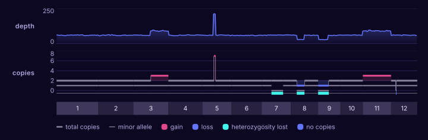
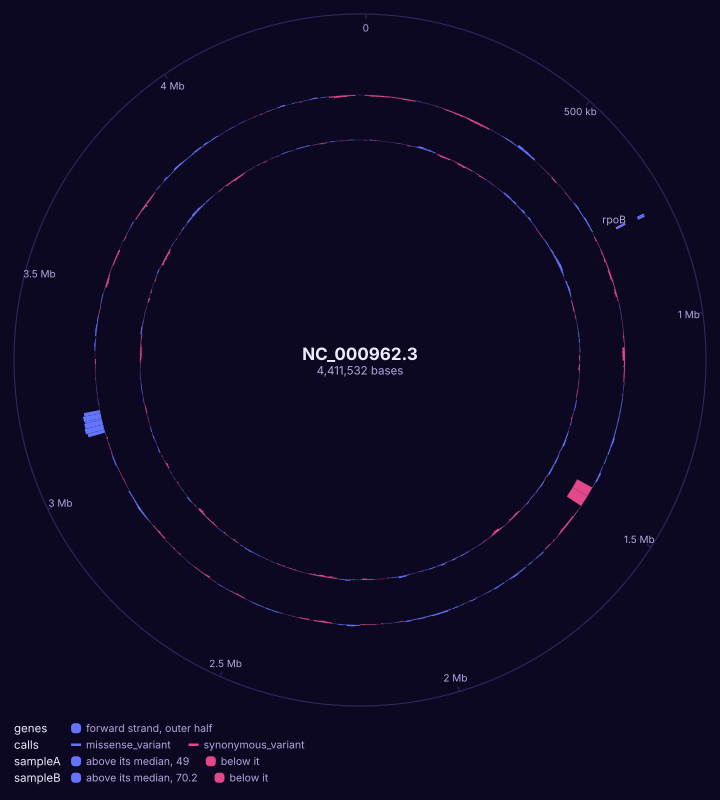

# A whole sequence

You have the depth of your reads in windows along a whole chromosome, as
bedGraph, for one sample or several.

```bash
karyon NC_000962.3 sampleA.bedgraph sampleB.bedgraph --same-scale -o genome.svg
```

<figure class="k-start" markdown>
{ .k-light width="720" height="227" }
{ .k-dark width="720" height="227" }
</figure>

The place is the whole sequence, by its name, and each file is a row. The first
sample drops to nothing where it has lost a stretch and doubles where it
carries one twice. `--same-scale` reads both off one scale, so the same height
is the same depth: the second sample was sequenced deeper, which each on a
scale of its own would hide. A bedGraph does not say how long the sequence is, so karyon
draws as far as the files reach and says so; write the span, as
`NC_000962.3:1-4,411,532`, to set it yourself.

## Change it

| To | Write |
|:--|:--|
| Zoom into the stretch with no reads | `NC_000962.3:1,400,000-1,560,000` in place of `NC_000962.3` |
| A log scale for the depth | `sampleA.bedgraph --log` |
| Each sample on a scale of its own | leave out `--same-scale` |
| Pin the top of a sample's scale, to match a figure drawn apart | `sampleA.bedgraph --max 150` |
| Shade the stretch the first sample lost, down every row | `--shade NC_000962.3:1,450,001-1,510,000=deletion` |
| Make depth windows from a BAM | `mosdepth --by 10000 sample reads.bam`, then draw `sample.regions.bed.gz`, read a window at a time through the `.csi` mosdepth writes beside it |
| Draw a bigWig, as deepTools or UCSC's tools write one | `sampleA.bw` in place of `sampleA.bedgraph`: it says how long each sequence is, and a whole one is read from the summary it keeps at that scale |

## Every sequence at once

With no place, the depth in windows and the segments a copy-number caller
fitted are drawn across every chromosome they name, end to end, in the order
chromosomes are counted, each named under them:

```bash
karyon tumour.bedgraph --label depth tumour.cns --ploidy 2 --label copies -o copies.svg
```

<figure class="k-start" markdown>
![A sample's depth in windows and its copy number across twelve chromosomes in alternating shades, each named under them: the depth rises over a gain on the second half of chromosome 3 and over all of 11, stands up in a tower over an amplification on 5, and falls over losses on 8 and 9, and the copies step the same way on a ladder of whole copies, with the loss of one allele marked along its foot on 7, 8 and 9, and a key under them naming the thick grey bar of the total copies, the thin one of the minor allele and each colour](../assets/start/genome-copies.svg){ .k-light width="720" height="236" }
{ .k-dark width="720" height="236" }
</figure>

`tumour.bedgraph` is the depth `mosdepth --by 500000` counts, and `tumour.cns`
the segments `cnvkit.py call` writes, read on a ladder of whole copies with
balanced at `--ploidy 2`. Each chromosome is as long as the furthest either
file reaches on it, since neither says how long the chromosomes run. The depth
follows the copies, and the lane along the foot of the copies says where one
allele was lost: on 8 and 9 with the copy it took, and on 7 with the other
allele doubled in its place, which the depth cannot show, since the copies
there still add up to two. The key under the chromosomes names what the
copies are drawn with: the thick grey bar of the total, the thinner one of the
minor allele, and the colours of a gain, a loss and a lost allele, each only
where a segment has one. Named on its own, the segment table is called
`tumour copy number`, apart from the depth's `tumour`; `--label` names either.
A chromosome a depth file has no row on would be a gap in its line, not a
depth of nought.

| To | Write |
|:--|:--|
| Draw one chromosome alone | `5` in front, as `karyon 5 tumour.bedgraph tumour.cns --ploidy 2` |
| Draw a BAM's depth this way | `mosdepth --by 500000 tumour reads.bam`, then `tumour.regions.bed.gz` in place of `tumour.bedgraph`; a BAM itself needs a place |
| Shade the amplification, down both tracks | `--shade 5:12,000,001-13,500,000=amplified` |
| Lay a scan over the same chromosomes | `trait.assoc` in front, from [the scan page](scan.md); `--rename 1=chr1` where the files call a chromosome differently |
| Draw a bigWig across the genome | `tumour.bw` in place of `tumour.bedgraph`: each chromosome as long as it says, read from the summary it keeps at that scale |

## As a circle

A chromosome with no ends can be drawn as one: the same two depths, with the
annotation and the calls, each a ring round the whole sequence, the first
outermost:

```bash
karyon NC_000962.3 --circular genes.gff3 calls.vcf.gz sampleA.bedgraph \
  sampleB.bedgraph --same-scale -o circle.svg
```

<figure class="k-start" markdown>
{ .k-light width="720" height="800" }
{ .k-dark width="720" height="800" }
</figure>

A circle closes where its sequence ends, so something has to say where that
is: here the `##contig` line of `calls.vcf.gz`, and a FASTA, a BAM or a GFF3's
`##sequence-region` would do as well. Each depth is cut into a thousand arcs and
read either side of its median, so the stretch the first sample lost dips inside
its line and the stretch it carries twice stands outside it, and `--same-scale`
puts both rings on one reach. The genes sit on the outer half of their ring for
the forward strand and the inner half for the reverse, and the calls are coloured
by their consequence. The key under the circle names each ring, outside in, and
so does each ring when you point at it.

| To | Write |
|:--|:--|
| Leave out the key under the circle | `--no-legend` |
| Name a ring | `--label depth` after its file |
| Move the ruler in among the rings, or leave it out | `--axis` where it should go, or `--no-axis` |
| Draw a reference's GC skew as a ring | the chromosome's FASTA among the files, as `H37Rv.fa` |
| Draw structural calls, with a chord across the middle for each join | `--structural sv.vcf` |
| Draw the same files along the chromosome | leave out `--circular` |

The example files: [sampleA.bedgraph](../data/sampleA.bedgraph),
[sampleB.bedgraph](../data/sampleB.bedgraph),
[tumour.bedgraph](../data/tumour.bedgraph),
[tumour.cns](../data/tumour.cns), [genes.gff3](../data/genes.gff3) and
[calls.vcf.gz](../data/calls.vcf.gz). Every option: `karyon help coverage`,
`karyon help copy-number` and `karyon help all`, or the
[command line reference](../guide/cli.md#a-whole-sequence-as-a-circle).
