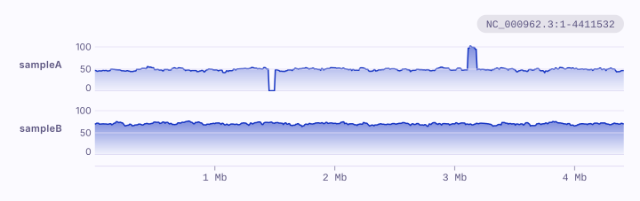
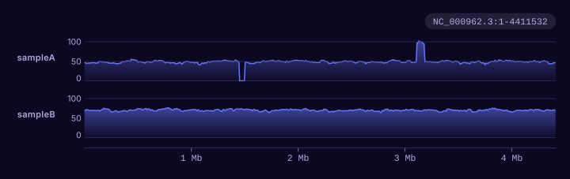

# A whole sequence

You have the depth of your reads in windows along a whole chromosome, as
bedGraph, for one sample or several.

```bash
karyon NC_000962.3 sampleA.bedgraph sampleB.bedgraph --same-scale -o genome.svg
```

<figure class="k-start" markdown>
{ .k-light width="720" height="227" }
{ .k-dark width="720" height="227" }
</figure>

The place is the whole sequence, by its name, and each file is a row. The first
sample drops to nothing where it has lost a stretch and doubles where it
carries one twice. `--same-scale` reads both off one scale, so the same height
is the same depth: the second sample was sequenced deeper, which each on a
scale of its own would hide. A bedGraph does not say how long the sequence is, so karyon
draws as far as the files reach and says so; write the span, as
`NC_000962.3:1-4,411,532`, to set it yourself.

## Change it

| To | Write |
|:--|:--|
| Zoom into the stretch with no reads | `NC_000962.3:1,400,000-1,560,000` in place of `NC_000962.3` |
| A log scale for the depth | `sampleA.bedgraph --log` |
| Each sample on a scale of its own | leave out `--same-scale` |
| Pin the top of a sample's scale, to match a figure drawn apart | `sampleA.bedgraph --max 150` |
| Shade the stretch the first sample lost, down every row | `--shade NC_000962.3:1,450,001-1,510,000=deletion` |
| Make depth windows from a BAM | `mosdepth --by 10000 sample reads.bam`, then draw `sample.regions.bed.gz` |
| Draw a bigWig, as deepTools or UCSC's tools write one | `sampleA.bw` in place of `sampleA.bedgraph`: it says how long each sequence is, and a whole one is read from the summary it keeps at that scale |

The example files: [sampleA.bedgraph](../data/sampleA.bedgraph) and
[sampleB.bedgraph](../data/sampleB.bedgraph). Every option:
`karyon help coverage`, or the [command line reference](../guide/cli.md).
