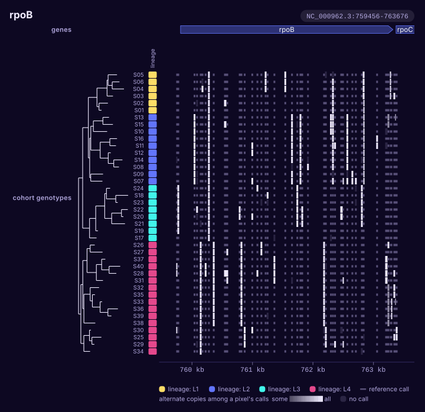

# Genotypes of many samples

You have a VCF of many samples, as a joint caller or `bcftools merge` writes
one, and want to see which samples carry which allele, site by site.

```bash
karyon rpoB genes.gff3 --genotypes cohort.vcf.gz --with-tree tree.nwk \
  --traits samples.tsv --columns lineage -o genotypes.svg
```

<figure class="k-start" markdown>
{ .k-light width="720" height="697" }
{ .k-dark width="720" height="697" }
</figure>

One row per sample and one cell per site, each at its position under the gene.
A short grey bar is a call of the reference, a blue cell a call of the other
allele, and a pale cell no call. In the order of the tree, the alleles a clade
shares are blocks rather than a speckle. Where sites are closer than a cell,
their pixel is shaded by the share of alternate calls under it, and the key
says so; zoom in and they come apart into cells. Each row's tooltip counts
the sample's calls in the window, and a cell that carries an alternate allele
names its call in a tooltip of its own. A diploid cohort's heterozygous calls
are the half-strength blue.

## Your file

- **A cohort's VCF**, with the `#CHROM` line that names the samples: from
  `bcftools merge` of single-sample VCFs, or from a joint caller such as
  GATK's GenotypeGVCFs or DeepVariant with GLnexus. `GT` is what is read, from
  wherever it is among the keys.
- **A big one**: compress it with `bgzip` and index it with
  `tabix -p vcf cohort.vcf.gz`, and the `.tbi` beside it is read for the rows
  over the place and the header that names the samples, with no other row of
  the file read. A BCF is read as it is, through the `.csi` that
  `bcftools index cohort.bcf` writes beside it, and its samples are the ones
  its header names.
- **Named on its own**, a VCF or a BCF is drawn as its calls, one lollipop
  per site, and a cohort's says that `--genotypes` draws its samples.

## Change it

| To | Write |
|:--|:--|
| A few samples, in this order | `--sample S07,S01,S12` |
| More than forty rows | `--max-rows 200`, or `--max-rows all` |
| Thinner rows | `--row-height 6` |
| What is known about each sample, beside the rows | `--traits samples.tsv`, with `--columns` to choose |
| The calls over them as lollipops | `cohort.vcf.gz` as well, before `--genotypes` |
| A whole sequence | `NC_000962.3:1-4,411,532` as the place |

The example files: [cohort.vcf.gz](../data/cohort.vcf.gz), with
[tree.nwk](../data/tree.nwk) and [samples.tsv](../data/samples.tsv). Every
option: `karyon help genotypes`, or the
[command line reference](../guide/cli.md).
