# What do you have?

Pick your data. Each page has one command, the figure it draws, and the few
changes people make most.

-   [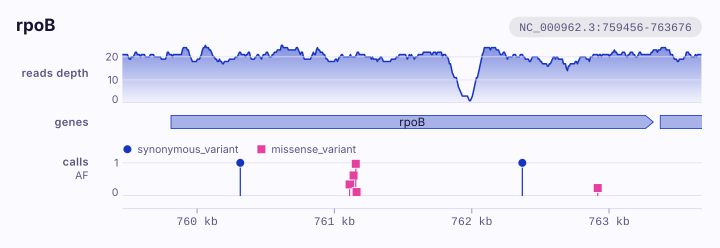{ .k-light width="720" height="248" loading="lazy" }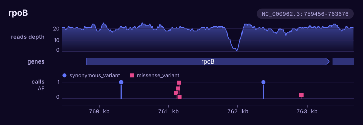{ .k-dark width="720" height="248" loading="lazy" }](reads.md)

    **[Reads, calls and genes](reads.md)**
    A BAM, a VCF and an annotation over one place.

-   [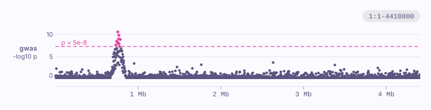{ .k-light width="720" height="185" loading="lazy" }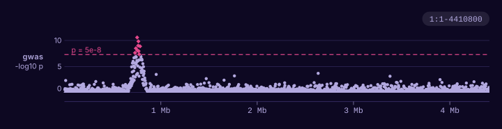{ .k-dark width="720" height="185" loading="lazy" }](scan.md)

    **[An association scan](scan.md)**
    A table from PLINK, REGENIE, SAIGE or another association tool.

-   [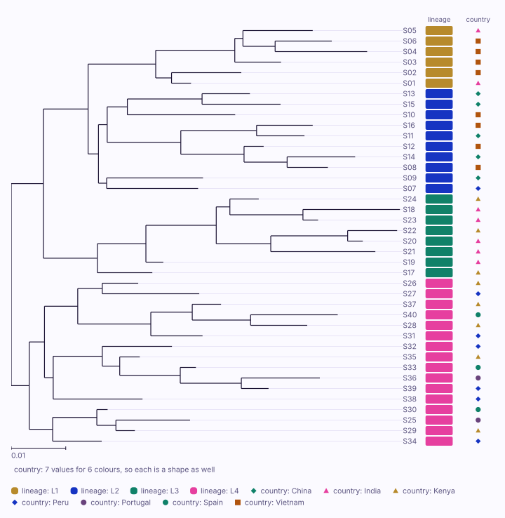{ .k-light width="720" height="717" loading="lazy" }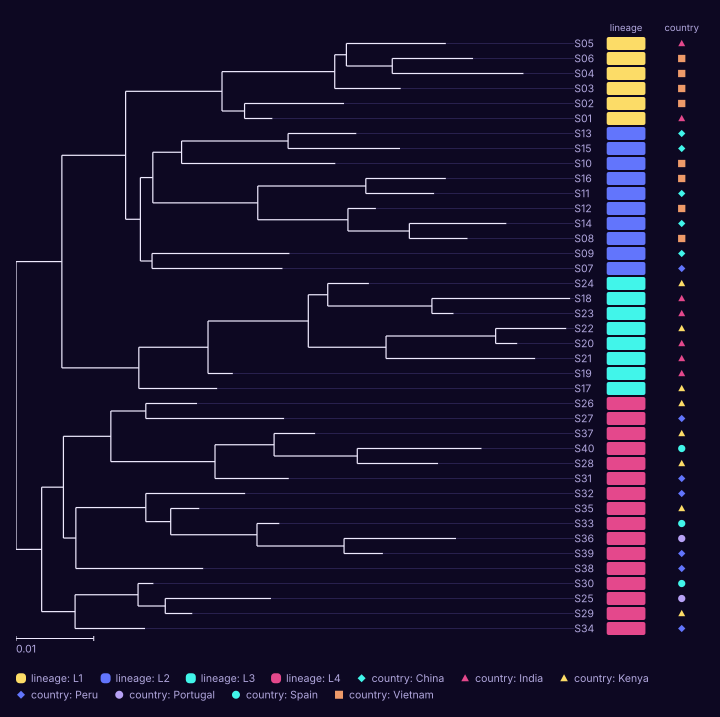{ .k-dark width="720" height="717" loading="lazy" }](tree.md)

    **[A tree and its samples](tree.md)**
    A Newick tree and a sheet of what you know about each sample.

-   [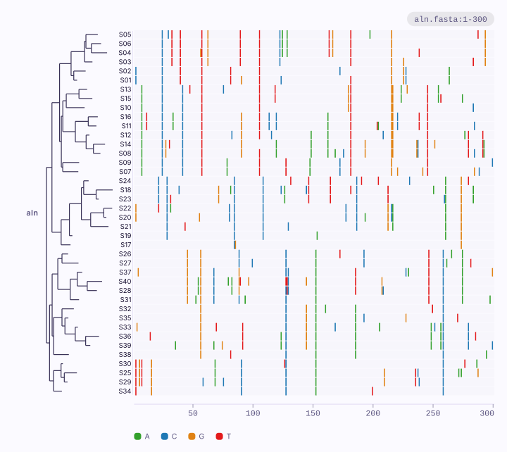{ .k-light width="720" height="642" loading="lazy" }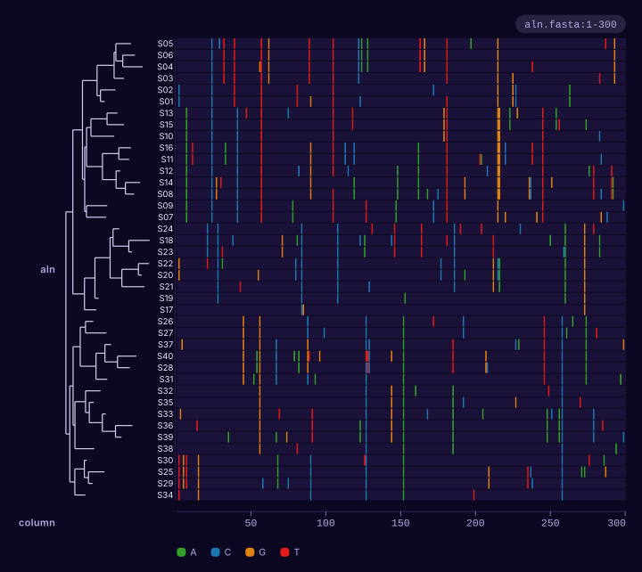{ .k-dark width="720" height="642" loading="lazy" }](alignment.md)

    **[An alignment and its tree](alignment.md)**
    An aligned FASTA, in the order of a tree drawn beside it.

-   [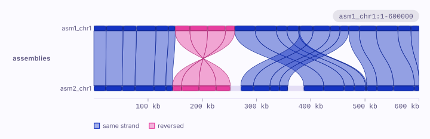{ .k-light width="720" height="234" loading="lazy" }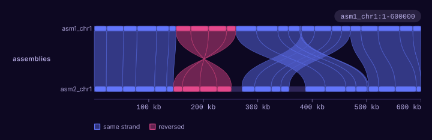{ .k-dark width="720" height="234" loading="lazy" }](assemblies.md)

    **[Two assemblies](assemblies.md)**
    How two assemblies line up, from a PAF alignment.

-   [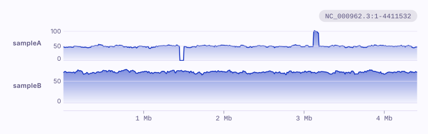{ .k-light width="720" height="227" loading="lazy" }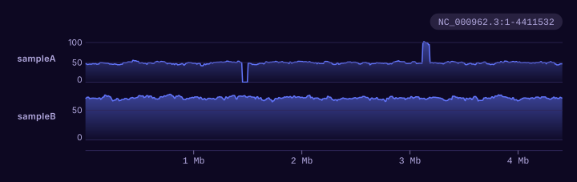{ .k-dark width="720" height="227" loading="lazy" }](genome.md)

    **[A whole sequence](genome.md)**
    The depth of one sample or several along a whole chromosome.

-   [{ .k-light width="720" height="602" loading="lazy" }{ .k-dark width="720" height="602" loading="lazy" }](samples.md)

    **[Many samples in windows](samples.md)**
    The depth or copy number of many samples, in the order of a tree.

-   [{ .k-light width="720" height="386" loading="lazy" }{ .k-dark width="720" height="386" loading="lazy" }](pairs.md)

    **[Pairs of positions](pairs.md)**
    Linkage from PLINK, contacts from a Hi-C map, scores between sites.

-   [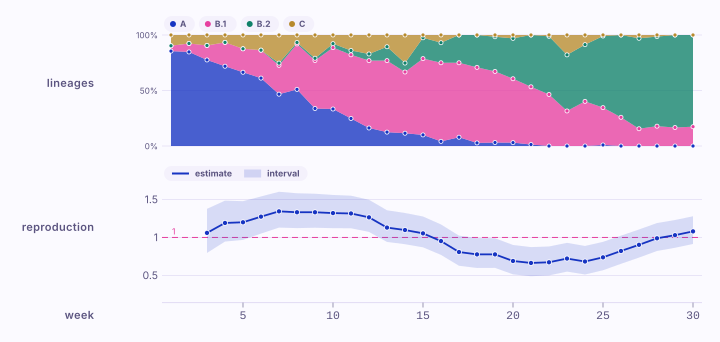{ .k-light width="720" height="342" loading="lazy" }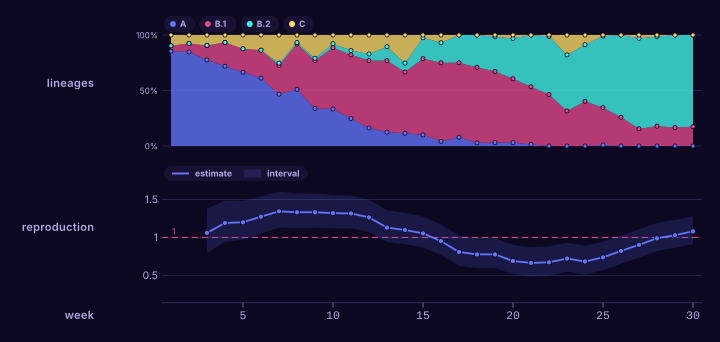{ .k-dark width="720" height="342" loading="lazy" }](time.md)

    **[Counts over time](time.md)**
    Lineages or mutations over time, and an estimate beside them.

-   [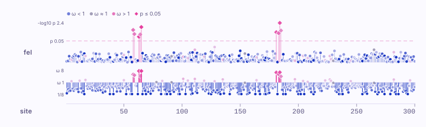{ .k-light width="720" height="216" loading="lazy" }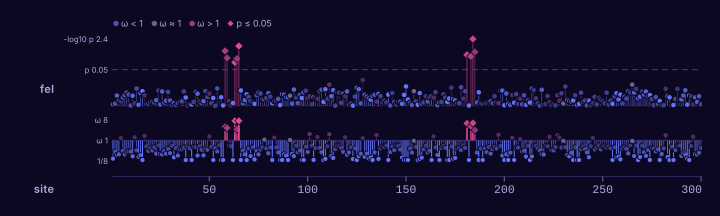{ .k-dark width="720" height="216" loading="lazy" }](selection.md)

    **[Selection along a gene](selection.md)**
    A test at each site, from HyPhy or a table of your own.

-   [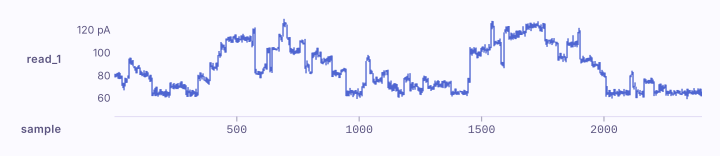{ .k-light width="720" height="156" loading="lazy" }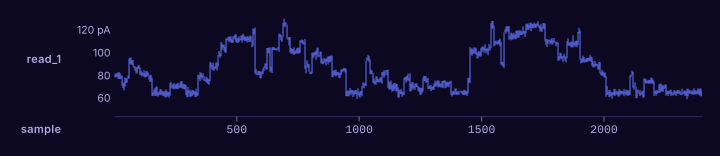{ .k-dark width="720" height="156" loading="lazy" }](signal.md)

    **[A nanopore signal](signal.md)**
    The raw current of a read, from a SLOW5 file.

Something else? The [gallery](../plots/index.md) shows every kind of figure
karyon draws, and the [command line reference](../guide/cli.md) every file it
reads.
