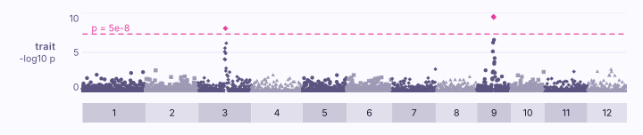
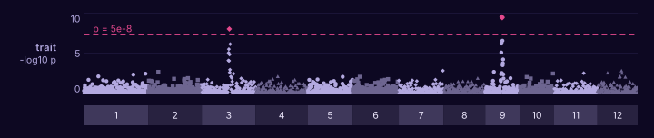

# An association scan

You have a table from an association tool: PLINK, PLINK 2, REGENIE, SAIGE,
GEMMA, BOLT-LMM or the GWAS Catalog.

```bash
karyon 1 gwas.assoc --threshold genome-wide -o scan.svg
```

<figure class="k-start" markdown>
{ .k-light width="720" height="185" }
{ .k-dark width="720" height="185" }
</figure>

The place, `1`, is the chromosome as the table names it. Each marker is as
high as `-log10` of its p-value, and the dashed line is p = 5e-8.

## Change it

| To | Write |
|:--|:--|
| Zoom into the peak | `1:700,000-820,000` in place of `1` |
| Draw the line elsewhere | `--threshold 1e-5` |
| Add the genes under the peak | `NC_000962.3:700,000-820,000 gwas.assoc --threshold genome-wide genes.gff3 --rename 1=NC_000962.3` |

`--rename` is for a table that names the chromosome `1` where the annotation
calls it `NC_000962.3`.

## Every chromosome at once

With no place, the table is drawn across every chromosome it names, end to
end, in the order they are counted, each named under the scan:

```bash
karyon trait.assoc --threshold genome-wide -o genome.svg
```

<figure class="k-start" markdown>
{ .k-light width="720" height="152" }
{ .k-dark width="720" height="152" }
</figure>

Each chromosome is as long as its furthest marker, since a table says where
its markers are and not how long the chromosomes run, and the shades alternate
so a tower is read against the chromosome it stands on. Name one to draw it
alone, as `karyon 3 trait.assoc`.

## Colour a peak by linkage

Zoomed into the peak, each marker coloured by its linkage with the strongest,
as LocusZoom draws one, with the recombination rate laid over it:

```bash
karyon 1:661,000-861,000 gwas.assoc --ld lead.ld --threshold genome-wide \
  --with-recombination genetic_map.txt -o locus.svg
```

<figure class="k-start" markdown>
{ .k-light width="720" height="214" }
{ .k-dark width="720" height="214" }
</figure>

`lead.ld` is PLINK's linkage of the lead with its neighbours, as
`plink --r2 --ld-snp snp00342 --ld-window-kb 100 --ld-window 99999
--ld-window-r2 0` writes it, and the lead is called by the name the scan gives
it. `genetic_map.txt` is a genetic map as HapMap writes one, laid over the
scan by `--with-recombination` and read off the scale on the right; named on
its own, it is drawn as a track of its own under the scan instead.

The example files: [gwas.assoc](../data/gwas.assoc),
[trait.assoc](../data/trait.assoc), [lead.ld](../data/lead.ld) and
[genetic_map.txt](../data/genetic_map.txt). Every option:
`karyon help manhattan`, or the [command line reference](../guide/cli.md).
